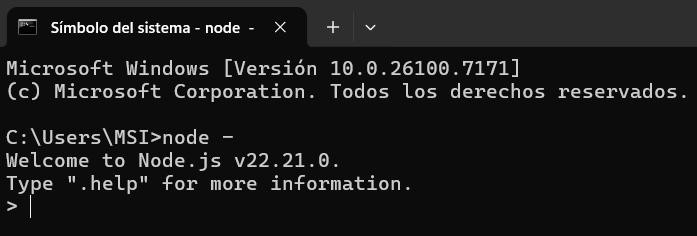
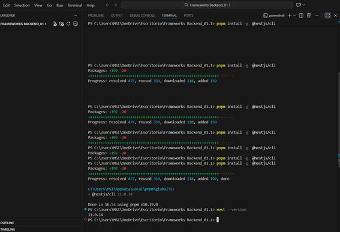
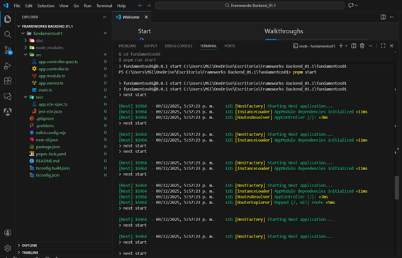
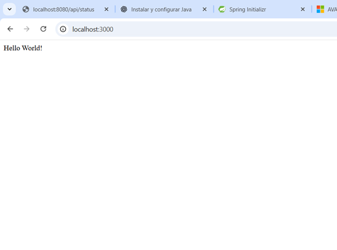
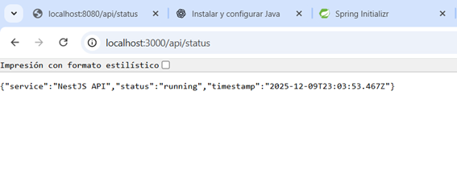

# Programación y Plataformas Web

# Frameworks Backend: Arquitectura Backend

<div align="center">
  
  
</div>

## Práctica 2: Arquitectura del Backend Moderno

### Autores

**Juan Alvarez - David Villa**
---

# Introducción

La arquitectura backend define **cómo se organiza internamente un servidor**, cómo se procesan las solicitudes y cómo fluye la información entre:

* controladores
* servicios
* bases de datos
* otros servicios internos
* clientes externos

Comprender la arquitectura es importante antes de trabajar con frameworks como **Spring Boot** o **NestJS**, ya que ambos siguen patrones de diseño claramente definidos.

En esta práctica analizaremos:

* capas de un backend
* patrones arquitectónicos (MVC, MVCS, Clean Architecture)
* estructura interna de una API
* estilos de comunicación (REST, RPC, gRPC, WebSockets, GraphQL)
* diferencias entre monolito, modular y microservicios

---

# 1. Capas en el Backend

El backend moderno funciona dividido en **capas lógicas**, cada una con una responsabilidad clara y bien definida. Esta separación permite:

- **Mantenibilidad**: Cambios en una capa no afectan otras
- **Testabilidad**: Cada capa se puede probar independientemente
- **Escalabilidad**: Se pueden optimizar capas específicas
- **Reutilización**: La lógica se puede usar en diferentes contextos

---

## 1.1 Capa de Presentación (Entradas / Endpoints)

**Responsabilidad**: Punto de entrada de todas las solicitudes externas.

* Aquí llegan las solicitudes del cliente (HTTP, WebSocket, gRPC).
* Se implementa con **controladores (controllers)** o **handlers**.
* Su **única responsabilidad** es:
  - Recibir la petición
  - Validar formato básico
  - Delegar al servicio correspondiente
  - Devolver la respuesta formateada

**Lo que NO debe hacer**:
- ❌ Contener lógica de negocio
- ❌ Acceder directamente a la base de datos
- ❌ Realizar cálculos complejos

**Ejemplo conceptual**:

```text
[Cliente Web/Móvil] → (HTTP Request) → [Controlador] → [Servicio]
                                            ↓
                                     (HTTP Response)

---

## 1.2 Capa de Negocio (Servicios)

**Responsabilidad**: Contener toda la lógica del negocio de la aplicación.

* Se implementa con **servicios (services)**.
* Contiene:
  - Validaciones de negocio
  - Cálculos y transformaciones
  - Flujos de trabajo (workflows)
  - Orquestación de operaciones complejas
  - Reglas de negocio

**Características**:
-  Independiente del tipo de entrada (HTTP, WebSocket, etc.)
-  Reutilizable en diferentes contextos
-  Fácil de testear
-  No conoce detalles de persistencia (usa repositorios)

**Ejemplo de lógica de negocio**:

```text
Controlador → Servicio → [
    1. Validar datos
    2. Verificar permisos
    3. Calcular precio con descuento
    4. Actualizar stock
    5. Crear orden
    6. Enviar email
] → Resultado
```

---

## 1.3 Capa de Persistencia (Datos)

**Responsabilidad**: Manejar toda la comunicación con sistemas de almacenamiento (bases de datos, cache, archivos).

* Implementada mediante:
  - **Repositorios**: Interfaces para acceder a datos
  - **ORM** (Object-Relational Mapping): Mapea objetos a tablas
  - **Entidades**: Representan tablas de la base de datos

**Conceptos clave**:
- Abstrae los detalles de persistencia
- Facilita cambio de base de datos
- Proporciona métodos CRUD estándar
- Puede incluir queries personalizadas

**Flujo**:
```
Servicio → Repositorio → ORM → SQL → Base de Datos
                                        ↓
                                    [usuarios]
                                    [productos]
                                    [ordenes]
```

---

## 1.4 Relación entre capas

**Flujo completo de una petición**:

```
1. Cliente envía petición HTTP
        ↓
2. [Capa de Presentación]
   - Controlador recibe la petición
   - Valida parámetros básicos
   - Extrae datos del request
        ↓
3. [Capa de Negocio]
   - Servicio aplica lógica de negocio
   - Valida reglas complejas
   - Orquesta operaciones
        ↓
4. [Capa de Persistencia]
   - Repositorio accede a la BD
   - ORM ejecuta queries SQL
   - Retorna entidades
        ↓
5. Base de Datos
   - Ejecuta operación
   - Retorna resultados
        ↓
6. Respuesta fluye de vuelta
   Repositorio → Servicio → Controlador → Cliente
```

**Ejemplo completo**:

```
GET /api/orders/123

┌──────────────────────────────────────────┐
│ Controlador (OrderController)            │
│ - Recibe petición                        │
│ - Extrae ID = 123                        │
└─────────────┬────────────────────────────┘
              ↓ orderService.findById(123)
┌──────────────────────────────────────────┐
│ Servicio (OrderService)                  │
│ - Valida que ID > 0                      │
│ - Verifica permisos del usuario          │
└─────────────┬────────────────────────────┘
              ↓ orderRepository.findById(123)
┌──────────────────────────────────────────┐
│ Repositorio (OrderRepository)            │
│ - Genera query SQL                       │
│ - SELECT * FROM orders WHERE id = 123    │
└─────────────┬────────────────────────────┘
              ↓
┌──────────────────────────────────────────┐
│ Base de Datos (PostgreSQL/MySQL)         │
│ - Ejecuta query                          │
│ - Retorna fila                           │
└─────────────┬────────────────────────────┘
              ↓ Entidad Order
┌──────────────────────────────────────────┐
│ Respuesta: HTTP 200                      │
│ {                                        │
│   "id": 123,                             │
│   "total": 99.99,                        │
│   "status": "pending"                    │
│ }                                        │
└──────────────────────────────────────────┘
```

Esta estructura se implementará tanto en **Spring Boot** como en **NestJS**.

---

# 2. Patrones Arquitectónicos del Backend

---

## 2.1 MVC – Modelo, Vista, Controlador

Aunque más usado en frontend, en backend funciona como:

* **Modelo** → Datos y entidades
* **Vista** → Respuesta enviada (normalmente JSON)
* **Controlador** → Maneja rutas

Spring Boot puede trabajar bajo este patrón, aunque en APIs REST la “vista” es casi inexistente.

---

## 2.2 MVCS – Modelo, Vista, Controlador, Servicio

Este es el modelo más usado en backend moderno.

* Los **servicios** contienen la lógica del negocio.
* El controlador se encarga solamente de recibir peticiones.
* Limpio, modular y escalable.

Es el patrón usado en:

* **Spring Boot**
* **NestJS**
* **Django Rest Framework**
* **Express con servicios**

---

## 2.3 Arquitectura en Capas (Layered Architecture)

Organiza el código según responsabilidades:

* capa de presentación
* capa de negocio
* capa de datos
* capa de infraestructura

Frameworks como Spring Boot están diseñados para apoyar este estilo.

---

## 2.4 Clean Architecture

Propuesta por Robert C. Martin.

* La lógica del negocio es el centro.
* Las dependencias apuntan hacia adentro.
* El framework no controla al proyecto, sino que el proyecto controla al framework.

Diagrama conceptual:

```
Entidades  →  Casos de Uso  →  Adaptadores  →  Framework
```

---

# 3. Estilos de Construcción del Backend

---

## 3.1 Monolito

Toda la aplicación vive en un solo proyecto.

✔ Ideal para aprendizaje y proyectos pequeños
✔ Fácil de desplegar
✔ Rápido de desarrollar

---

## 3.2 Monolito Modular

Dividido en módulos independientes dentro del mismo proyecto.

✔ Mejor organización
✔ Facilita crecimiento

---

## 3.3 Microservicios

La aplicación se divide en servicios independientes.

✔ Escalabilidad
✔ Tolerancia a fallos
❗ Mucho más complejo
❗ Requiere infraestructura avanzada

---

# 4. Estilos de Comunicación Cliente–Servidor

Los clientes pueden comunicarse con el backend de diferentes formas dependiendo de:
- Tipo de aplicación (web, móvil, IoT)
- Requisitos de tiempo real
- Volumen de datos
- Complejidad de consultas

Cada estilo tiene sus propias características, ventajas y casos de uso específicos.

A continuación se explica **cómo funciona cada uno** y **cómo se consume desde el cliente**.

---

## 4.1 REST (Representational State Transfer)

### Definición

REST es un **estilo arquitectónico** para diseñar APIs sobre HTTP, basado en recursos y verbos HTTP estándar.

**Características principales**:
-  **Stateless**: Cada petición es independiente
-  **Basado en recursos**: URLs representan entidades
-  **Usa verbos HTTP**: GET, POST, PUT, DELETE, PATCH
-  **Respuestas en JSON o XML**
-  **Cacheable**: Soporta caché HTTP
-  **Cliente-Servidor**: Separación clara de responsabilidades

### Estructura de una API REST

```
GET    /api/users          → Listar usuarios
GET    /api/users/123      → Obtener usuario específico
POST   /api/users          → Crear usuario
PUT    /api/users/123      → Actualizar usuario completo
PATCH  /api/users/123      → Actualizar parcialmente
DELETE /api/users/123      → Eliminar usuario
```

### Ejemplo de servidor REST (Spring Boot)

```java
@RestController
@RequestMapping("/api/products")
public class ProductController {
    
    @Autowired
    private ProductService productService;
    
    // GET /api/products
    @GetMapping
    public List<Product> getAllProducts() {
        return productService.findAll();
    }
    
    // GET /api/products/5
    @GetMapping("/{id}")
    public Product getProduct(@PathVariable Long id) {
        return productService.findById(id);
    }
    
    // POST /api/products
    @PostMapping
    public Product createProduct(@RequestBody ProductDTO dto) {
        return productService.create(dto);
    }
    
    // PUT /api/products/5
    @PutMapping("/{id}")
    public Product updateProduct(@PathVariable Long id, @RequestBody ProductDTO dto) {
        return productService.update(id, dto);
    }
    
    // DELETE /api/products/5
    @DeleteMapping("/{id}")
    public void deleteProduct(@PathVariable Long id) {
        productService.delete(id);
    }
}
```

### Ejemplo de servidor REST (NestJS)

```typescript
@Controller('products')
export class ProductController {
    constructor(private readonly productService: ProductService) {}
    
    @Get()
    async getAllProducts(): Promise<Product[]> {
        return this.productService.findAll();
    }
    
    @Get(':id')
    async getProduct(@Param('id') id: string): Promise<Product> {
        return this.productService.findById(+id);
    }
    
    @Post()
    async createProduct(@Body() dto: CreateProductDto): Promise<Product> {
        return this.productService.create(dto);
    }
    
    @Put(':id')
    async updateProduct(
        @Param('id') id: string,
        @Body() dto: UpdateProductDto
    ): Promise<Product> {
        return this.productService.update(+id, dto);
    }
    
    @Delete(':id')
    async deleteProduct(@Param('id') id: string): Promise<void> {
        return this.productService.delete(+id);
    }
}
```

### Cómo consumir API REST desde el cliente

#### **JavaScript/TypeScript (Frontend)**

```javascript
// GET - Obtener todos los productos
fetch('http://localhost:3000/api/products')
    .then(response => response.json())
    .then(products => console.log(products))
    .catch(error => console.error(error));

// GET - Obtener un producto específico
fetch('http://localhost:3000/api/products/5')
    .then(response => response.json())
    .then(product => console.log(product));

// POST - Crear producto
fetch('http://localhost:3000/api/products', {
    method: 'POST',
    headers: {
        'Content-Type': 'application/json',
        'Authorization': 'Bearer token123'
    },
    body: JSON.stringify({
        name: 'Laptop HP',
        price: 899.99,
        stock: 15
    })
})
    .then(response => response.json())
    .then(newProduct => console.log('Creado:', newProduct));

// PUT - Actualizar producto completo
fetch('http://localhost:3000/api/products/5', {
    method: 'PUT',
    headers: { 'Content-Type': 'application/json' },
    body: JSON.stringify({
        name: 'Laptop HP Actualizada',
        price: 799.99,
        stock: 20
    })
})
    .then(response => response.json())
    .then(updated => console.log('Actualizado:', updated));

// PATCH - Actualizar parcialmente
fetch('http://localhost:3000/api/products/5', {
    method: 'PATCH',
    headers: { 'Content-Type': 'application/json' },
    body: JSON.stringify({
        stock: 25  // Solo actualizar stock
    })
})
    .then(response => response.json())
    .then(updated => console.log('Stock actualizado:', updated));

// DELETE - Eliminar producto
fetch('http://localhost:3000/api/products/5', {
    method: 'DELETE'
})
    .then(response => {
        if (response.ok) {
            console.log('Producto eliminado');
        }
    });
```

#### **Usando Axios (más moderno)**

```javascript
import axios from 'axios';

const api = axios.create({
    baseURL: 'http://localhost:3000/api',
    headers: {
        'Content-Type': 'application/json',
        'Authorization': 'Bearer token123'
    }
});

// GET
const products = await api.get('/products');
console.log(products.data);

// POST
const newProduct = await api.post('/products', {
    name: 'Laptop HP',
    price: 899.99
});

// PUT
const updated = await api.put('/products/5', {
    name: 'Laptop HP Pro',
    price: 999.99
});

// DELETE
await api.delete('/products/5');
```

#### **cURL (Línea de comandos)**

```bash
# GET
curl http://localhost:3000/api/products

# GET específico
curl http://localhost:3000/api/products/5

# POST
curl -X POST http://localhost:3000/api/products \
  -H "Content-Type: application/json" \
  -d '{"name":"Laptop HP","price":899.99}'

# PUT
curl -X PUT http://localhost:3000/api/products/5 \
  -H "Content-Type: application/json" \
  -d '{"name":"Laptop Updated","price":799.99}'

# DELETE
curl -X DELETE http://localhost:3000/api/products/5
```

#### **Postman / Insomnia**

```
Method: GET
URL: http://localhost:3000/api/products
Headers:
  - Content-Type: application/json
  - Authorization: Bearer token123
```

** Cuándo usar REST**:
- APIs públicas y privadas
- Aplicaciones web y móviles
- CRUD tradicional
- Sistemas que requieren caché
- Integraciones simples

---

## 4.2 RPC (Remote Procedure Call)

### Definición

RPC permite **invocar funciones remotas** como si fueran locales. El cliente llama a procedimientos que se ejecutan en el servidor.

**Características**:
-  Centrado en **acciones/funciones** (no en recursos)
-  Más simple que REST en algunos casos
-  Puede usar diferentes protocolos (HTTP, TCP)


** Cuándo usar RPC**:
- Comunicación entre microservicios internos
- Cuando las operaciones no mapean bien a recursos
- Sistemas de alto rendimiento

---

## 4.3 gRPC (Google RPC)

### Definición

**gRPC** es una implementación moderna de RPC creada por Google que usa:
- **HTTP/2**: Multiplexación, compresión
- **Protocol Buffers**: Serialización binaria eficiente
- **Tipado fuerte**: Schemas definidos en `.proto`

**Características**:
-  Muy rápido (10x más rápido que REST)
-  Menor uso de ancho de banda
-  Streaming bidireccional
-  Generación automática de código cliente/servidor
-  Ideal para microservicios


## 4.4 WebSockets

### Definición

**WebSocket** establece una **conexión persistente y bidireccional** entre cliente y servidor, permitiendo comunicación en tiempo real.

**Características**:
-  Conexión permanente (no request/response)
-  Comunicación bidireccional (cliente ↔ servidor)
-  Baja latencia
-  Ideal para tiempo real

**Flujo de WebSocket**:
```
Cliente                         Servidor
   |                               |
   |---- Handshake HTTP ---------->|
   |<--- Upgrade to WebSocket -----|
   |                               |
   |===== Conexión persistente ====|
   |                               |
   |---- sendMessage ------------->|
   |<--- newMessage ---------------|
   |<--- userJoined ---------------|
   |---- typing ------------------>|
   |<--- notification -------------|
   |                               |
   |===== Permanece abierta ======|
```

** Cuándo usar WebSockets**:
- **Chat en tiempo real**
- **Notificaciones push**
- **Juegos multiplayer**
- **Dashboards en vivo**
- **Colaboración en tiempo real** (Google Docs)
- **Trading/Bolsa** (precios actualizados)

---

## 4.5 SSE (Server Sent Events)

### Definición

**SSE** permite que el **servidor envíe datos al cliente** de forma continua a través de una conexión HTTP persistente.

**Características**:
-  Unidireccional: Solo servidor → cliente
-  Sobre HTTP estándar
-  Reconexión automática
-  Más simple que WebSockets

## 4.6 GraphQL

### Definición

**GraphQL** es un lenguaje de consulta para APIs que permite al cliente **solicitar exactamente los datos que necesita**, nada más, nada menos.

**Características**:
-  Cliente define la estructura de la respuesta
-  Un solo endpoint (`/graphql`)
-  Evita over-fetching y under-fetching
-  Tipado fuerte
-  Introspección (documentación automática)


# 5. Comparativa Completa de Estilos de Comunicación

| Característica | REST | RPC | gRPC | WebSocket | SSE | GraphQL |
|----------------|------|-----|------|-----------|-----|---------|
| **Protocolo** | HTTP/HTTPS | Varios | HTTP/2 | WebSocket | HTTP | HTTP/HTTPS |
| **Dirección** | Request/Response | Request/Response | Bidireccional | Bidireccional | Servidor→Cliente | Request/Response |
| **Formato** | JSON/XML | Varios | Protocol Buffers | Texto/Binario | Texto | JSON |
| **Complejidad** | Baja | Media | Alta | Media | Baja | Media-Alta |
| **Performance** | Media | Media-Alta | Muy Alta | Alta | Media | Media |
| **Tiempo Real** | ❌ | ❌ |  |  |  | ❌ |
| **Caché** |  Fácil | ⚠️ Difícil | ⚠️ Difícil | ❌ | ❌ | ⚠️ Complejo |
| **Tipado** | ❌ | ⚠️ Depende |  Fuerte | ❌ | ❌ |  Fuerte |
| **Over-fetching** |  Común | ⚠️ Depende | ❌ | N/A | N/A | ❌ |
| **Documentación** | Swagger/OpenAPI | Manual | Auto-generada | Manual | Manual | Auto-generada |
| **Curva aprendizaje** | Baja | Media | Alta | Media | Baja | Media |
| **Uso principal** | APIs públicas | Microservicios | Microservicios | Chat/Gaming | Dashboards | Apps complejas |

---

# 6. Seguridad y API Gateway

## 6.1 Seguridad

El backend debe proteger:

* autenticación
* autorización
* manejo de contraseñas
* tokens (JWT)
* protección contra ataques comunes

Se verá en el tema 09.

---

## 6.2 API Gateway

Un punto central por donde pasan todas las solicitudes en sistemas grandes.

Funciones:

* routing
* autenticación
* rate limiting
* logging

---

# Resultados y evidencias

# 1. Captura del comando de verificación de Node.js



# 2. Captura del servidor NestJS iniciándose correctamente





# 3. Captura del endpoint /api/status funcionando





# 5. Explicación breve escrita por el estudiante

Es una ruta que recibe peticiones (como /api/datos) y devuelve respuestas (JSON). En Spring Boot, se crea con @Controller y @GetMapping (u otros métodos HTTP).

Entendí de @Controller y @Get:

 - @Controller: Marca una clase como controlador.

- @GetMapping: Mapea un método a una ruta GET.

Módulos:
Son contenedores que organizan partes relacionadas de la app (controladores, servicios). En Spring se usa @Configuration o @ComponentScan.

Cómo funciona NestJS:
Usa un servidor HTTP (Express o Fastify) que recibe peticiones y las dirige a los controladores según sus rutas.

Similitudes con Spring Boot:

 1. Usan decoradores/anotaciones para rutas.

 2.  Tienen inyección de dependencias.

3. Usan módulos para organizar.

4. Arrancan un servidor embebido automáticamente.


