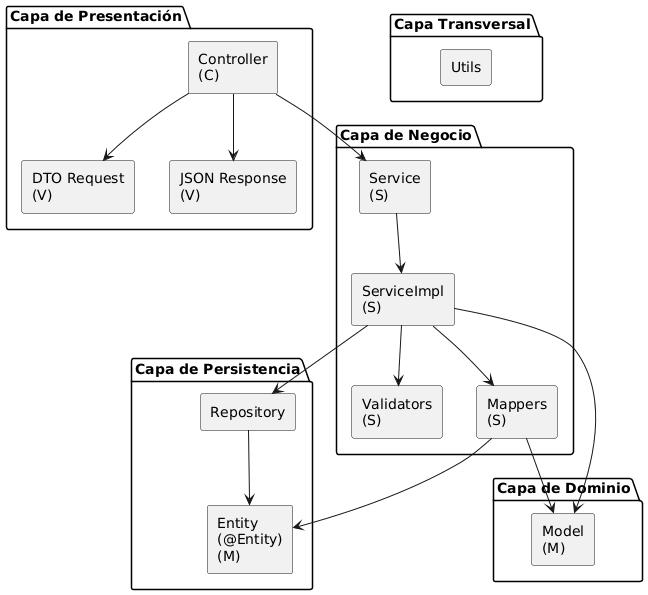

# Programación y Plataformas Web

# Frameworks Backend: Arquitectura Backend

<div align="center">
  
  
</div>

## Práctica 2: Arquitectura del Backend Moderno

### Autores

**Pablo Torres**
📧 [ptorresp@ups.edu.ec](mailto:ptorresp@ups.edu.ec)
💻 GitHub: [PabloT18](https://github.com/PabloT18)

---

# Introducción

La arquitectura backend define **cómo se organiza internamente un servidor**, cómo se procesan las solicitudes y cómo fluye la información entre:

* controladores
* servicios
* bases de datos
* otros servicios internos
* clientes externos

Comprender la arquitectura es importante antes de trabajar con frameworks como **Spring Boot** o **NestJS**, ya que ambos siguen patrones de diseño claramente definidos.

En esta práctica analizaremos:

* capas de un backend
* patrones arquitectónicos (MVC, MVCS, Clean Architecture)
* estructura interna de una API
* estilos de comunicación (REST, RPC, gRPC, WebSockets, GraphQL)
* diferencias entre monolito, modular y microservicios

---

# 1. Capas en el Backend

El backend moderno funciona dividido en **capas lógicas**, cada una con una responsabilidad clara y bien definida. Esta separación permite:

- **Mantenibilidad**: Cambios en una capa no afectan otras
- **Testabilidad**: Cada capa se puede probar independientemente
- **Escalabilidad**: Se pueden optimizar capas específicas
- **Reutilización**: La lógica se puede usar en diferentes contextos

---

## 1.1 Capa de Presentación (Entradas / Endpoints)

**Responsabilidad**: Punto de entrada de todas las solicitudes externas.

* Aquí llegan las solicitudes del cliente (HTTP, WebSocket, gRPC).
* Se implementa con **controladores (controllers)** o **handlers**.
* Su **única responsabilidad** es:
  - Recibir la petición
  - Validar formato básico
  - Delegar al servicio correspondiente
  - Devolver la respuesta formateada

**Lo que NO debe hacer**:
- ❌ Contener lógica de negocio
- ❌ Acceder directamente a la base de datos
- ❌ Realizar cálculos complejos

**Ejemplo conceptual**:

```text
[Cliente Web/Móvil] → (HTTP Request) → [Controlador] → [Servicio]
                                            ↓
                                     (HTTP Response)
```
---

## 1.2 Capa de Negocio (Servicios)

**Responsabilidad**: Contener toda la lógica del negocio de la aplicación.

* Se implementa con **servicios (services)**.
* Contiene:
  - Validaciones de negocio
  - Cálculos y transformaciones
  - Flujos de trabajo (workflows)
  - Orquestación de operaciones complejas
  - Reglas de negocio

**Características**:
-  Independiente del tipo de entrada (HTTP, WebSocket, etc.)
-  Reutilizable en diferentes contextos
-  Fácil de testear
-  No conoce detalles de persistencia (usa repositorios)

**Ejemplo de lógica de negocio**:

```text
Controlador → Servicio → [
    1. Validar datos
    2. Verificar permisos
    3. Calcular precio con descuento
    4. Actualizar stock
    5. Crear orden
    6. Enviar email
] → Resultado
```

---

## 1.3 Capa de Persistencia (Datos)

**Responsabilidad**: Manejar toda la comunicación con sistemas de almacenamiento (bases de datos, cache, archivos).

* Implementada mediante:
  - **Repositorios**: Interfaces para acceder a datos
  - **ORM** (Object-Relational Mapping): Mapea objetos a tablas
  - **Entidades**: Representan tablas de la base de datos

**Conceptos clave**:
- Abstrae los detalles de persistencia
- Facilita cambio de base de datos
- Proporciona métodos CRUD estándar
- Puede incluir queries personalizadas

**Flujo**:
```
Servicio → Repositorio → ORM → SQL → Base de Datos
                                        ↓
                                    [usuarios]
                                    [productos]
                                    [ordenes]
```

---

## 1.4 Relación entre capas

**Flujo completo de una petición**:

```
1. Cliente envía petición HTTP
        ↓
2. [Capa de Presentación]
   - Controlador recibe la petición
   - Valida parámetros básicos
   - Extrae datos del request
        ↓
3. [Capa de Negocio]
   - Servicio aplica lógica de negocio
   - Valida reglas complejas
   - Orquesta operaciones
        ↓
4. [Capa de Persistencia]
   - Repositorio accede a la BD
   - ORM ejecuta queries SQL
   - Retorna entidades
        ↓
5. Base de Datos
   - Ejecuta operación
   - Retorna resultados
        ↓
6. Respuesta fluye de vuelta
   Repositorio → Servicio → Controlador → Cliente
```

**Ejemplo completo**:

```
GET /api/orders/123

┌──────────────────────────────────────────┐
│ Controlador (OrderController)            │
│ - Recibe petición                        │
│ - Extrae ID = 123                        │
└─────────────┬────────────────────────────┘
              ↓ orderService.findById(123)
┌──────────────────────────────────────────┐
│ Servicio (OrderService)                  │
│ - Valida que ID > 0                      │
│ - Verifica permisos del usuario          │
└─────────────┬────────────────────────────┘
              ↓ orderRepository.findById(123)
┌──────────────────────────────────────────┐
│ Repositorio (OrderRepository)            │
│ - Genera query SQL                       │
│ - SELECT * FROM orders WHERE id = 123    │
└─────────────┬────────────────────────────┘
              ↓
┌──────────────────────────────────────────┐
│ Base de Datos (PostgreSQL/MySQL)         │
│ - Ejecuta query                          │
│ - Retorna fila                           │
└─────────────┬────────────────────────────┘
              ↓ Entidad Order
┌──────────────────────────────────────────┐
│ Respuesta: HTTP 200                      │
│ {                                        │
│   "id": 123,                             │
│   "total": 99.99,                        │
│   "status": "pending"                    │
│ }                                        │
└──────────────────────────────────────────┘
```

Esta estructura se implementará tanto en **Spring Boot** como en **NestJS**.

---

# 2. Patrones Arquitectónicos del Backend

---

## 2.1 MVC – Modelo, Vista, Controlador

Aunque más usado en frontend, en backend funciona como:

* **Modelo** → Datos y entidades
* **Vista** → Respuesta enviada (normalmente JSON)
* **Controlador** → Maneja rutas

Spring Boot puede trabajar bajo este patrón, aunque en APIs REST la “vista” es casi inexistente.

---

## 2.2 MVCS – Modelo, Vista, Controlador, Servicio

Este es el modelo más usado en backend moderno.

* Los **servicios** contienen la lógica del negocio.
* El controlador se encarga solamente de recibir peticiones.
* Limpio, modular y escalable.

Es el patrón usado en:

* **Spring Boot**
* **NestJS**
* **Django Rest Framework**
* **Express con servicios**


## 2.3 Arquitectura en Capas (Layered Architecture)

Organiza el código según responsabilidades:

* capa de presentación
* capa de negocio
* capa de dominio
* capa de persistencia

Frameworks como Spring Boot están diseñados para apoyar este estilo.

---

## 2.4 Clean Architecture

Propuesta por Robert C. Martin.

* La lógica del negocio es el centro.
* Las dependencias apuntan hacia adentro.
* El framework no controla al proyecto, sino que el proyecto controla al framework.

Diagrama conceptual:

```
Entidades  →  Casos de Uso  →  Adaptadores  →  Framework
```

---


## 2.5 Relación entre MVCS y Capas Lógicas
En la práctica, los frameworks backend modernos combinan patrones arquitectónicos (MVCS) con capas lógicas.

La siguiente tabla muestra cómo los componentes más comunes de un backend moderno se relacionan tanto con el patrón MVCS como con las capas lógicas, usando Spring Boot como referencia conceptual. 

Componentes comunes en Backends Modernos (Referencia: Spring Boot / NestJS)

| Componente         | Rol MVCS       | Capa lógica  | Descripción                                                                                                             |
| ------------------ | -------------- | ------------ | ----------------------------------------------------------------------------------------------------------------------- |
| Controller         | Controller (C) | Presentación | Recibe las peticiones HTTP, valida el formato básico y delega la lógica al Service. No contiene lógica de negocio.      |
| DTO (Request)      | View (V)       | Presentación | Transporta los datos de entrada desde el cliente hacia el backend. Vive entre Controller y Service. No contiene lógica. |
| DTO (Response)     | View (V)       | Presentación | Transporta los datos de salida hacia el cliente. Define la estructura del JSON de respuesta. No contiene lógica.        |
| Service            | Service (S)    | Negocio      | Define los métodos de negocio y las reglas que gobiernan el sistema. Orquesta las operaciones.                          |
| ServiceImpl        | Service (S)    | Negocio      | Implementa la lógica de negocio definida en la interfaz Service. Coordina validaciones, mappers y repositorios.         |
| Validators         | Service (S)    | Negocio      | Contienen validaciones de negocio y reglas complejas que no dependen solo del formato de datos.                         |
| Mappers            | Service (S)    | Negocio      | Convierten entre Entity ↔ Model ↔ DTO, desacoplando la capa de persistencia de la presentación.                         |
| Model (Dominio)    | Model (M)      | Dominio      | Representa los conceptos del dominio. No depende de base de datos ni de frameworks.                                     |
| Entity (`@Entity`) | Model (M)      | Persistencia | Representa una tabla de base de datos. Depende de JPA / Hibernate y refleja la estructura persistida.                   |
| Repository         | —              | Persistencia | Accede a la base de datos y provee operaciones CRUD. No contiene lógica de negocio.                                     |
| Utils              | —              | Transversal  | Proveen funciones reutilizables (fechas, cadenas, cálculos). No dependen del dominio ni del framework.                  |
| JSON Response      | View (V)       | Presentación | Es la vista final enviada al cliente en formato JSON, construida a partir de DTOs de respuesta.                         |


---

Nota: Aunque los ejemplos suelen mostrarse con Spring Boot, esta organización es aplicable a cualquier backend moderno que utilice controladores, servicios y capas bien definidas (NestJS, Django REST, ASP.NET, Express estructurado). 


* **DTO** → comunica
* **Model** → representa el dominio
* **Entity** → persiste
* **Service** → decide
* **Controller** → enruta
* **Vista (JSON)** → responde

### 2.5.1 Relación entre capas con MVCS
```
┌───────────────────────────────────────────────┐
│                CAPA DE PRESENTACIÓN           │
│                                               │
│  ┌───────────────┐     ┌───────────────────┐  │
│  │ Controller (C)│ ──▶ │ DTO Request (V)   │  │
│  └───────────────┘     └───────────────────┘  │
│            │                                  │
│            ▼                                  │
│       JSON Response (V)                       │
└───────────────┬───────────────────────────────┘
                │
                ▼
┌───────────────────────────────────────────────┐
│                CAPA DE NEGOCIO                │
│                                               │
│  ┌─────────────────────────────────────────┐  │
│  │ Service / ServiceImpl (S)               │  │
│  │                                         │  │
│  │  - Lógica de negocio                    │  │
│  │  - Validaciones de negocio              │  │
│  │  - Orquestación de flujos               │  │
│  │  - Uso de Mappers y Validators          │  │
│  └─────────────────────────────────────────┘  │
│         ▲                 ▲                   │
│         │                 │                   │
│    Mappers (S)       Validators (S)           │
└───────────────┬───────────────────────────────┘
                │
                ▼
┌───────────────────────────────────────────────┐
│              CAPA DE DOMINIO                  │
│                                               │
│  ┌─────────────────────────────────────────┐  │
│  │ Model (M)                               │  │
│  │                                         │  │
│  │  - Conceptos del dominio                │  │
│  │  - No depende de BD                     │  │
│  │  - No depende de frameworks             │  │
│  └─────────────────────────────────────────┘  │
└───────────────┬───────────────────────────────┘
                │
                ▼
┌───────────────────────────────────────────────┐
│            CAPA DE PERSISTENCIA               │
│                                               │
│  ┌─────────────────────────────────────────┐  │
│  │ Repository                              │  │
│  └─────────────────────────────────────────┘  │
│                │                              │
│                ▼                              │
│  ┌─────────────────────────────────────────┐  │
│  │ Entity (@Entity) (M)                    │  │
│  │                                         │  │
│  │  - Representa tablas                    │  │
│  │  - Depende de JPA / ORM                 │  │
│  └─────────────────────────────────────────┘  │
└───────────────────────────────────────────────┘

┌───────────────────────────────────────────────┐
│            CAPA TRANSVERSAL                   │
│                                               │
│  Utils                                        │
│  - Fechas                                     │
│  - Strings                                    │
│  - Cálculos reutilizables                     │
└───────────────────────────────────────────────┘
```



---

# 3. Estilos de Construcción del Backend

---

## 3.1 Monolito

Toda la aplicación vive en un solo proyecto.

* Ideal para aprendizaje y proyectos pequeños
* Fácil de desplegar
* Rápido de desarrollar

---

## 3.2 Monolito Modular

Dividido en módulos independientes dentro del mismo proyecto.

* Mejor organización
* Facilita crecimiento

---

## 3.3 Microservicios

La aplicación se divide en servicios independientes.

* Escalabilidad
* Tolerancia a fallos
* Mucho más complejo
* Requiere infraestructura avanzada

---

# 4. Estilos de Comunicación Cliente–Servidor

Los clientes pueden comunicarse con el backend de diferentes formas dependiendo de:
- Tipo de aplicación (web, móvil, IoT)
- Requisitos de tiempo real
- Volumen de datos
- Complejidad de consultas

Cada estilo tiene sus propias características, ventajas y casos de uso específicos.


---

## 4.1 REST (Representational State Transfer)

Para ver ejemplos de consumo REST, visita el archivo [02_arquitectura_backend-consumo-rest.md](02_arquitectura_backend-consumo-rest.md).

### Definición

REST es un **estilo arquitectónico** para diseñar APIs sobre HTTP, basado en recursos y verbos HTTP estándar.

**Características principales**:
-  **Stateless**: Cada petición es independiente
-  **Basado en recursos**: URLs representan entidades
-  **Usa verbos HTTP**: GET, POST, PUT, DELETE, PATCH
-  **Respuestas en JSON o XML**
-  **Cacheable**: Soporta caché HTTP
-  **Cliente-Servidor**: Separación clara de responsabilidades

### Estructura de una API REST

```
GET    /api/users          → Listar usuarios
GET    /api/users/123      → Obtener usuario específico
POST   /api/users          → Crear usuario
PUT    /api/users/123      → Actualizar usuario completo
PATCH  /api/users/123      → Actualizar parcialmente
DELETE /api/users/123      → Eliminar usuario
```


Para ver ejemplos de consumo REST, visita el archivo [02_arquitectura_backend-consumo-rest.md](02_arquitectura_backend-consumo-rest.md).

---

## 4.2 RPC (Remote Procedure Call)

### Definición

RPC permite **invocar funciones remotas** como si fueran locales. El cliente llama a procedimientos que se ejecutan en el servidor.

**Características**:
-  Centrado en **acciones/funciones** (no en recursos)
-  Más simple que REST en algunos casos
-  Puede usar diferentes protocolos (HTTP, TCP)


** Cuándo usar RPC**:
- Comunicación entre microservicios internos
- Cuando las operaciones no mapean bien a recursos
- Sistemas de alto rendimiento

---

## 4.3 gRPC (Google RPC)

### Definición

**gRPC** es una implementación moderna de RPC creada por Google que usa:
- **HTTP/2**: Multiplexación, compresión
- **Protocol Buffers**: Serialización binaria eficiente
- **Tipado fuerte**: Schemas definidos en `.proto`

**Características**:
-  Muy rápido (10x más rápido que REST)
-  Menor uso de ancho de banda
-  Streaming bidireccional
-  Generación automática de código cliente/servidor
-  Ideal para microservicios


## 4.4 WebSockets

### Definición

**WebSocket** establece una **conexión persistente y bidireccional** entre cliente y servidor, permitiendo comunicación en tiempo real.

**Características**:
-  Conexión permanente (no request/response)
-  Comunicación bidireccional (cliente ↔ servidor)
-  Baja latencia
-  Ideal para tiempo real

**Flujo de WebSocket**:
```
Cliente                         Servidor
   |                               |
   |---- Handshake HTTP ---------->|
   |<--- Upgrade to WebSocket -----|
   |                               |
   |===== Conexión persistente ====|
   |                               |
   |---- sendMessage ------------->|
   |<--- newMessage ---------------|
   |<--- userJoined ---------------|
   |---- typing ------------------>|
   |<--- notification -------------|
   |                               |
   |===== Permanece abierta ======|
```

** Cuándo usar WebSockets**:
- **Chat en tiempo real**
- **Notificaciones push**
- **Juegos multiplayer**
- **Dashboards en vivo**
- **Colaboración en tiempo real** (Google Docs)
- **Trading/Bolsa** (precios actualizados)

---

## 4.5 SSE (Server Sent Events)

### Definición

**SSE** permite que el **servidor envíe datos al cliente** de forma continua a través de una conexión HTTP persistente.

**Características**:
-  Unidireccional: Solo servidor → cliente
-  Sobre HTTP estándar
-  Reconexión automática
-  Más simple que WebSockets

## 4.6 GraphQL

### Definición

**GraphQL** es un lenguaje de consulta para APIs que permite al cliente **solicitar exactamente los datos que necesita**, nada más, nada menos.

**Características**:
-  Cliente define la estructura de la respuesta
-  Un solo endpoint (`/graphql`)
-  Evita over-fetching y under-fetching
-  Tipado fuerte
-  Introspección (documentación automática)


# 5. Comparativa Completa de Estilos de Comunicación

| Característica | REST | RPC | gRPC | WebSocket | SSE | GraphQL |
|----------------|------|-----|------|-----------|-----|---------|
| **Protocolo** | HTTP/HTTPS | Varios | HTTP/2 | WebSocket | HTTP | HTTP/HTTPS |
| **Dirección** | Request/Response | Request/Response | Bidireccional | Bidireccional | Servidor→Cliente | Request/Response |
| **Formato** | JSON/XML | Varios | Protocol Buffers | Texto/Binario | Texto | JSON |
| **Complejidad** | Baja | Media | Alta | Media | Baja | Media-Alta |
| **Performance** | Media | Media-Alta | Muy Alta | Alta | Media | Media |
| **Tiempo Real** | ❌ | ❌ |  |  |  | ❌ |
| **Caché** |  Fácil | ⚠️ Difícil | ⚠️ Difícil | ❌ | ❌ | ⚠️ Complejo |
| **Tipado** | ❌ | ⚠️ Depende |  Fuerte | ❌ | ❌ |  Fuerte |
| **Over-fetching** |  Común | ⚠️ Depende | ❌ | N/A | N/A | ❌ |
| **Documentación** | Swagger/OpenAPI | Manual | Auto-generada | Manual | Manual | Auto-generada |
| **Curva aprendizaje** | Baja | Media | Alta | Media | Baja | Media |
| **Uso principal** | APIs públicas | Microservicios | Microservicios | Chat/Gaming | Dashboards | Apps complejas |

---

# 6. Seguridad y API Gateway

## 6.1 Seguridad

El backend debe proteger:

* autenticación
* autorización
* manejo de contraseñas
* tokens (JWT)
* protección contra ataques comunes

Se verá en el tema 09.

---

## 6.2 API Gateway

Un punto central por donde pasan todas las solicitudes en sistemas grandes.

Funciones:

* routing
* autenticación
* rate limiting
* logging

---

# Resultados Esperados

Al finalizar este tema se debe comprender:

* Qué es una arquitectura backend
* Qué son controladores, servicios y repositorios
* Cómo fluye una petición a través del sistema
* Diferencias entre modelos arquitectónicos
* Qué estilos de comunicación existen y cuándo usarlos

Estos conceptos se aplicarán directamente en:


* [`spring-boot/02_estructura_proyecto.md`](../spring-boot/p67/a_dodente/02_estructura_proyecto.md)

* [`nest/02_estructura_proyecto.md`](../nest/p67/a_dodente/02_estructura_proyecto.md)

