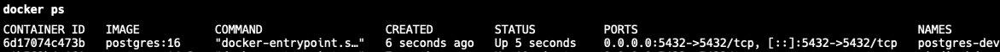
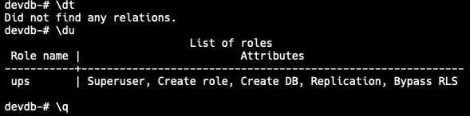
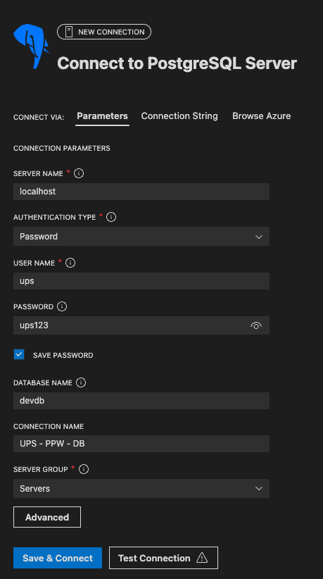
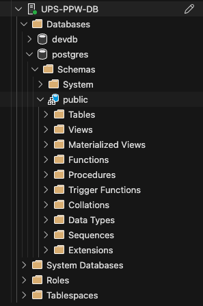
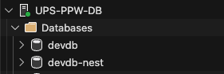

# Programación y Plataformas Web

# Instalación de PostgreSQL mediante Docker y Configuración para Entornos de Desarrollo

<div align="center">
  
  
</div>

## Guía Complementaria 05-B: Instalación y configuración de PostgreSQL con Docker

### Autores

**Pablo Torres**

 📧 [ptorresp@ups.edu.ec](mailto:ptorresp@ups.edu.ec)

 💻 GitHub: PabloT18

---

# Introducción

A partir de la práctica 05, los proyectos Spring Boot y NestJS necesitan conectarse a una **base de datos real**.
PostgreSQL es el motor recomendado por su:

* rendimiento
* estabilidad
* soporte avanzado para tipos
* amplia adopción en la industria
* compatibilidad con Hibernate/JPA y TypeORM

En entornos de desarrollo, la forma más práctica y reproducible de ejecutar PostgreSQL es mediante **Docker**, evitando instalaciones manuales del motor en el sistema operativo.

Este documento explica:

* qué es un contenedor de base de datos
* cómo preparar una base PostgreSQL lista para Spring/Nest
* cómo crear y persistir datos mediante volúmenes
* cómo inspeccionar y administrar la base
* cómo preparar un ambiente estándar para todos los estudiantes

La configuración final funcionará tanto para:

* `spring-boot/05_repositorios_bd.md`
* `nest/05_repositorios_bd.md`


# 1. ¿Por qué usar Docker para PostgreSQL?

Ventajas principales:

### **1. Entorno limpio y reproducible**

No depende del sistema operativo. El mismo contenedor funciona igual en Windows, macOS y Linux.

### **2. Aislamiento**

El motor de base de datos no interfiere con instalaciones existentes.

### **3. Eliminación rápida**

Al finalizar un curso o proyecto, el contenedor puede eliminarse sin dejar rastros.

### **4. Volúmenes persistentes**

Los datos sobreviven aunque el contenedor se reinicie o se elimine.

### **5. Facilidad de creación**

Un solo archivo o comando levanta todo el ambiente.


# 2. Requisitos previos

* Docker comands line instalado
  [https://www.docker.com/products/docker-desktop](https://www.docker.com)

* Conexión estable a Internet (solo para descargar la imagen inicial)

* Terminal habilitada (cmd, PowerShell, Bash, zsh, etc.)


# 3. Creación del volumen persistente

Para garantizar que los datos de PostgreSQL permanezcan disponibles aunque el contenedor se elimine, se utiliza un volumen.

Se crea el volumen:

```bash
docker volume create pgdata
```

Verificar que existe:

```bash
docker volume ls
```


# 4. Crear y ejecutar el contenedor PostgreSQL


## 4.1 Descargar la imagen oficial de PostgreSQL

```bash
docker pull postgres:16
```

Verificar que la imagen está disponible localmente:

```bash
docker images
```

Debe aparecer postgres 16.

## 4.2 Crear y levantar el contenedor

Se levanta un contenedor PostgreSQL configurado para desarrollo local:

```bash
docker run -d \
  --name postgres-dev \
  -e POSTGRES_USER=ups \
  -e POSTGRES_PASSWORD=ups123 \
  -e POSTGRES_DB=devdb \
  -p 5432:5432 \
  -v pgdata:/var/lib/postgresql/data \
  postgres:16
```

Verificar que el contenedor está corriendo:
```bash
docker ps
```


### Parámetros explicados:

| Parámetro                            | Descripción                             |
| ------------------------------------ | --------------------------------------- |
| `--name postgres-dev`                | Nombre del contenedor                   |
| `POSTGRES_USER`                      | Usuario administrador                   |
| `POSTGRES_PASSWORD`                  | Contraseña                              |
| `POSTGRES_DB`                        | Base inicial creada automáticamente     |
| `-p 5432:5432`                       | Expone el puerto para Spring/Nest       |
| `-v pgdata:/var/lib/postgresql/data` | Persistencia de datos                   |
| `postgres:16`                        | Imagen oficial de PostgreSQL versión 16 |


# 5. Verificar estado del servidor

Consultar contenedores en ejecución:

```bash
docker ps
```

La salida debe mostrar:

```
postgres-dev  ...   0.0.0.0:5432->5432/tcp
```


# 6. Acceder a PostgreSQL desde la terminal

Ejecutar la herramienta `psql` dentro del contenedor:

```bash
docker exec -it postgres-dev psql -U ups -d devdb
```

Dentro de `psql`, comandos útiles:

```sql
\dt         -- listar tablas
\du         -- listar usuarios
\q          -- salir
```


# 7. Crear bases de datos adicionales en el mismo contenedor

Un contenedor PostgreSQL puede alojar múltiples bases de datos. Esto es útil para:

* Separar datos de Spring Boot y NestJS
* Aislar ambientes de prueba
* Organizar proyectos diferentes

## 7.1. Crear base adicional en contenedor existente

Si ya tienes el contenedor `postgres-dev` corriendo, puedes crear una nueva base de datos:

### Usando psql desde el contenedor:

```bash
docker exec -it postgres-dev psql -U ups -d devdb -c "CREATE DATABASE \"devdb-nest\";"
```

### O conectándote interactivamente:

```bash
docker exec -it postgres-dev psql -U ups -d devdb
```

Dentro de `psql`:
```sql
CREATE DATABASE "devdb-nest";
\l              -- listar todas lasdocker exec -it postgres-dev psql -U ups -d devdb -c "CREATE DATABASE \"devdb-nest\";" bases
\c devdb-nest   -- conectarse a la nueva base
\q              -- salir
```


## 7.2. Verificar las bases de datos creadas

Listar todas las bases:

```bash
docker exec -it postgres-dev psql -U ups -c "\l"
```

Salida esperada:
```
                                                List of databases
    Name     | Owner | Encoding | Locale Provider |  Collate   |   Ctype    | ICU Locale | Access privileges 
-------------+-------+----------+-----------------+------------+------------+------------+-------------------
 devdb       | ups   | UTF8     | libc            | en_US.utf8 | en_US.utf8 |            | 
 devdb-nest  | ups   | UTF8     | libc            | en_US.utf8 | en_US.utf8 |            | 
 postgres    | ups   | UTF8     | libc            | en_US.utf8 | en_US.utf8 |            | 
 template0   | ups   | UTF8     | libc            | en_US.utf8 | en_US.utf8 |            | =c/ups           +
             |       |          |                 |            |            |            | ups=CTc/ups
 template1   | ups   | UTF8     | libc            | en_US.utf8 | en_US.utf8 |            | =c/ups           +
             |       |          |                 |            |            |            | ups=CTc/ups
```


# 8. Conexión desde un cliente gráfico

Puede usarse:

* DBeaver
* TablePlus
* PgAdmin
* DataGrip
* Extensión de VSCode "PostgreSQL" (Recomendado)
  https://marketplace.visualstudio.com/items?itemName=ms-ossdata.vscode-pgsql

## Parámetros para conexión a Spring Boot:

| Parámetro  | Valor     |
| ---------- | --------- |
| Host       | localhost |
| Puerto     | 5432      |
| Usuario    | ups       |
| Contraseña | ups123    |
| Base       | devdb     |

## Parámetros para conexión a NestJS:

| Parámetro  | Valor      |
| ---------- | ---------- |
| Host       | localhost  |
| Puerto     | 5432       |
| Usuario    | ups        |
| Contraseña | ups123     |
| Base       | devdb-nest |



Con esto se puede inspeccionar la base, crear tablas, insertar datos y ejecutar consultas SQL directamente.



# 8. Gestión del ciclo de vida del contenedor

## 8.1. Verificar el estado del contenedor

Ver todos los contenedores (activos e inactivos):

```bash
docker ps -a
```

Ver solo contenedores activos:

```bash
docker ps
```

## 8.2. Iniciar un contenedor detenido

Si el contenedor aparece como `Exited` o `STATUS = Exited (0)`:

```bash
docker start postgres-dev
```

Verificar que está corriendo:

```bash
docker ps
```

Debe mostrar `STATUS = Up X seconds/minutes`

## 8.3. Detener el contenedor

```bash
docker stop postgres-dev
```

## 8.4. Reiniciar el contenedor

```bash
docker restart postgres-dev
```

## 8.5. Ver logs del contenedor

Para diagnosticar problemas:

```bash
docker logs postgres-dev
```

Ver logs en tiempo real:

```bash
docker logs -f postgres-dev
```

## 8.6. Eliminar el contenedor

Eliminar contenedor (los datos NO se pierden si usaste volumen):

```bash
docker rm postgres-dev
```

⚠️ **Importante**: Si tienes el volumen `pgdata`, los datos persisten aunque elimines el contenedor.

## 8.7. Eliminar datos completamente

Si se desea eliminar también los datos del volumen:

```bash
docker volume rm pgdata
```

⚠️ **PELIGRO**: Esto elimina permanentemente todos los datos de las bases de datos.


# 9. Preparación para integración con Spring Boot y NestJS

Las aplicaciones backend deben utilizar estos parámetros:

## Spring Boot (Java)

| Campo         | Valor     |
| ------------- | --------- |
| host          | localhost |
| puerto        | 5432      |
| usuario       | ups       |
| contraseña    | ups123    |
| base de datos | devdb     |

**Configuración en `application.yml`:**
```yaml
spring:
  datasource:
    url: jdbc:postgresql://localhost:5432/devdb
    username: ups
    password: ups123
```

## NestJS (TypeScript)

| Campo         | Valor      |
| ------------- | ---------- |
| host          | localhost  |
| puerto        | 5432       |
| usuario       | ups        |
| contraseña    | ups123     |
| base de datos | devdb-nest |

**Configuración en `app.module.ts`:**
```typescript
TypeOrmModule.forRoot({
  type: 'postgres',
  host: 'localhost',
  port: 5432,
  username: 'ups',
  password: 'ups123',
  database: 'devdb-nest',
  // ...
})
```

### ¿Por qué separar las bases de datos?

* **Aislamiento**: Los datos de cada framework no se mezclan
* **Testing**: Facilita pruebas independientes
* **Limpieza**: Spring Boot y NestJS pueden usar `synchronize: true` sin conflictos
* **Aprendizaje**: Se comprende mejor la gestión de múltiples bases

Estos parámetros se usarán en:

✔ `application.yml` (Spring Boot)
✔ `TypeOrmModule.forRoot()` (NestJS)

Además, los repositorios de ambos frameworks requieren:

* entidades persistentes (`@Entity`)
* adaptadores ORM (JPA / TypeORM)
* operaciones CRUD mapeadas a la base
* definiciones de relaciones (en temas posteriores)




# 10. Resultados esperados

Al finalizar este documento, el estudiante debe:

* comprender qué es un contenedor de base de datos
* crear un servidor PostgreSQL con datos persistentes
* inspeccionar y administrar el motor con Docker
* conectarse al motor mediante herramientas externas
* preparar el entorno para los próximos temas de integración con ORM

Este contenido sirve como prerequisito directo para:

* `spring-boot/05_repositorios_bd.md`
* `nest/05_repositorios_bd.md`


---

# 11. Solución de problemas comunes

## Error: "container is not running"

**Problema:**
```bash
Error response from daemon: container [...] is not running
```

**Solución:**
El contenedor está detenido. Iniciarlo:
```bash
docker start postgres-dev
```

## Error: "port 5432 is already allocated"

**Problema:**
```bash
Error: Bind for 0.0.0.0:5432 failed: port is already allocated
```

**Causa:** Ya existe otro servicio usando el puerto 5432 (otro PostgreSQL, otro contenedor, etc.)

**Solución 1:** Detener el otro servicio o contenedor
```bash
# Ver qué contenedores están usando el puerto
docker ps

# Detener el otro contenedor PostgreSQL
docker stop <nombre-otro-contenedor>
```

**Solución 2:** Usar un puerto diferente
```bash
docker run -d \
  --name postgres-dev \
  -e POSTGRES_USER=ups \
  -e POSTGRES_PASSWORD=ups123 \
  -e POSTGRES_DB=devdb \
  -p 5433:5432 \
  -v pgdata:/var/lib/postgresql/data \
  postgres:16
```
> Nota: Cambia `5433` por cualquier puerto disponible. Luego conecta usando `localhost:5433`

## Error: "database does not exist"

**Problema:**
```bash
FATAL: database "devdb-nest" does not exist
```

**Solución:**
Crear la base de datos:
```bash
# Asegurarse que el contenedor está corriendo
docker start postgres-dev

# Crear la base de datos
docker exec -it postgres-dev psql -U ups -d postgres -c "CREATE DATABASE \"devdb-nest\";"
```

> Nota: Usamos `-d postgres` porque siempre existe la base `postgres` por defecto

## Verificar bases de datos existentes

```bash
docker exec -it postgres-dev psql -U ups -c "\l"
```

## Contenedor no inicia correctamente

Ver los logs para diagnosticar:
```bash
docker logs postgres-dev
```

## Resetear completamente (eliminar todo)

Si quieres empezar de cero:

```bash
# 1. Detener y eliminar contenedor
docker stop postgres-dev
docker rm postgres-dev

# 2. Eliminar volumen (ELIMINA TODOS LOS DATOS)
docker volume rm pgdata

# 3. Crear volumen nuevo
docker volume create pgdata

# 4. Levantar contenedor nuevamente
docker run -d \
  --name postgres-dev \
  -e POSTGRES_USER=ups \
  -e POSTGRES_PASSWORD=ups123 \
  -e POSTGRES_DB=devdb \
  -p 5432:5432 \
  -v pgdata:/var/lib/postgresql/data \
  postgres:16

# 5. Crear la base para NestJS
docker exec -it postgres-dev psql -U ups -d postgres -c "CREATE DATABASE \"devdb-nest\";"
```
