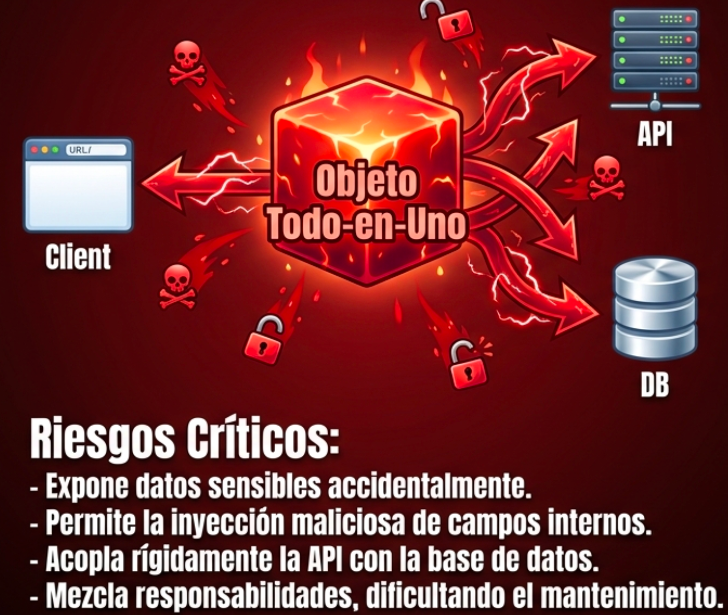

# Programación y Plataformas Web

# Frameworks Backend: Modelos, DTOs, Mappers y Validaciones

<div align="center">
  
  
</div>

## Práctica 6: Modelos, DTOs, Mappers y Validaciones

### Autores

**Pablo Torres**

[ptorresp@ups.edu.ec](mailto:ptorresp@ups.edu.ec)

GitHub: [PabloT18](https://github.com/PabloT18)

---

# Introducción

En los temas anteriores se construyó la base de una aplicación backend organizada por capas.

Hasta este punto se ha trabajado con:

* controladores
* servicios
* modelos
* DTOs
* mappers
* repositorios
* entidades persistentes
* base de datos

Sin embargo, para que una API backend sea mantenible y segura, no basta con recibir datos y guardarlos directamente.

Es necesario diferenciar claramente:

* qué datos entran por la API
* qué objeto usa la lógica de negocio
* qué estructura se guarda en la base de datos
* qué datos se devuelven al cliente
* qué reglas deben validarse antes de procesar la información


---

# 1. Problema inicial

En una aplicación pequeña puede parecer suficiente usar un solo objeto para todo.

Ejemplo:

```txt
User
```

Y usarlo para:

* recibir datos desde la API
* aplicar lógica de negocio
* guardar en base de datos
* devolver la respuesta al cliente

Aunque esto parece simple, genera problemas.

## 1.1 Problemas de usar un solo objeto

Si se usa el mismo objeto para todo, pueden ocurrir errores como:

* exponer datos sensibles
* recibir campos que el cliente no debería enviar
* guardar datos sin validación
* acoplar la API con la base de datos
* hacer difícil cambiar la estructura interna
* mezclar responsabilidades
* dificultar pruebas y mantenimiento





Ejemplo no recomendado:

```json
{
  "id": 1,
  "name": "Ana",
  "email": "ana@example.com",
  "password": "123456",
  "passwordHash": "$2a$10...",
  "createdAt": "2026-06-20T10:00:00Z",
  "internalStatus": "ACTIVE"
}
```

El cliente no debería recibir:

```txt
password
passwordHash
internalStatus
```

Tampoco debería poder enviar libremente campos internos como:

```txt
id
createdAt
updatedAt
role
status
```

Por eso se separan DTOs, modelos y entidades.

---

# 2. Separación de objetos por responsabilidad

Una arquitectura backend ordenada diferencia los objetos según su propósito.

| Elemento   | Responsabilidad                                           |
| ---------- | --------------------------------------------------------- |
| DTO        | Representa datos que entran o salen por la API            |
| Model      | Representa el concepto de negocio dentro del sistema      |
| Entity     | Representa la estructura persistente en base de datos     |
| Mapper     | Convierte datos entre DTO, Model y Entity                 |
| Validation | Verifica que los datos cumplan reglas antes de procesarse |


# 3. DTO

## 3.1 ¿Qué es un DTO?

DTO significa **Data Transfer Object**.

Un DTO es un objeto usado para transportar datos entre el cliente y el backend.

Su función principal es definir la forma de los datos que:

* entran por una petición
* salen como respuesta
* se validan antes de llegar a la lógica de negocio

Un DTO no representa una tabla de base de datos.

Un DTO no debería contener lógica de negocio compleja.

Un DTO define un contrato de comunicación.

---

## 3.2 DTO de entrada

Un DTO de entrada define qué datos puede enviar el cliente.

Ejemplo para crear un usuario:

```txt
CreateUserDto
```

Campos permitidos:

```txt
name
email
password
```

Ejemplo JSON:

```json
{
  "name": "Ana Torres",
  "email": "ana@example.com",
  "password": "12345678"
}
```

El cliente no debería enviar:

```txt
id
createdAt
updatedAt
passwordHash
```

Porque esos datos deben ser generados por el backend o por la base de datos.

---

## 3.3 DTO de actualización

Un DTO de actualización define qué datos pueden modificarse.

Ejemplo:

```txt
UpdateUserDto
```

Campos permitidos:

```txt
name
email
password
```

En una actualización parcial, algunos campos pueden ser opcionales.

Ejemplo JSON:

```json
{
  "name": "Ana María Torres"
}
```

---

## 3.4 DTO de salida

Un DTO de salida define qué datos se devuelven al cliente.

Ejemplo:

```txt
UserResponseDto
```

Campos permitidos:

```txt
id
name
email
status
```

Ejemplo JSON:

```json
{
  "id": 1,
  "name": "Ana Torres",
  "email": "ana@example.com",
  "status": "ACTIVE"
}
```

El DTO de salida evita exponer datos sensibles.

No debería devolver:

```txt
password
passwordHash
tokens internos
deletedAt
```

---

## 3.5 Ubicación del DTO

El DTO pertenece principalmente a la capa de presentación o capa API.

Se usa cerca del controlador porque representa lo que entra y sale por HTTP.

Ubicación conceptual:

```txt
Cliente
  ↓
DTO
  ↓
Controller
```

En una estructura modular, los DTOs del recurso `users` deberían estar dentro del módulo `users`.

Ejemplo:

```txt
users/
└── dto/
    ├── CreateUserDto
    ├── UpdateUserDto
    └── UserResponseDto
```

---

# 4. Modelo de dominio

## 4.1 ¿Qué es un modelo?

Un modelo de dominio representa un concepto del negocio dentro de la aplicación.

No representa directamente la petición HTTP.

No representa directamente una tabla de base de datos.

Su función es permitir que el servicio trabaje con un objeto propio de la lógica de negocio.

Ejemplo:

```txt
UserModel
```

El `UserModel` puede representar al usuario dentro del sistema, independientemente de cómo llegó desde la API o cómo será guardado en la base de datos.

---

## 4.2 Por qué usar modelos

El modelo permite desacoplar la lógica de negocio de:

* el formato de la API
* la estructura de la base de datos
* las anotaciones del ORM
* las reglas de serialización
* los campos internos de persistencia

Esto permite que el servicio trabaje con objetos más limpios.

Ejemplo conceptual:

```txt
CreateUserDto -> UserModel -> UserEntity
```

El servicio debería razonar sobre usuarios, no sobre JSON ni columnas de base de datos.

---

## 4.3 Qué contiene un modelo

Un modelo puede contener:

* identificador
* datos principales del recurso
* estado de negocio
* valores calculados
* datos necesarios para reglas internas

Ejemplo conceptual:

```txt
UserModel
  - id
  - name
  - email
  - password
  - passwordHash
  - status
```

El modelo puede tener datos temporales usados durante el flujo de negocio.

Ejemplo:

```txt
password
```

Puede existir en el modelo antes de generar:

```txt
passwordHash
```

Luego el mapper puede convertir el modelo hacia la entidad persistente.

---

## 4.4 Ubicación del modelo

El modelo pertenece a la capa de negocio o dominio.

En una estructura modular:

```txt
users/
└── model/
    └── UserModel
```

También puede llamarse:

```txt
users/
└── models/
    └── UserModel
```

La decisión depende de la convención del proyecto.

Para este curso se recomienda usar singular:

```txt
model/
```

---

# 5. Entidad persistente

## 5.1 ¿Qué es una entidad?

Una entidad persistente representa la estructura que será guardada en la base de datos.

A diferencia del modelo, la entidad sí está relacionada directamente con la persistencia.

Una entidad puede representar:

* una tabla
* una colección
* columnas
* relaciones
* claves primarias
* restricciones
* metadatos del ORM

Ejemplo:

```txt
UserEntity
```

Tabla asociada:

```txt
users
```

Columnas:

```txt
id
name
email
password_hash
status
created_at
updated_at
```

---


## 5.2 Ubicación de la entidad

La entidad pertenece a la capa de persistencia.

En una estructura modular:

```txt
users/
└── entity/
    └── UserEntity
```

También puede usarse:

```txt
users/
└── entities/
    └── UserEntity
```

Para este curso se recomienda usar singular:

```txt
entity/
```

---

# 6. Mapper

## 6.1 ¿Qué es un mapper?

Un mapper es un componente encargado de transformar objetos entre capas.

Convierte:

```txt
DTO -> Model
Model -> Entity
Entity -> Model
Model -> DTO
```

Su objetivo es evitar que el controlador o el servicio tengan muchas conversiones manuales.

---

## 6.2 Por qué usar mappers

Los mappers ayudan a:

* centralizar conversiones
* evitar duplicación de código
* proteger datos sensibles
* separar API, negocio y persistencia
* mantener servicios más limpios
* facilitar cambios futuros

Sin mapper, el servicio puede llenarse de código repetitivo como:

```txt
crear objeto
copiar campo por campo
ocultar password
renombrar propiedades
adaptar nombres entre DTO y Entity
```

Con mapper, esa lógica queda aislada.

---
# 7. Validaciones

## 7.1 ¿Qué es validar?

Validar significa comprobar que los datos recibidos cumplen las reglas esperadas antes de procesarlos.

Una validación evita que datos incorrectos, incompletos o inseguros lleguen a la lógica de negocio o a la base de datos.

Ejemplo:

```txt
El email no puede estar vacío.
El password debe tener mínimo 8 caracteres.
El nombre no puede superar 80 caracteres.
```

---

## 7.2 Validaciones de formato

Las validaciones de formato revisan que un dato tenga la estructura correcta.

Ejemplos:

```txt
email válido
longitud mínima
longitud máxima
campo obligatorio
número positivo
fecha válida
```

Ejemplo:

```json
{
  "name": "",
  "email": "correo-invalido",
  "password": "123"
}
```

Errores esperados:

```txt
name es obligatorio
email debe tener formato válido
password debe tener mínimo 8 caracteres
```

Estas validaciones suelen ubicarse en los DTOs.

---

## 7.3 Validaciones de negocio

Las validaciones de negocio dependen de las reglas del sistema.

Ejemplos:

```txt
El correo no debe estar registrado previamente.
El usuario debe estar activo para iniciar sesión.
El stock debe ser mayor que la cantidad solicitada.
Un estudiante no puede matricularse dos veces en el mismo curso.
```

Estas validaciones no deberían estar en el DTO.

Deben ubicarse en el servicio.

---

## 7.4 Diferencia entre validación de formato y validación de negocio

| Tipo de validación | Ubicación recomendada | Ejemplo                                          |
| ------------------ | --------------------- | ------------------------------------------------ |
| Formato            | DTO                   | Email válido, campo obligatorio, longitud mínima |
| Negocio            | Service               | Email único, stock suficiente, usuario activo    |
| Persistencia       | Entity / Database     | Clave única, relación obligatoria, foreign key   |

---

## 7.5 Validaciones de persistencia

Las validaciones de persistencia son reglas relacionadas con la base de datos.

Ejemplos:

```txt
email único
id obligatorio
relación obligatoria
campo no nulo
restricción de longitud
clave foránea válida
```

Estas reglas pueden definirse en:

* entidad
* migraciones
* base de datos
* ORM

No reemplazan las validaciones del DTO ni del servicio.

Sirven como una última barrera de consistencia.

---

# 8. Validación por capas

Cada capa valida un tipo diferente de regla.

```txt
DTO
  ↓ valida formato
Controller
  ↓ recibe datos válidos
Service
  ↓ valida reglas de negocio
Repository
  ↓ envía entidad
Database
  ↓ valida restricciones
```

Ejemplo para crear usuario:

```txt
CreateUserDto:
- name obligatorio
- email válido
- password mínimo 8 caracteres

UserService:
- verificar que email no exista
- generar passwordHash
- asignar estado ACTIVE

UserEntity / Database:
- email único
- passwordHash no nulo
- createdAt automático
```

---

# 9. Nombres recomendados para el recurso users

Para el recurso `users`, se recomienda usar los siguientes nombres:

| Tipo                 | Nombre            |
| -------------------- | ----------------- |
| DTO de creación      | `CreateUserDto`   |
| DTO de actualización | `UpdateUserDto`   |
| DTO de respuesta     | `UserResponseDto` |
| Modelo               | `UserModel`       |
| Entidad              | `UserEntity`      |
| Mapper               | `UserMapper`      |
| Repositorio          | `UserRepository`  |
| Servicio             | `UserService`     |
| Controlador          | `UserController`  |

En NestJS, los archivos pueden nombrarse así:

```txt
create-user.dto.ts
update-user.dto.ts
user-response.dto.ts
user.model.ts
user.entity.ts
user.mapper.ts
users.repository.ts
users.service.ts
users.controller.ts
users.module.ts
```

En Spring Boot:

```txt
CreateUserDto.java
UpdateUserDto.java
UserResponseDto.java
UserModel.java
UserEntity.java
UserMapper.java
UserRepository.java
UserService.java
UserServiceImpl.java
UserController.java
```

---

# 10. Ejemplo conceptual de creación de usuario

## 10.1 Entrada

```json
{
  "name": "Ana Torres",
  "email": "ana@example.com",
  "password": "12345678"
}
```

---

## 10.2 DTO de entrada

```txt
CreateUserDto
  - name
  - email
  - password
```

Responsabilidad:

```txt
Definir qué datos acepta la API.
```

---

## 10.3 Modelo

```txt
UserModel
  - id
  - name
  - email
  - password
  - passwordHash
  - status
```

Responsabilidad:

```txt
Representar al usuario dentro de la lógica de negocio.
```

---

## 10.4 Entidad

```txt
UserEntity
  - id
  - name
  - email
  - passwordHash
  - status
  - createdAt
  - updatedAt
```

Responsabilidad:

```txt
Representar cómo se guarda el usuario en la base de datos.
```

---

## 10.5 DTO de salida

```txt
UserResponseDto
  - id
  - name
  - email
  - status
```

Responsabilidad:

```txt
Definir qué datos se devuelven al cliente.
```

