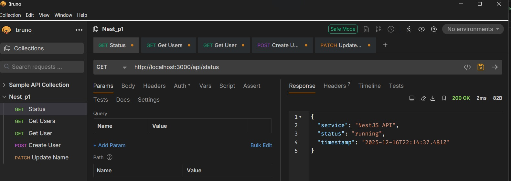
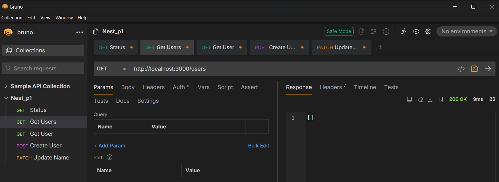
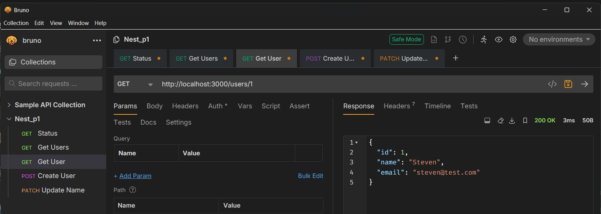
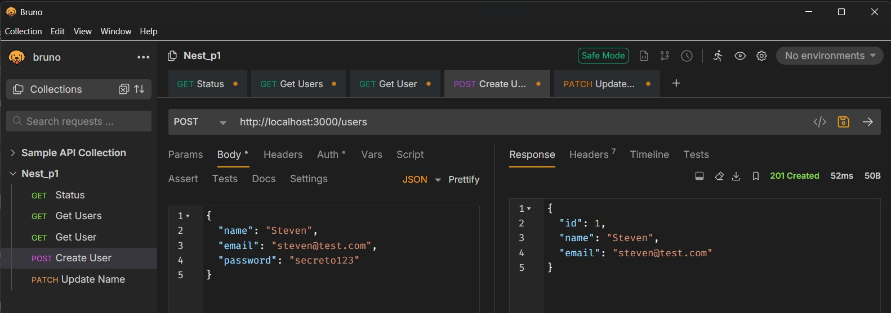
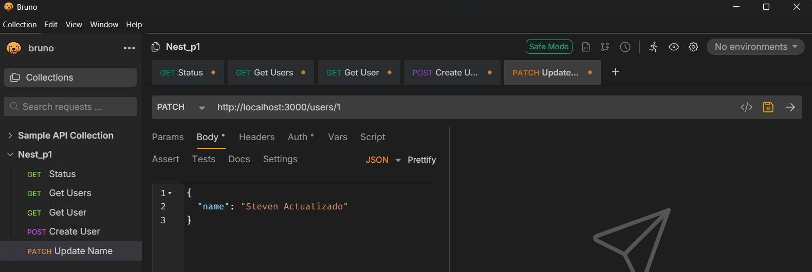
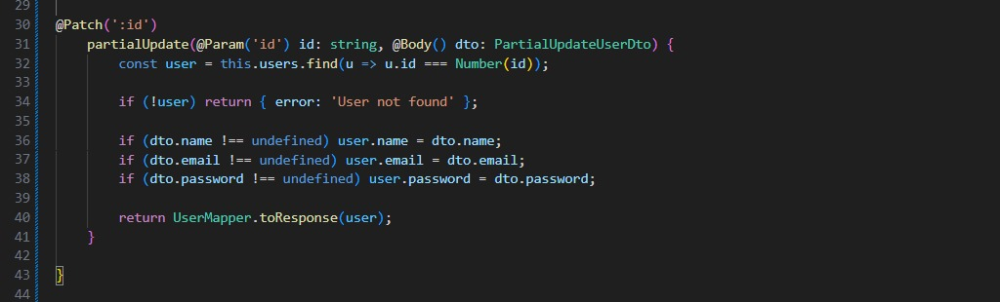

# Programación y Plataformas Web

## Frameworks Backend: NestJS – API REST y CRUD Inicial

<div align="center">
  
</div>

---

# Práctica 3 (NestJS): Construcción de una API REST usando controladores, DTOs, modelos y mappers

### Autores

**Pablo Torres**
📧 [ptorresp@ups.edu.ec](mailto:ptorresp@ups.edu.ec)
💻 GitHub: PabloT18

---

# 1. Introducción

En esta práctica se desarrolla un **CRUD REST completo** utilizando únicamente:

* controladores
* modelos
* DTOs
* mappers
* un arreglo en memoria como almacenamiento temporal

Aún **no** se utilizan:

* servicios (van en el tema 05)
* pipes de validación (tema 06)
* base de datos (tema 07)

El objetivo de este tema es comprender:

* cómo se estructuran los endpoints REST dentro de NestJS
* cómo se reciben datos mediante DTOs
* cómo se devuelve información usando DTOs de respuesta
* cómo un controlador puede administrar un CRUD básico antes de usar servicios

El módulo de ejemplo será **users/**.
En la parte práctica se replica todo para **products/**.

---

# 2. Estructura que se utilizará

Dentro de:

```
src/users/
```

se deben tener únicamente estas carpetas para este tema:

```
users/
 ├── controllers/
 ├── dtos/
 ├── entities/
 ├── mappers/
 └── users.module.ts   (ya creado en el tema anterior)
```

---

# 3. Modelo de dominio (Entidad sin base de datos)

En:

`src/users/entities/user.entity.ts`

Aquí se define la estructura interna del usuario, incluyendo campos que **no** se enviarán al cliente.

```ts
export class User {
  id: number;
  name: string;
  email: string;
  password: string; // campo interno, no se expone
  createdAt: Date;

  constructor(id: number, name: string, email: string, password: string) {
    this.id = id;
    this.name = name;
    this.email = email;
    this.password = password; 
    this.createdAt = new Date();
  }
}
```

---

# 4. DTOs de entrada (Request DTOs)

Los DTOs controlan **qué se recibe** desde el cliente.

---

## 4.1. DTO para crear un usuario

`src/users/dtos/create-user.dto.ts`

```ts
export class CreateUserDto {
  name: string;
  email: string;
}
```

---

## 4.2. DTO para actualizar completamente (PUT)

`src/users/dtos/update-user.dto.ts`

```ts
export class UpdateUserDto {
  name: string;
  email: string;
}
```

---

## 4.3. DTO para actualización parcial (PATCH)

`src/users/dtos/partial-update-user.dto.ts`

```ts
export class PartialUpdateUserDto {
  name?: string;
  email?: string;
}
```

---

# 5. DTO de salida (Response DTO)

Este DTO controla **qué campos se devuelven al cliente**.

`src/users/dtos/user-response.dto.ts`

```ts
export class UserResponseDto {
  id: number;
  name: string;
  email: string;
}
```

Note que este DTO **no** incluye `createdAt`.

---

# 6. Mapper para transformar Entidad ↔ DTO

En:

`src/users/mappers/user.mapper.ts`

Aquí se define la conversión entre:

* DTO → Entidad
* Entidad → DTO

```ts
export class UserMapper {
  static toEntity(id: number, dto: any) {
    return new User(id, dto.name, dto.email);
  }

  static toResponse(entity: User) {
    return {
      id: entity.id,
      name: entity.name,
      email: entity.email,
    };
  }
}
```

---

# 7. Controlador con CRUD completo

Ahora se construyen los endpoints REST.

Archivo:

`src/users/controllers/users.controller.ts`

```ts
import { Controller, Get, Post, Put, Patch, Delete, Param, Body } from '@nestjs/common';

@Controller('api/users')
export class UsersController {
  private users = [];
  private currentId = 1;

  @Get()
  findAll() {
    return this.users.map(u => UserMapper.toResponse(u));
  }

  @Get(':id')
  findOne(@Param('id') id: string) {
    const user = this.users.find(u => u.id === Number(id));
    if (!user) return { error: 'User not found' };

    return UserMapper.toResponse(user);
  }

  @Post()
  create(@Body() dto: CreateUserDto) {
    const entity = UserMapper.toEntity(this.currentId++, dto);
    this.users.push(entity);
    return UserMapper.toResponse(entity);
  }

c

  @Patch(':id')
  partialUpdate(@Param('id') id: string, @Body() dto: PartialUpdateUserDto) {
    const user = this.users.find(u => u.id === Number(id));
    if (!user) return { error: 'User not found' };

    if (dto.name !== undefined) user.name = dto.name;
    if (dto.email !== undefined) user.email = dto.email;

    return UserMapper.toResponse(user);
  }

  @Delete(':id')
  remove(@Param('id') id: string) {
    const exists = this.users.some(u => u.id === Number(id));
    if (!exists) return { error: 'User not found' };

    this.users = this.users.filter(u => u.id !== Number(id));
    return { message: 'Deleted successfully' };
  }
}
```

---

# 8. Endpoints disponibles

| Método | Ruta             | Descripción                |
| ------ | ---------------- | -------------------------- |
| GET    | `/api/users`     | Lista usuarios             |
| GET    | `/api/users/:id` | Obtiene un usuario         |
| POST   | `/api/users`     | Crea usuario               |
| PUT    | `/api/users/:id` | Reemplaza usuario completo |
| PATCH  | `/api/users/:id` | Actualiza parcialmente     |
| DELETE | `/api/users/:id` | Elimina usuario            |

---

# 9. Actividad práctica

En esta práctica se:

1. Construye el CRUD completo para `users/`
2. Se verifica que el controlador funciona sin servicios ni base de datos
3. Se replica toda la estructura para el dominio:

```
products/
```

El módulo `products/` debe contener:

```
products/
 ├── controllers/
 ├── dtos/
 ├── entities/
 ├── mappers/
 └── products.module.ts
```

Y su controlador debe incluir **los mismos endpoints REST** que `users/`.

---

# 10. Resultados y evidencias

Cada estudiante debe agregar en su archivo:

### ✔ 1. Captura del consumo de cada endpoint de Products:

* GET /api/products
* GET /api/products/:id
* POST /api/products
* PUT /api/products/:id
* PATCH /api/products/:id
* DELETE /api/products/:id


Bruno:

 


 


 


 


 


### ✔ 2. Captura del archivo `products.controller.ts`

Debe visualizarse la estructura completa en el IDE.

 

 


### ✔ 3. Explicación breve

Debe incluir:

* por qué se usa DTO de entrada y DTO de salida

Se implementan dos tipos de DTOs para aplicar el principio de Separación de Responsabilidades:

DTO de Entrada (CreateUserDto): Actúa como un contrato estricto de validación. Asegura que los datos que envía el cliente (como email o password) cumplan con las reglas de negocio antes de tocar la lógica interna.

DTO de Salida (Response): Define exclusivamente qué datos se muestran al cliente, permitiendo ocultar información sensible o irrelevante sin afectar la estructura interna del sistema.


* por qué la entidad no debe devolverse a la API

La Entidad (Entity) representa la estructura fiel de la base de datos. Devolverla directamente es una mala práctica de seguridad y diseño porque:

Exposición de datos sensibles: Se podrían filtrar campos como password, salt o deletedAt.

Acoplamiento fuerte: Si se cambia el nombre de una columna en la base de datos, se rompería automáticamente la aplicación del frontend. La API debe ser independiente de cómo se guardan los datos.

* cómo funciona el mapper

El Mapper actúa como un traductor o adaptador entre la capa de persistencia (Entidad) y la capa de presentación (DTO).


