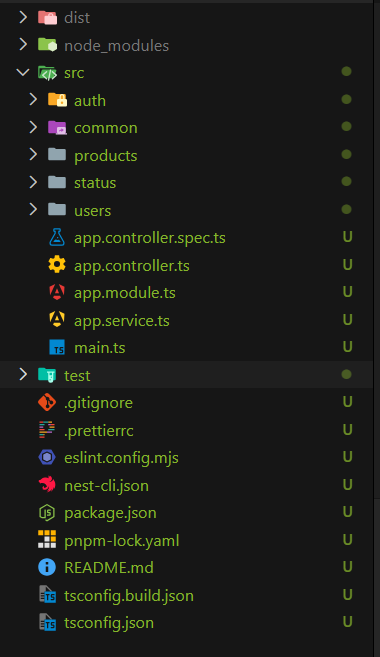
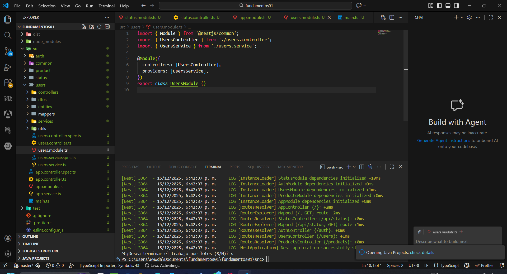
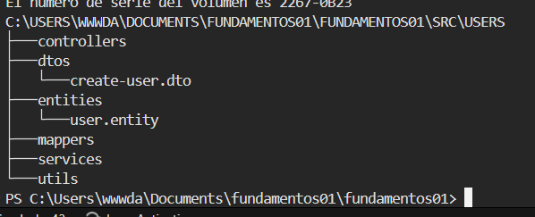

# Programación y Plataformas Web

# Frameworks Backend: NestJS – Estructura del Proyecto

<div align="center">
  
</div>

## Práctica 2 (NestJS): Arquitectura Interna, Organización del Proyecto y Estructura Modular

### Autores

**Pablo Torres**
📧 [ptorresp@ups.edu.ec](mailto:ptorresp@ups.edu.ec)
💻 GitHub: [PabloT18](https://github.com/PabloT18)

---

# 1. Introducción

En la práctica anterior se revisó cómo crear un proyecto NestJS y cómo definir un endpoint básico.
En esta práctica se estudiará cómo NestJS organiza internamente sus componentes, cómo funciona su arquitectura modular, qué elementos conforman un backend profesional y cómo estructurar el proyecto siguiendo buenas prácticas empresariales.

El objetivo es comprender:

* cómo se organiza un proyecto NestJS a nivel de carpetas
* cómo se relacionan módulos, controladores y servicios
* cómo funciona la inyección de dependencias
* cómo dividir la aplicación por dominios
* cómo estandarizar una arquitectura que permita escalar el sistema

NestJS está diseñado desde su núcleo para trabajar con:

* módulos
* controladores
* servicios
* proveedores
* pipes, filters, interceptors
* componentes reutilizables

Esto hace que la estructura del proyecto sea clara, mantenible y adecuada para proyectos grandes.

---

# 2. ¿Cómo organiza NestJS un proyecto?

NestJS sigue tres pilares fundamentales:

---

## **1. Arquitectura modular**

Todo en NestJS gira alrededor de módulos.

Un módulo:

* agrupa controladores, servicios y proveedores
* encapsula lógica por dominio
* puede ser importado por otros módulos
* permite mantener el proyecto ordenado

Ejemplo de módulo inicial:

```
AppModule → módulo raíz
StatusModule → módulo creado por el estudiante
UsersModule → módulo del dominio usuarios
ProductsModule → módulo del dominio productos
```

---

## **2. Decoradores**

NestJS utiliza decoradores para definir comportamientos:

| Decorador             | Función                         |
| --------------------- | ------------------------------- |
| `@Module()`           | Declara un módulo               |
| `@Controller()`       | Declara un controlador          |
| `@Get()`, `@Post()`   | Manejan rutas HTTP              |
| `@Injectable()`       | Declara un servicio o proveedor |
| `@Param()`, `@Body()` | Obtienen valores del request    |

Esta sintaxis permite un código limpio y expresivo.

---

## **3. Inyección de dependencias (DI)**

NestJS utiliza un contenedor de inyección de dependencias que:

* crea instancias de servicios
* administra el ciclo de vida de objetos
* permite reutilizar lógica en otros módulos
* ordena las responsabilidades de manera clara

Por ejemplo, un controlador solicita un servicio:

```ts
constructor(private readonly usersService: UsersService) {}
```

NestJS suministra automáticamente la instancia correcta.

---

# 3. Archivos esenciales de un proyecto NestJS

| Archivo             | Función                                                |
| ------------------- | ------------------------------------------------------ |
| `main.ts`           | Punto de entrada del servidor                          |
| `app.module.ts`     | Módulo raíz donde se registran los módulos principales |
| `app.controller.ts` | Controlador raíz                                       |
| `app.service.ts`    | Servicio raíz                                          |
| `nest-cli.json`     | Configuración del CLI                                  |
| `tsconfig.json`     | Configuración de TypeScript                            |
| `package.json`      | Dependencias del proyecto                              |

---

# 4. Estructura inicial generada por NestJS

```
src/
 ├── app.controller.ts
 ├── app.service.ts
 ├── app.module.ts
 ├── main.ts
test/
package.json
tsconfig.json
nest-cli.json
```

Esta estructura es funcional, pero insuficiente para un proyecto real.
En adelante se organizará el backend siguiendo una arquitectura modular por dominio.

---

# 5. Arquitectura MVCS aplicada en NestJS

NestJS implementa MVCS de forma natural:

| Capa          | Carpeta sugerida             |
| ------------- | ---------------------------- |
| Presentación  | `controllers/`               |
| Negocio       | `services/`                  |
| Dominio       | `entities/`                  |
| Persistencia  | (posterior) ORM/Repositorios |
| Comunicación  | `dtos/`                      |
| Configuración | `config/`                    |
| Utilidades    | `utils/`                     |

A diferencia de otros frameworks, NestJS NO distribuye estas carpetas de manera automática, sino que permite organizarlas dentro de **módulos por dominio**.

---

# 6. Estructura modular recomendada (proyecto grande)

Se recomienda organizar el proyecto por **dominios**, replicando la estructura de una aplicación real.

Estructura principal:

```
src/
 ├── config/
 ├── utils/
 ├── users/
 ├── products/
 ├── auth/
 └── app.module.ts
```

Cada dominio contiene:

```
users/
  ├── controllers/
  ├── services/
  ├── dtos/
  ├── entities/
  ├── mappers/
  ├── utils/
  └── users.module.ts
```

Esta arquitectura:

* facilita asignar módulos por grupos de estudiantes
* escala sin desorden
* permite que cada dominio crezca sin afectar otros
* imita la estructura de microservicios pero dentro de un monolito modular

---

# 7. Flujo interno de NestJS dentro de esta estructura

```
HTTP Request → Nest Runtime
        ↓
Module Resolver
        ↓
Controller (users/controllers)
        ↓
Service (users/services)
        ↓
Base de Datos (posterior)
        ↓
DTO o respuesta JSON
```

NestJS utiliza su motor interno para:

* encontrar el módulo correcto
* inyectar el servicio solicitado
* procesar decoradores
* manejar tuberías, filtros, interceptores

---

# 8. Actividad práctica del tema 02


## 1. Crear carpetas base para configuración y utilidades

**Estas carpetas NO tienen comandos CLI específicos, crear manualmente:**

```bash
# Desde la raíz del proyecto
mkdir src/config
mkdir src/utils
```

Estructura:
```
src/
  ├── config/     # Configuraciones globales (BD, env, etc.)
  ├── utils/      # Funciones auxiliares reutilizables
  └── app.module.ts
```

---

## 2. Generar módulos de dominio usando NestJS CLI

**Usar comandos oficiales de NestJS para generar módulos completos:**

**EN LA PRACTICA SE DEBEN CREAR 3 MÓDULOS: `users`, `products` y `auth`.**
**PARA  `users`, `products` VER COMANDOS DE  (3. Crear subcarpetas adicionales dentro de cada módulo)** 
**PARA `auth` SE MUESTRA COMPLETO A CONTINUACIÓN (VERISON ESTANDAR):**

### Generar módulo de Auth

```bash
# Generar el módulo
nest generate module auth

# Generar el controlador
nest generate controller auth

# Generar el servicio
nest generate service auth
```

**Forma abreviada:**
```bash
nest g mo auth     # module
nest g co auth     # controller
nest g s auth      # service
```

**Resultado automático:**
```
src/auth/
  ├── auth.controller.ts
  ├── auth.controller.spec.ts
  ├── auth.service.ts
  ├── auth.service.spec.ts
  └── auth.module.ts
```

```bash
# Desde src/users/
mkdir dtos
mkdir entities
mkdir mappers
mkdir utils
```
Estructura final de `auth/` versión estandar:
```auth/
  ├── controllers/
  ├── services/
  ├── dtos/           # ← Manual
  ├── entities/       # ← Manual
  ├── mappers/        # ← Manual
  ├── utils/          # ← Manual
  ├── auth.controller.ts
  ├── auth.controller.spec.ts
  ├── auth.service.ts
  ├── auth.service.spec.ts
  └── auth.module.ts
```

 **El CLI automáticamente**:
- Crea el módulo con la estructura correcta
- Registra el controller y service en `auth.module.ts`
- Importa el módulo en `app.module.ts`
- Añade decoradores necesarios


---

## 3. Crear subcarpetas adicionales dentro de cada módulo

**Las subcarpetas para DTOs, entities, mappers y utils NO tienen comandos CLI, crear manualmente:**

Crear perviamente los modulos `users` y `products` con los comandos CLI indicados anteriormente.

### Dentro del módulo `users/`, `products/`:


**Nota**: Se deria organizar en subcarpetas `controllers/` y `services/` si se generan múltiples controladores o servicios en el futuro.

```bash
# Opción con estructura más organizada
nest g mo users
mkdir src/users/controllers
mkdir src/users/services
mkdir src/users/dtos
mkdir src/users/entities
mkdir src/users/mappers
mkdir src/users/utils

# Luego generar componentes en sus carpetas
nest g co users/controllers/users --flat
nest g s users/services/users --flat
```

---

## 4. Verificar archivos generados automáticamente

### `users/users.controller.ts` (generado por CLI):

```ts
import { Controller } from '@nestjs/common';

@Controller('users')
export class UsersController {}
```

### `users/users.service.ts` (generado por CLI):

```ts
import { Injectable } from '@nestjs/common';

@Injectable()
export class UsersService {}
```

### `users/users.module.ts` (generado por CLI):

```ts
import { Module } from '@nestjs/common';
import { UsersController } from './users.controller';
import { UsersService } from './users.service';

@Module({
  controllers: [UsersController],
  providers: [UsersService],
})
export class UsersModule {}
```

### `app.module.ts` (actualizado automáticamente por CLI):

```ts
import { Module } from '@nestjs/common';
import { UsersModule } from './users/users.module';
import { ProductsModule } from './products/products.module';
import { AuthModule } from './auth/auth.module';

@Module({
  imports: [
    UsersModule,
    ProductsModule,
    AuthModule,
  ],
})
export class AppModule {}
```

---

## 5. Comandos adicionales útiles del CLI de NestJS (Los verás en el futuro, en las siguetes practicas)

### Generar otros componentes:

```bash
# Generar Guard (protección de rutas)
nest g guard auth/guards/jwt

# Generar Interceptor (transformar respuestas)
nest g interceptor common/interceptors/transform

# Generar Pipe (validación)
nest g pipe common/pipes/validation

# Generar Filter (manejo de errores)
nest g filter common/filters/http-exception

# Generar Middleware
nest g middleware common/middleware/logger

# Generar DTO (clase)
nest g class users/dtos/create-user.dto --no-spec

# Generar Entity (clase)
nest g class users/entities/user.entity --no-spec
```

### Ver ayuda del CLI:

```bash
nest --help
nest generate --help
```

---

## 6. Iniciar el servidor y verificar

```bash
# Modo desarrollo
pnpm start:dev

# o
npm run start:dev
```


---


---

## 8. Estructura final del proyecto

**Estructura resultante:**


###  Estructura organizada (con subcarpetas controllers/ y services/)

La organización deber qedar así:

`auth/` version estandar
`users/` y `products/` con subcarpetas

en subcarpetas, debes usar comandos específicos indicados anteriormente

**Estructura resultante**:

```
src/
  ├── config/
  ├── utils/
  ├── users/
  │   ├── controllers/           # ← Manual
  │   │   └── users.controller.ts # ← CLI: nest g co users/controllers/users --flat
  │   ├── services/              # ← Manual
  │   │   └── users.service.ts    # ← CLI: nest g s users/services/users --flat
  │   ├── dtos/                  # ← Manual
  │   ├── entities/              # ← Manual
  │   ├── mappers/               # ← Manual
  │   ├── utils/                 # ← Manual
  │   └── users.module.ts        # ← CLI
  ├── products/
  │   ├── controllers/
  │   │   └── products.controller.ts
  │   ├── services/
  │   │   └── products.service.ts
  │   ├── dtos/
  │   ├── entities/
  │   ├── mappers/
  │   ├── utils/
  │   └── products.module.ts
  ├── auth/                      # ← CLI: nest g mo auth
  │   ├── dtos/                  # ← Manual
  │   ├── entities/              # ← Manual
  │   ├── strategies/            # ← Manual
  │   ├── guards/                # ← Manual
  │   ├── auth.controller.ts     # ← CLI: nest g co auth (raíz del módulo)
  │   ├── auth.service.ts        # ← CLI: nest g s auth (raíz del módulo)
  │   └── auth.module.ts         # ← CLI
  ├── app.module.ts
  └── main.ts
```

⚠️ **Nota importante**: Si se usa subcarperas se debe actualizar las importaciones en los módulos:

```ts
// users/users.module.ts
import { Module } from '@nestjs/common';
import { UsersController } from './controllers/users.controller';  // ← Cambio de ruta
import { UsersService } from './services/users.service';            // ← Cambio de ruta

@Module({
  controllers: [UsersController],
  providers: [UsersService],
})
export class UsersModule {}
```


---

# 9. Resultados y Evidencias

Cada estudiante debe entregar:

---

### 1. Captura del IDE mostrando la estructura modular:

Debe visualizarse:

```
config/
utils/
users/
products/
auth/
```

---

### 2. Captura del archivo `users.module.ts`

Verificando que:

* controla el dominio
* contiene controller y service
* está bien configurado



---

### 3. Captura del árbol desde terminal

Ejemplo:

```bash
tree src/users
```

---

### 4. Explicación breve escrita por el estudiante

Debe describir:

* cómo entiende la arquitectura modular
La arquitectura modular en NestJS se basa en dividir la aplicación en módulos independientes, donde cada módulo representa una funcionalidad o dominio del sistema. Un módulo agrupa todos los elementos necesarios para una característica específica, como controladores, servicios, entidades y utilidades. Esta forma de organización permite que la aplicación sea más ordenada, escalable y fácil de mantener, ya que cada módulo tiene responsabilidades claras y bien definidas.

* qué relación hay entre controller, service y módulo
En NestJS, la relación entre controller, service y módulo sigue un flujo estructurado:

> Controller:
Es el encargado de manejar las solicitudes HTTP entrantes. Define las rutas y recibe los datos del cliente, delegando el procesamiento al servicio correspondiente.

> Service:
Contiene la lógica de negocio. Procesa la información recibida desde el controller y realiza las operaciones necesarias, como validaciones, transformaciones o llamadas a la base de datos.

> Módulo:
Actúa como el contenedor que organiza y conecta los controllers y services. El módulo declara qué componentes forman parte de él y cuáles pueden ser reutilizados por otros módulos.

* por qué separar dominios mejora la mantenibilidad
Separar dominios mejora la mantenibilidad porque cada parte del sistema se enfoca en una única responsabilidad. Por ejemplo, el dominio users gestiona todo lo relacionado con usuarios sin depender directamente de products o auth. Esto reduce el acoplamiento entre funcionalidades, facilita la localización de errores y permite realizar cambios o mejoras en un dominio sin afectar a los demás. Además, esta separación favorece la reutilización de código, la escritura de pruebas unitarias y el crecimiento ordenado de la aplicación.

---


