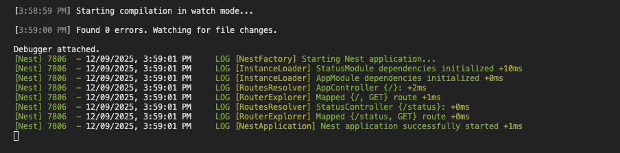
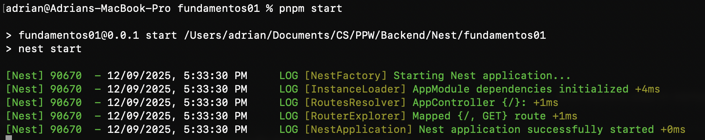

# Programación y Plataformas Web

# Frameworks Backend: NestJS – Instalación y Configuración

<div align="center">
  
</div>

## Práctica 1 (NestJS): Instalación, Configuración Inicial y Primer Endpoint

### Autores

**Rafael Prieto**
📧 pprietos@est.ups.edu.ec
💻 GitHub: [Raet0](https://github.com/Raet0)

**Adrian Lazo**
📧 blazoc@est.ups.edu.ec
💻 GitHub: [scomygod](https://github.com/scomygod)

---

# 1. Introducción al framework

**NestJS** es un framework backend para Node.js escrito en TypeScript.
Se inspira en las arquitecturas empresariales de Java (como Spring), combinando:

* TypeScript
* Decoradores
* Inyección de dependencias
* Arquitectura modular
* Patrones de controlador–servicio

NestJS ofrece una estructura escalable y organizada para crear:

* APIs REST
* aplicaciones modulares
* servicios distribuidos
* microservicios
* aplicaciones en tiempo real (WebSockets)

Sitio oficial:
[https://nestjs.com/](https://nestjs.com/)
Documentación:
[https://docs.nestjs.com/](https://docs.nestjs.com/)

---

# 2. Requisitos oficiales

Según la documentación actual de NestJS, se requiere:

## Node.js

Versión mínima:

* **Node 18 LTS**
* Recomendado: **Node 20 LTS**

Verificación:

```bash
node -v
```

---


## Tipos de administrador de paquetes compatibles

NestJS permite el uso de:

| Gestor   | Recomendado |
| -------- | ----------- |
| **npm**  | Sí          |
| **pnpm** | Sí          |
| yarn     | Sí          |

En esta asignatura se usará **pnpm**, por su eficiencia y velocidad.

Verificación:

```bash
pnpm -v
```

## NestJS CLI

El CLI se utiliza para:

* generar proyectos
* crear módulos, controladores y servicios
* ejecutar el servidor en modo desarrollo

Instalación global del framework (se indica, no se ordena):

```bash
pnpm install -g  @nestjs/cli
```

Verificación:

```bash
nest --version
```


---

# 3. Configuración del entorno de desarrollo

NestJS utiliza TypeScript, por lo que se requiere un editor con buen soporte para TS.

---

# 4. Creación del proyecto NestJS

Para iniciar un proyecto NestJS estándar, se utiliza el CLI.

### 4.1 Crear el proyecto

La estructura del proyecto se genera mediante:

```bash
nest new fundamentos01
```

Durante la creación, se solicita elegir un gestor de paquetes.
El valor recomendado para este curso es:

```
pnpm
```

---

## 4.2 Estructura inicial del proyecto

Una vez creado, se genera la siguiente estructura:

```
fundamentos01/
 ├── src/
 │    ├── app.controller.ts
 │    ├── app.controller.spec.ts
 │    ├── app.service.ts
 │    ├── app.module.ts
 │    └── main.ts
 ├── test/
 ├── tsconfig.json
 ├── package.json
 ├── pnpm-lock.yaml
 └── nest-cli.json
```


### Elementos clave:

| Archivo             | Función                       |
| ------------------- | ----------------------------- |
| `main.ts`           | Punto de entrada del servidor |
| `app.module.ts`     | Módulo raíz del proyecto      |
| `app.controller.ts` | Controlador principal         |
| `app.service.ts`    | Lógica de negocio inicial     |
| `nest-cli.json`     | Configuración del CLI         |
| `package.json`      | Dependencias del proyecto     |

NestJS siempre organiza la aplicación en **módulos**, lo cual favorece escalabilidad y mantenibilidad.

---

# 5. Ejecutar el proyecto por primera vez

Se inicia el servidor en modo desarrollo mediante:

```bash
pnpm start
```

Salida esperada:

```
[Nest] 8421  - 2025-02-28 14:12:33  LOG [NestFactory] Starting Nest application...
[Nest] 8421  - 2025-02-28 14:12:33  LOG [InstanceLoader] AppModule dependencies initialized
[Nest] 8421  - 2025-02-28 14:12:33  LOG [RoutesResolver] AppController {/}: +1ms
[Nest] 8421  - 2025-02-28 14:12:33  LOG [NestApplication] Nest application successfully started
```

El servidor queda disponible en:

```
http://localhost:3000
```

---

# 6. Creación del primer endpoint profesional

Se implementará un endpoint estándar usado en APIs modernas: **/api/status**

Guia oficial:
[https://docs.nestjs.com/controllers](https://docs.nestjs.com/controllers)

### 6.1 Crear un módulo para la práctica

```bash
nest g module status
```

Resultado:

```
src/status/status.module.ts
```

Esto actualiza `app.module.ts` para incluir el nuevo módulo.
```typescript
@Module({
  imports: [StatusModule],
  controllers: [AppController],
  providers: [AppService],
})
export class AppModule {}
```

### 6.2 Crear el controlador

```bash
nest g controller status
```

Se genera:

```
src/status/status.controller.ts
```

Modificar el contenido:

```ts
import { Controller, Get } from '@nestjs/common';

@Controller('api/status')
export class StatusController {
  @Get()
  getStatus() {
    return {
      service: 'NestJS API',
      status: 'running',
      timestamp: new Date().toISOString(),
    };
  }
}
```

---

### 6.3 Registrar el módulo en `app.module.ts`

En `src/app.module.ts`:

```ts
import { Module } from '@nestjs/common';
import { StatusModule } from './status/status.module';

@Module({
  imports: [StatusModule],
})
export class AppModule {}
```

---

### 6.4 Acceder al endpoint

Al ejecutar el servidor:


```
http://localhost:3000/api/status
```

Salida esperada:

```json
{
  "service": "NestJS API",
  "status": "running",
  "timestamp": "2025-02-28T15:44:10.192Z"
}
```


---

# 7. Explicación breve de las anotaciones utilizadas

### `@Controller()`

Indica que la clase administra rutas HTTP.
Define el prefijo del conjunto de endpoints.

### `@Get()`

Indica que el método responde a solicitudes HTTP GET.

### `@Module()`

Define un módulo.
Un módulo organiza controladores, servicios y proveedores.

---

# 8. Sección práctica

En esta práctica se:

1. Instala el CLI de NestJS.
2. Crea un proyecto base utilizando TypeScript.
3. Ejecuta el servidor Nest en el puerto 3000.
4. Implementa un endpoint profesional: `/api/status`.
5. Observa la forma modular de NestJS y la estructura generada.

---

# 9. Resultados y evidencias

Cada estudiante o grupo debe agregar en su archivo:

### 1. Captura del comando de verificación de Node.js

```
node -v
```


### 2. Captura del servidor NestJS iniciándose correctamente

Debe mostrar:

```
Nest application successfully started
```



### 3. Captura del endpoint `/api/status` funcionando

En navegador, Postman, Bruno o VS Code REST client.


### 4. Captura del siguiente comando en terminal 

```bash
ls ./src/status/
```


### 5. Explicación breve escrita por el estudiante

Incluyendo:

* qué entendió de `@Controller`, `@Get` y módulos
* cómo funciona el servidor NestJS
* qué similitudes encontró con Spring Boot

En esta clase entendí que @Controller sirve para crear rutas y @Get para responder cuando alguien entra a esa ruta. Los módulos solo organizan el proyecto en partes. El servidor NestJS arranca en Node y atiende las rutas que vamos creando. Se parece a Spring Boot porque también usa anotaciones y una estructura por módulos y controladores.

