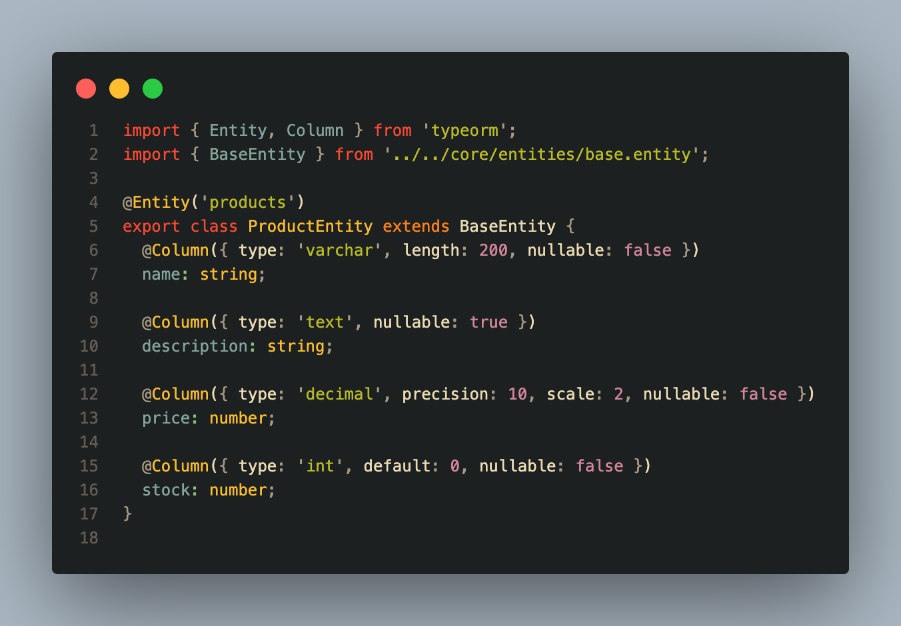
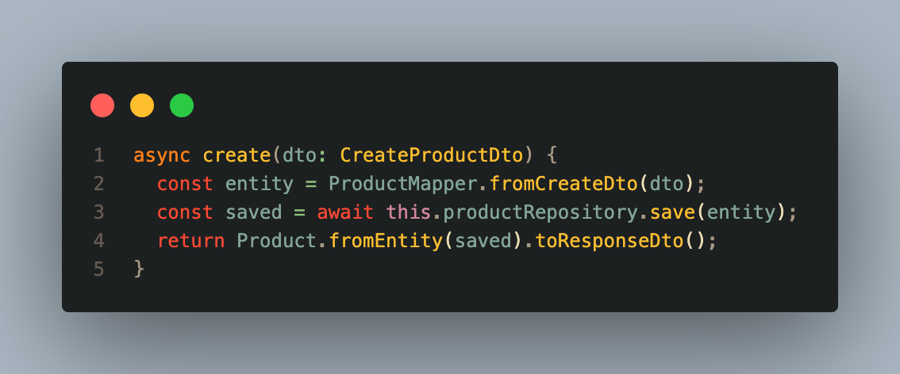
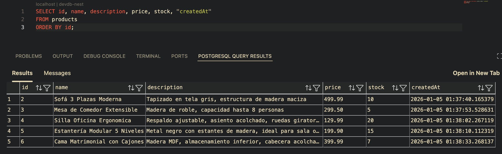
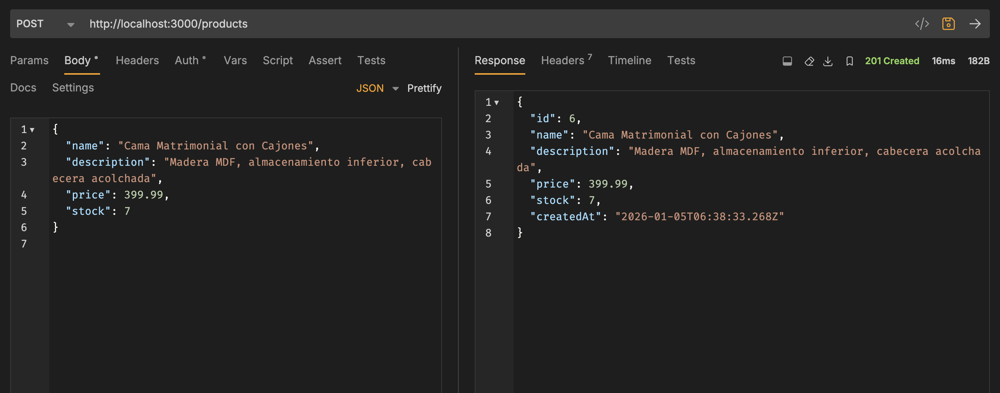
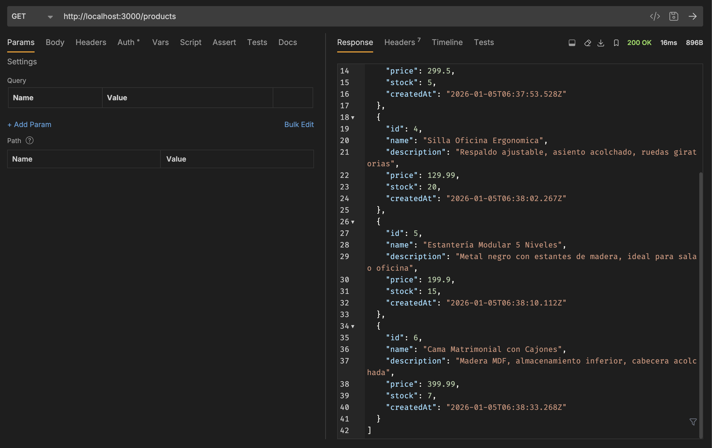
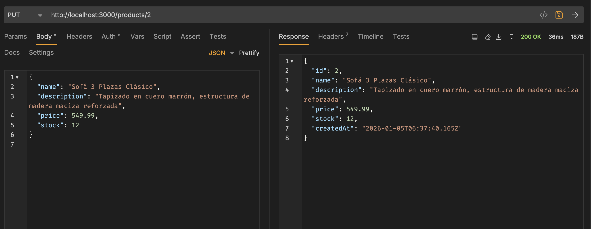
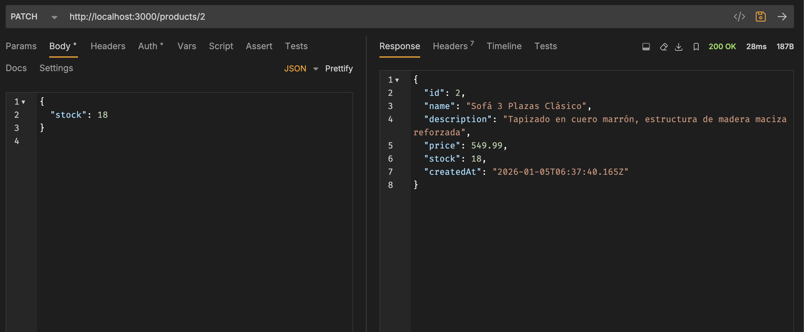
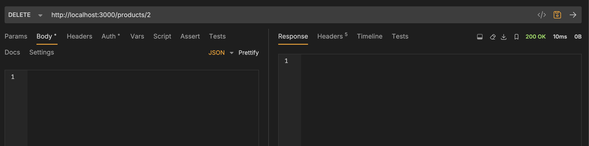
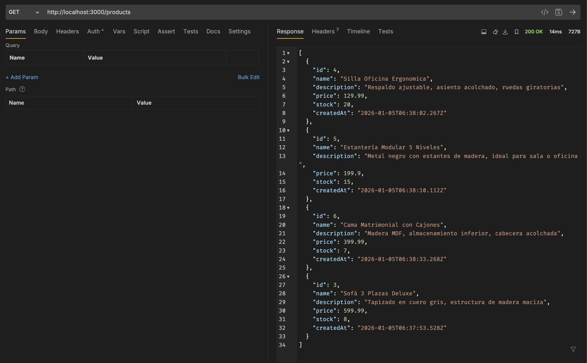

# Programación y Plataformas Web

# **NestJS – Persistencia con TypeORM, Entidades, Repositorios y Conexión a Base de Datos**

<div align="center">
  
  
</div>

## **Práctica 5 (NestJS): Persistencia real con PostgreSQL, Entidades TypeORM y Repositorios**

### Autores

**Rafael Prieto**
📧 pprietos@est.ups.edu.ec
💻 GitHub: [Raet0](https://github.com/Raet0)

**Adrian Lazo**
📧 blazoc@est.ups.edu.ec
💻 GitHub: [scomygod](https://github.com/scomygod)

---

# **1. Instalación y Preparación del Entorno**

Para utilizar una base de datos real con NestJS se necesitan:

1. **TypeORM** (ORM para TypeScript)
2. **Driver PostgreSQL**
3. **Configuración de conexión**
4. **Base de datos en ejecución (Docker recomendado)**

## **1.1. Instalación de dependencias**

Ejecutar en la raíz del proyecto:

```bash
pnpm install --save @nestjs/typeorm typeorm pg
```


Donde:
* `@nestjs/typeorm` → Integración de TypeORM con NestJS
* `typeorm` → ORM para TypeScript/JavaScript
* `pg` → Driver de PostgreSQL para Node.js

## **1.2. Configuración de TypeORM en el módulo principal**

Archivo:
`src/app.module.ts`

```typescript
import { Module } from '@nestjs/common';
import { TypeOrmModule } from '@nestjs/typeorm';
import { UsersModule } from './users/users.module';
import { ProductsModule } from './products/products.module';

@Module({
  imports: [
    TypeOrmModule.forRoot({
      type: 'postgres',
      host: 'localhost',
      port: 5432,
      username: 'ups',
      password: 'ups123',
      database: 'devdb-nest',
      entities: [__dirname + '/**/*.entity{.ts,.js}'],
      synchronize: true, // Solo para desarrollo
      logging: true,     // Muestra SQL en consola
    }),
    UsersModule,
    ProductsModule,
  ],
})
export class AppModule {}
```

### **Explicación de la configuración**

#### **Propiedades de conexión**

```typescript
type: 'postgres'
```
* Especifica el tipo de base de datos
* Opciones: `'postgres'`, `'mysql'`, `'mongodb'`, `'sqlite'`, etc.

```typescript
host: 'localhost'
port: 5432
```
* **host**: Dirección donde se ejecuta PostgreSQL
* **port**: Puerto (5432 es el puerto por defecto de PostgreSQL)

```typescript
username: 'ups'
password: 'ups123'
database: 'devdb'
```
* Credenciales de acceso a la base de datos
* **database**: Nombre de la base de datos a utilizar

#### **Propiedades de TypeORM**

```typescript
entities: [__dirname + '/**/*.entity{.ts,.js}']
```
* **entities**: Array de rutas donde TypeORM buscará las entidades
* `__dirname + '/**/*.entity{.ts,.js}'` → Busca todos los archivos que terminen en `.entity.ts` o `.entity.js`
* TypeORM detecta automáticamente todas las clases con decorador `@Entity()`

```typescript
synchronize: true
```
* **synchronize**: Sincroniza automáticamente el esquema de la BD con las entidades
* `true` → Crea/actualiza tablas al iniciar la aplicación (solo desarrollo)
* `false` → No modifica el esquema (producción, usar migraciones)
* ⚠️ **PELIGRO**: En producción puede causar pérdida de datos

```typescript
logging: true
```
* **logging**: Muestra las consultas SQL ejecutadas en la consola
* Útil para debugging y aprendizaje
* En producción se configura con niveles: `['error', 'warn']`

### **Buenas prácticas de configuración**

Para proyectos reales, usar variables de entorno:

```typescript
// app.module.ts
TypeOrmModule.forRoot({
  type: 'postgres',
  host: process.env.DB_HOST,
  port: parseInt(process.env.DB_PORT),
  username: process.env.DB_USERNAME,
  password: process.env.DB_PASSWORD,
  database: process.env.DB_NAME,
  entities: [__dirname + '/**/*.entity{.ts,.js}'],
  synchronize: process.env.NODE_ENV === 'development',
  logging: process.env.NODE_ENV === 'development',
})
```

Archivo `.env`:
```
DB_HOST=localhost
DB_PORT=5432
DB_USERNAME=ups
DB_PASSWORD=ups123
DB_NAME=devdb
NODE_ENV=development
```

## **1.3. Requisitos previos**

La base de datos debe existir antes de iniciar NestJS:

```
Base: devdb
Usuario: ups
Contraseña: ups123
```

Creada mediante Docker según:

📌 [`docs/05_b_instalacion_postgres_docker.md`](../../../docs/05_b_instalacion_postgres_docker.md)

---

# **2. Modelo vs Entidad Persistente en NestJS**

Hasta el tema anterior se trabajó con:

### Un **modelo User** sin decoradores, usado solo en memoria

Ese modelo **no sirve para persistencia** porque:

* No posee decoradores de TypeORM
* No representa una tabla
* No tiene ID gestionado por BD
* No funciona con el ORM
* No debe exponerse directamente en la API

Por lo tanto, en este tema se crea **por primera vez una entidad real User**.

### **Arquitectura de capas en NestJS**

```
DTO → Modelo de Dominio → Entidad TypeORM
Entidad TypeORM → Modelo de Dominio → DTO
```

Esta separación permite:
* Independencia entre dominio y persistencia
* Cambiar el ORM sin afectar la lógica de negocio
* Aplicar reglas de negocio en el modelo de dominio
* Controlar qué se expone en la API

---

# **3. Superclase de Auditoría (BaseEntity)**

Todas las entidades deben tener:

* ID autogenerado
* Fechas de creación/actualización
* Marca lógica de eliminado (soft delete)

TypeORM permite crear una clase base con estos campos comunes.

## **Creación de BaseEntity**

Archivo:
`src/core/entities/base.entity.ts`

```typescript
import { 
  PrimaryGeneratedColumn, 
  CreateDateColumn, 
  UpdateDateColumn, 
  Column 
} from 'typeorm';

export abstract class BaseEntity {

  @PrimaryGeneratedColumn('increment')
  id: number;

  @CreateDateColumn({ type: 'timestamp' })
  createdAt: Date;

  @UpdateDateColumn({ type: 'timestamp' })
  updatedAt: Date;

  @Column({ default: false })
  deleted: boolean;
}
```

### **Explicación de decoradores**

#### **@PrimaryGeneratedColumn('increment')**
```typescript
@PrimaryGeneratedColumn('increment')
id: number;
```
* Define la clave primaria de la tabla
* `'increment'` → Autoincremento secuencial (1, 2, 3, ...)
* Otras opciones: `'uuid'` para generar UUIDs
* Genera: `id SERIAL PRIMARY KEY` en PostgreSQL

#### **@CreateDateColumn**
```typescript
@CreateDateColumn({ type: 'timestamp' })
createdAt: Date;
```
* Establece automáticamente la fecha de creación
* Solo se asigna una vez al insertar el registro
* TypeORM maneja el valor automáticamente
* No es necesario asignarlo manualmente

#### **@UpdateDateColumn**
```typescript
@UpdateDateColumn({ type: 'timestamp' })
updatedAt: Date;
```
* Actualiza automáticamente la fecha en cada modificación
* TypeORM actualiza el valor en cada `save()`
* Útil para auditoría y rastreo de cambios

#### **@Column**
```typescript
@Column({ default: false })
deleted: boolean;
```
* Define una columna regular
* `default: false` → Valor por defecto en la BD
* Permite soft delete (marcar como eliminado sin borrar físicamente)

### **Ventajas de BaseEntity**

* **Reutilización**: Todas las entidades heredan estos campos
* **Consistencia**: Estructura uniforme en todas las tablas
* **Auditoría**: Rastreo automático de cambios
* **Mantenibilidad**: Cambios centralizados

---

# **4. Creación de la Entidad User con TypeORM**

Las clases creadas en las secciones anteriores NO son entidades persistentes. 
Son modelos de dominio usados en memoria.

Por lo que se recomienda crear una entidad real `UserEntity` que represente la tabla `users` en PostgreSQL.
Cambiar el nombre del arvhivo para evitar confusiones.

Antes teníamos:
`src/users/entities/user.entity.ts` → Modelo de dominio

Debe quedar como:
`src/users/models/user.model.ts` → Modelo de dominio
y la entidad como:
`src/users/entities/user.entity.ts` → Entidad persistente


## **Entidad UserEntity**

Archivo:
`src/users/entities/user.entity.ts`

```typescript
import { Entity, Column } from 'typeorm';
import { BaseEntity } from '../../core/entities/base.entity';

@Entity('users')
export class UserEntity extends BaseEntity {

  @Column({ type: 'varchar', length: 150, nullable: false })
  name: string;

  @Column({ type: 'varchar', length: 150, unique: true, nullable: false })
  email: string;

  @Column({ type: 'varchar', nullable: false })
  password: string;
}
```

### **Explicación de decoradores**

#### **@Entity('users')**
```typescript
@Entity('users')
export class UserEntity extends BaseEntity
```
* Marca la clase como una entidad de TypeORM
* `'users'` → Nombre de la tabla en PostgreSQL
* Si se omite el nombre, usa el nombre de la clase en minúsculas

#### **@Column con opciones**
```typescript
@Column({ type: 'varchar', length: 150, nullable: false })
name: string;
```
* **type**: Tipo de datos en PostgreSQL (`varchar`, `int`, `boolean`, `text`, etc.)
* **length**: Longitud máxima (solo para `varchar`)
* **nullable**: Si acepta valores NULL (`false` = `NOT NULL`)

```typescript
@Column({ type: 'varchar', length: 150, unique: true, nullable: false })
email: string;
```
* **unique**: Crea un índice único en la columna
* Genera: `UNIQUE CONSTRAINT` en PostgreSQL
* Evita emails duplicados a nivel de base de datos

### **Tabla generada en PostgreSQL**

Al iniciar la aplicación, TypeORM crea automáticamente:

```sql
CREATE TABLE users (
  id SERIAL PRIMARY KEY,
  name VARCHAR(150) NOT NULL,
  email VARCHAR(150) UNIQUE NOT NULL,
  password VARCHAR NOT NULL,
  createdAt TIMESTAMP DEFAULT now(),
  updatedAt TIMESTAMP DEFAULT now(),
  deleted BOOLEAN DEFAULT false
);
```

---

# **5. Repositorios en NestJS con TypeORM**

Los repositorios reemplazan completamente las listas en memoria.

## **Configuración del repositorio en el módulo**

Archivo:
`src/users/users.module.ts`

```typescript
import { Module } from '@nestjs/common';
import { TypeOrmModule } from '@nestjs/typeorm';
import { UsersController } from './controllers/users.controller';
import { UsersService } from './services/users.service';
import { UserEntity } from './entities/user.entity';

@Module({
  imports: [
    TypeOrmModule.forFeature([UserEntity])
  ],
  controllers: [UsersController],
  providers: [UsersService],
})
export class UsersModule {}

```

### **¿Qué hace TypeOrmModule.forFeature()?**

```typescript
TypeOrmModule.forFeature([UserEntity])
```

**1. Registra las entidades en el módulo**
* Indica qué entidades están disponibles en este módulo
* TypeORM crea automáticamente un repositorio para cada entidad
* El repositorio se inyecta en los servicios

**2. Proporciona el Repository<UserEntity>**
* NestJS crea una instancia de `Repository<UserEntity>`
* Se puede inyectar en servicios con `@InjectRepository()`
* El repositorio maneja todas las operaciones de BD

**3. Aísla responsabilidades**
* Cada módulo declara sus propias entidades
* No hay conflictos entre módulos
* Mejor organización del código

## **Uso del repositorio en el servicio**

Archivo:
`src/users/services/users.service.ts`

```typescript
import { Injectable } from '@nestjs/common';
import { InjectRepository } from '@nestjs/typeorm';
import { Repository } from 'typeorm';
import { UserEntity } from '../entities/user.entity';
import { CreateUserDto } from '../dtos/create-user.dto';
import { UserResponseDto } from '../dtos/user-response.dto';

@Injectable()
export class UsersService {

  constructor(
    @InjectRepository(UserEntity)
    private readonly userRepository: Repository<UserEntity>,
  ) {}

  // Métodos CRUD aquí...
}
```

### **Inyección del repositorio**

```typescript
constructor(
  @InjectRepository(UserEntity)
  private readonly userRepository: Repository<UserEntity>,
) {}
```

**@InjectRepository(UserEntity)**
* Decorador que le indica a NestJS qué repositorio inyectar
* NestJS busca el repositorio registrado en `TypeOrmModule.forFeature()`
* Proporciona el repositorio específico para `UserEntity`

**Repository&lt;UserEntity&gt;**
* Tipo genérico de TypeORM
* Especifica que este repositorio trabaja con `UserEntity`
* Proporciona type-safety: todos los métodos están tipados

**private readonly**
* `private` → Solo accesible dentro del servicio
* `readonly` → No se puede reasignar después del constructor

### **Métodos automáticos del Repository**

TypeORM proporciona automáticamente:

#### **Métodos de consulta**
```typescript
// Obtener todos los registros
await this.userRepository.find()

// Obtener un registro por ID
await this.userRepository.findOne({ where: { id: 1 } })

// Obtener con condiciones
await this.userRepository.findOne({ where: { email: 'test@test.com' } })

// Contar registros
await this.userRepository.count()

// Verificar existencia
await this.userRepository.exist({ where: { email: 'test@test.com' } })
```

#### **Métodos de escritura**
```typescript
// Guardar (insert o update)
await this.userRepository.save(userEntity)

// Crear instancia sin guardar
const user = this.userRepository.create({ name: 'Test', email: 'test@test.com' })

// Eliminar físicamente
await this.userRepository.delete(id)

// Eliminar por entidad
await this.userRepository.remove(userEntity)
```

#### **Métodos con QueryBuilder**
```typescript
// Consultas complejas
await this.userRepository
  .createQueryBuilder('user')
  .where('user.name LIKE :name', { name: '%John%' })
  .andWhere('user.deleted = :deleted', { deleted: false })
  .getMany()
```

### **¿Por qué Repository&lt;UserEntity&gt;?**

Similar a Spring Boot, TypeORM usa genéricos:

```typescript
Repository<T>
```

Donde:
* **T** → Tipo de la entidad que gestiona el repositorio

En nuestro caso:
```typescript
Repository<UserEntity>
      ↑
   Entidad
```

**Ventajas:**
* **Type-safe**: El compilador verifica los tipos
* **IntelliSense**: Autocompletado en el IDE
* **Consistencia**: Todos los repositorios siguen el mismo patrón
* **Sin SQL manual**: TypeORM genera las consultas

---

# **6. Transformaciones: Factory Methods en TypeScript**

Los servicios NO deben devolver entidades directamente.

## **Patrón Factory Method en la clase de dominio**

Archivo:
`src/users/models/user.model.ts`

```typescript
import { UserEntity } from '../entities/user.entity';
import { CreateUserDto } from '../dtos/create-user.dto';
import { UpdateUserDto } from '../dtos/update-user.dto';
import { PartialUpdateUserDto } from '../dtos/partial-update-user.dto';
import { UserResponseDto } from '../dtos/user-response.dto';

export class User {
  constructor(
    public id: number,
    public name: string,
    public email: string,
    public password: string,
    public createdAt: Date,
  ) {}

  // ==================== FACTORY METHODS ====================

  /**
   * Crea un User desde un DTO de creación
   */
  static fromDto(dto: CreateUserDto): User {
    return new User(
      0, // El ID se asigna en BD
      dto.name,
      dto.email,
      dto.password, // Aquí se cifraría en un caso real
      new Date(),
    );
  }

  /**
   * Crea un User desde una entidad persistente
   */
  static fromEntity(entity: UserEntity): User {
    return new User(
      entity.id,
      entity.name,
      entity.email,
      entity.password,
      entity.createdAt,
    );
  }

  // ==================== CONVERSION METHODS ====================

  /**
   * Convierte este User a una entidad persistente
   */
  toEntity(): UserEntity {
    const entity = new UserEntity();
    if (this.id > 0) {
      entity.id = this.id;
    }
    entity.name = this.name;
    entity.email = this.email;
    entity.password = this.password;
    return entity;
  }

  /**
   * Convierte este User a un DTO de respuesta
   */
  toResponseDto(): UserResponseDto {
    return {
      id: this.id,
      name: this.name,
      email: this.email,
      createdAt: this.createdAt.toISOString(),
    };
    // NO incluye password
  }

  /**
   * Aplica actualización completa
   */
  update(dto: UpdateUserDto): User {
    this.name = dto.name;
    this.email = dto.email;
    if (dto.password) {
      this.password = dto.password;
    }
    return this;
  }

  /**
   * Aplica actualización parcial
   */
  partialUpdate(dto: PartialUpdateUserDto): User {
    if (dto.name !== undefined) {
      this.name = dto.name;
    }
    if (dto.email !== undefined) {
      this.email = dto.email;
    }
    if (dto.password !== undefined) {
      this.password = dto.password;
    }
    return this;
  }
}
```

### **Flujo de conversión**

```
1. Cliente → CreateUserDto
   ↓
2. User.fromDto(dto) → User (dominio)
   ↓
3. user.toEntity() → UserEntity
   ↓
4. repository.save(entity) → BD PostgreSQL
   ↓
5. User.fromEntity(saved) → User
   ↓
6. user.toResponseDto() → UserResponseDto
   ↓
7. Cliente
```

---

# **7. Servicio con Programación Funcional**

El servicio usa el repositorio y transforma datos con enfoque funcional.

Archivo:
`src/users/services/users.service.ts`

```typescript
import { Injectable, NotFoundException } from '@nestjs/common';
import { InjectRepository } from '@nestjs/typeorm';
import { Repository } from 'typeorm';
import { UserEntity } from '../entities/user.entity';
import { User } from '../models/user.model';
import { CreateUserDto } from '../dtos/create-user.dto';
import { UpdateUserDto } from '../dtos/update-user.dto';
import { PartialUpdateUserDto } from '../dtos/partial-update-user.dto';
import { UserResponseDto } from '../dtos/user-response.dto';

@Injectable()
export class UsersService {

  constructor(
    @InjectRepository(UserEntity)
    private readonly userRepository: Repository<UserEntity>,
  ) {}

  /**
   * Obtener todos los usuarios (enfoque funcional)
   */
  async findAll(): Promise<UserResponseDto[]> {
    // 1. Repository → Entities
    const entities = await this.userRepository.find();

    // 2. Entities → Domain Models → DTOs (programación funcional)
    return entities
      .map(User.fromEntity)           // Entity → User
      .map(user => user.toResponseDto()); // User → DTO
  }

  /**
   * Obtener un usuario por ID (enfoque funcional con manejo de errores)
   */
  async findOne(id: number): Promise<UserResponseDto> {
    const entity = await this.userRepository.findOne({ where: { id } });

    if (!entity) {
      throw new NotFoundException(`User with ID ${id} not found`);
    }

    return User.fromEntity(entity).toResponseDto();
  }

  /**
   * Crear usuario (flujo funcional)
   */
  async create(dto: CreateUserDto): Promise<UserResponseDto> {
    // Flujo funcional: DTO → Model → Entity → Save → Model → DTO
    const user = User.fromDto(dto);           // DTO → Domain
    const entity = user.toEntity();            // Domain → Entity
    const saved = await this.userRepository.save(entity); // Persistir
    
    return User.fromEntity(saved).toResponseDto(); // Entity → Domain → DTO
  }

  /**
   * Actualizar usuario completo (PUT)
   */
  async update(id: number, dto: UpdateUserDto): Promise<UserResponseDto> {
    const entity = await this.userRepository.findOne({ where: { id } });

    if (!entity) {
      throw new NotFoundException(`User with ID ${id} not found`);
    }

    // Flujo funcional con transformaciones
    const updated = User.fromEntity(entity)  // Entity → Domain
      .update(dto)                           // Aplicar cambios
      .toEntity();                           // Domain → Entity

    const saved = await this.userRepository.save(updated);
    
    return User.fromEntity(saved).toResponseDto();
  }

  /**
   * Actualizar parcialmente (PATCH)
   */
  async partialUpdate(id: number, dto: PartialUpdateUserDto): Promise<UserResponseDto> {
    const entity = await this.userRepository.findOne({ where: { id } });

    if (!entity) {
      throw new NotFoundException(`User with ID ${id} not found`);
    }

    const updated = User.fromEntity(entity)
      .partialUpdate(dto)
      .toEntity();

    const saved = await this.userRepository.save(updated);
    
    return User.fromEntity(saved).toResponseDto();
  }

  /**
   * Eliminar usuario
   */
  async delete(id: number): Promise<void> {
    const result = await this.userRepository.delete(id);

    if (result.affected === 0) {
      throw new NotFoundException(`User with ID ${id} not found`);
    }
  }
}
```

### **Ventajas del enfoque funcional en NestJS**

1. **Transformaciones claras**: Cada paso es explícito
2. **Inmutabilidad**: No se mutan objetos intermedios
3. **Composición**: Se encadenan transformaciones
4. **Type-safe**: TypeScript valida todos los tipos
5. **Testeable**: Cada transformación es fácil de probar

### **Comparación con enfoque imperativo**

**❌ Imperativo (evitar):**
```typescript
async findAll(): Promise<UserResponseDto[]> {
  const entities = await this.userRepository.find();
  const result = [];
  
  for (let i = 0; i < entities.length; i++) {
    const user = User.fromEntity(entities[i]);
    const dto = user.toResponseDto();
    result.push(dto);
  }
  
  return result;
}
```

**✅ Funcional (recomendado):**
```typescript
async findAll(): Promise<UserResponseDto[]> {
  return (await this.userRepository.find())
    .map(User.fromEntity)
    .map(user => user.toResponseDto());
}
```

---

# **8. Flujo completo con base de datos real**

```
Cliente HTTP
    ↓
Controlador (@Controller)
    ↓ recibe CreateUserDto
Servicio (@Injectable)
    ↓ User.fromDto()
    ↓ user.toEntity()
    ↓ repository.save()
Repository (TypeORM)
    ↓ SQL INSERT
Base de Datos PostgreSQL
    ↓ retorna UserEntity
Repository
    ↓ User.fromEntity()
    ↓ user.toResponseDto()
Servicio
    ↓ UserResponseDto
Controlador
    ↓ JSON
Cliente HTTP
```

---

# **9. Salida esperada en consola**

Al iniciar la aplicación NestJS con TypeORM configurado:

### **Conexión exitosa**
```
[Nest] LOG [TypeOrmModule] TypeOrmModule dependencies initialized
[Nest] LOG [InstanceLoader] UserEntity loaded
```

### **Creación de tabla automática (synchronize: true)**
```sql
query: CREATE TABLE "users" (
  "id" SERIAL NOT NULL,
  "createdAt" TIMESTAMP NOT NULL DEFAULT now(),
  "updatedAt" TIMESTAMP NOT NULL DEFAULT now(),
  "deleted" boolean NOT NULL DEFAULT false,
  "name" character varying(150) NOT NULL,
  "email" character varying(150) NOT NULL,
  "password" character varying NOT NULL,
  CONSTRAINT "UQ_email" UNIQUE ("email"),
  CONSTRAINT "PK_users" PRIMARY KEY ("id")
)
```

### **Consulta SQL al ejecutar findAll()**
```sql
query: SELECT "UserEntity"."id", "UserEntity"."name", "UserEntity"."email", 
       "UserEntity"."createdAt", "UserEntity"."updatedAt", "UserEntity"."deleted" 
FROM "users" "UserEntity"
```

---

# **10. Actividad práctica**

El estudiante debe replicar toda la arquitectura aprendida en el módulo:

```
src/products/
```

## **10.1. Crear ProductEntity**

Debe extender de `BaseEntity` e incluir:

```typescript
name: string        // VARCHAR(200), NOT NULL
description: string // TEXT
price: number       // DECIMAL(10,2), NOT NULL
stock: number       // INTEGER, NOT NULL, DEFAULT 0
```

## **10.2. Crear ProductRepository**

Configurar en `ProductsModule`:

```typescript
TypeOrmModule.forFeature([ProductEntity])
```

## **10.3. Crear modelo de dominio Product**

Con factory methods:
* `Product.fromDto()`
* `Product.fromEntity()`
* `product.toEntity()`
* `product.toResponseDto()`

## **10.4. Implementar ProductsService**

Con programación funcional en todos los métodos:
* `findAll()`
* `findOne(id)`
* `create(dto)`
* `update(id, dto)`
* `partialUpdate(id, dto)`
* `delete(id)`

## **10.5. Actualizar ProductsController**

Conectar el controlador con el servicio.

## **10.6. Probar el CRUD completo**

* POST /api/products → Crear 5 productos
* GET /api/products → Listar todos
* GET /api/products/:id → Obtener uno
* PUT /api/products/:id → Actualizar completo
* PATCH /api/products/:id → Actualizar parcial
* DELETE /api/products/:id → Eliminar

## **10.7. Validar en PostgreSQL**

Usar DBeaver, pgAdmin o extensión de VSCode para verificar:

```sql
SELECT * FROM products;
```

---

# **11. Resultados y evidencias**

## **11.1. Captura de ProductEntity**
Screenshot del archivo `product.entity.ts` completo


## **11.2. Captura de ProductsService**
Screenshot del método `create()` con programación funcional


## **11.3. Captura de PostgreSQL**
Screenshot de consulta SQL mostrando los 5 productos creados:
```sql
SELECT id, name, description, price, stock, "createdAt" 
FROM products 
ORDER BY id;
```


## **11.4. Capturas de Postman/Thunder Client**
* POST creando un producto

* GET listando productos

* PUT/PATCH actualizando



* DELETE eliminando

*GET después de eliminar para comprobar*



---

# **13. Comparación: NestJS vs Spring Boot**

| Aspecto | NestJS (TypeORM) | Spring Boot (JPA/Hibernate) |
|---------|------------------|------------------------------|
| **Lenguaje** | TypeScript | Java/Kotlin |
| **ORM** | TypeORM | Hibernate |
| **Decorador Entity** | `@Entity()` | `@Entity` |
| **Primary Key** | `@PrimaryGeneratedColumn()` | `@Id + @GeneratedValue` |
| **Repositorio** | `Repository<T>` | `JpaRepository<T, ID>` |
| **Inyección** | `@InjectRepository()` | Constructor injection |
| **Configuración** | `TypeOrmModule.forRoot()` | `application.yml` |
| **Sincronización** | `synchronize: true` | `ddl-auto: update` |

Ambos frameworks siguen principios similares de arquitectura en capas y separación de responsabilidades.
