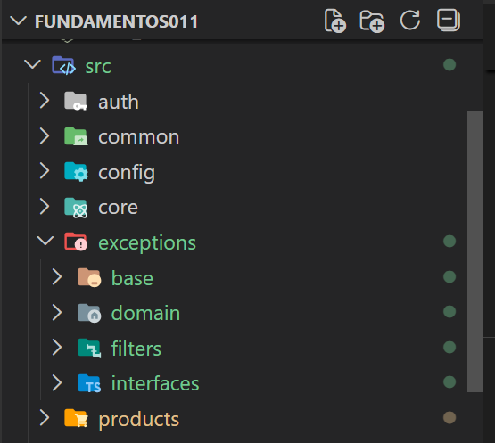
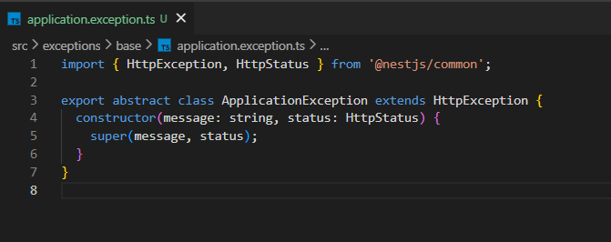
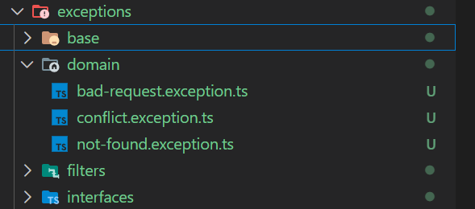
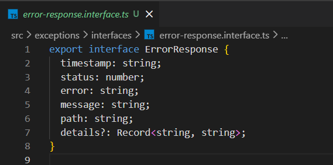
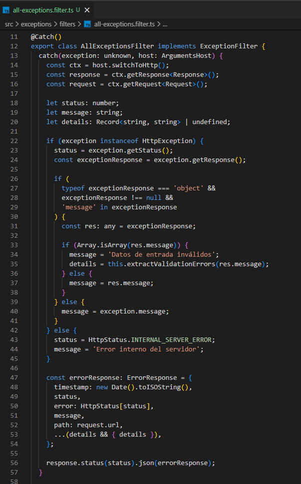
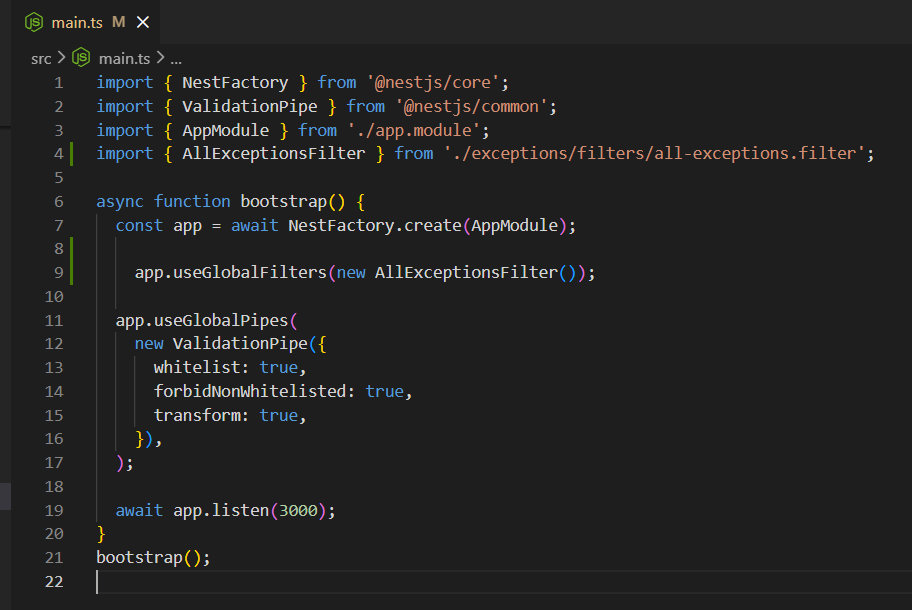
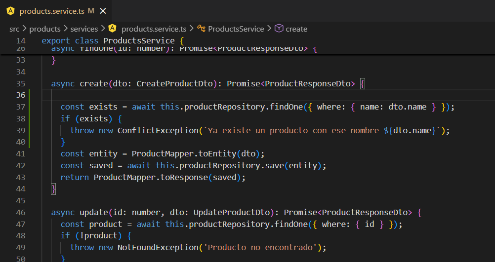
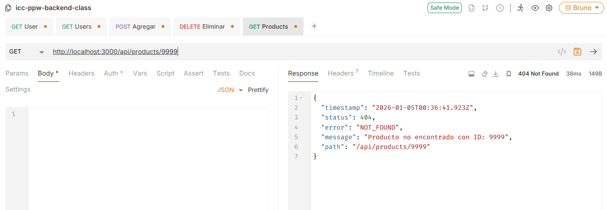
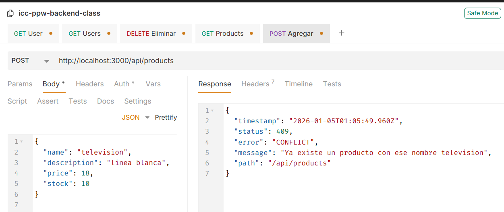
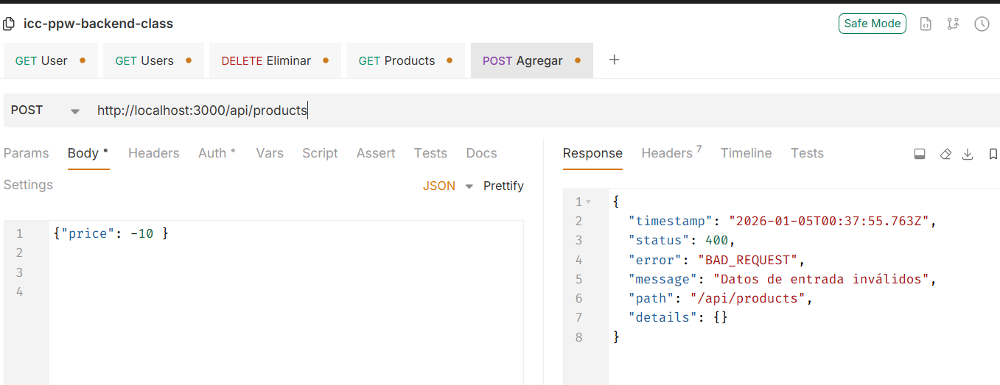

# Práctica 7 (NestJS): Manejo Global de Errores y Excepciones

  

---

## Autor

Cinthya Ramón  
cramonm1@est.ups.edu.ec  
GitHub: https://github.com/CinthyLu

---

# 1. Introducción

En esta práctica se implementó un **sistema global de manejo de errores y excepciones** en una aplicación backend desarrollada con NestJS.

El objetivo fue estandarizar la forma en que la aplicación responde ante errores, evitando respuestas inconsistentes y eliminando el uso de bloques `try/catch` en controladores y servicios. Para ello se utilizaron **excepciones personalizadas** y un **filter global**, garantizando respuestas claras, estructuradas y alineadas con buenas prácticas profesionales.

---

# 2. Tecnologías utilizadas

- **Node.js**
- **NestJS**
- **TypeScript**
- **PostgreSQL**
- **TypeORM**
- **Docker**
- **VS Code**

---

# 3. Estructura del módulo de excepciones

Se creó una estructura modular para el manejo de errores, separando responsabilidades entre dominio, infraestructura y transporte.

Estructura implementada:
src/
└── exceptions/
├── base/
├── domain/
├── filters/
└── interfaces/

Esta organización permite escalar el sistema de errores sin afectar otras capas de la aplicación.

IMAGEN 01  
Estructura de carpetas del módulo exceptions

---

# 4. Excepción base de la aplicación

Se implementó una clase base `ApplicationException`, la cual extiende de `HttpException`.  
Todas las excepciones del dominio heredan de esta clase, asegurando un manejo uniforme del código de estado HTTP y del mensaje de error.

IMAGEN 02  
Archivo application.exception.ts

---

# 5. Excepciones de dominio

Se definieron excepciones específicas para representar errores de negocio:

- NotFoundException  
- ConflictException  
- BadRequestException  

Estas excepciones se lanzan exclusivamente desde los servicios y **no generan respuestas HTTP directamente**.

IMAGEN 03  
Excepciones de dominio personalizadas

---

# 6. Contrato único de respuesta de error

Se definió una interfaz `ErrorResponse` que establece el formato único de las respuestas de error, incluyendo información como:

- timestamp
- status
- error
- message
- path
- details (opcional)

Este contrato permite que el frontend consuma errores de forma consistente.

IMAGEN 04  
Interfaz ErrorResponse

---

# 7. Filter global de excepciones

Se implementó el filter global `AllExceptionsFilter`, encargado de capturar cualquier excepción lanzada en la aplicación y transformarla en una respuesta JSON estandarizada.

Este filter también procesa automáticamente los errores generados por `class-validator`.

IMAGEN 05  
Archivo all-exceptions.filter.ts

---

# 8. Registro del filter global

El filter global se registró en el archivo `main.ts`, asegurando que todas las excepciones sean interceptadas de forma centralizada.

IMAGEN 06  
Registro del filter global en main.ts

---

# 9. Uso de excepciones en ProductsService

Las excepciones personalizadas se utilizan directamente en la capa de servicios para expresar errores de negocio, como:

- Producto no encontrado
- Conflicto por nombre duplicado
- Datos inválidos

De esta forma, el servicio no construye respuestas HTTP, sino que únicamente expresa errores semánticos.

IMAGEN 07  
Uso de excepciones en products.service.ts

---

# 10. Pruebas de manejo de errores

Se realizaron pruebas enviando solicitudes incorrectas a la API, verificando que todas las respuestas mantienen el mismo formato estructurado.

Pruebas realizadas:
- Error 404: producto inexistente
- Error 409: conflicto por nombre duplicado
- Error 400: datos inválidos

IMAGEN 08  
Error 404 – recurso no encontrado

IMAGEN 09  
Error 409 – conflicto de negocio

IMAGEN 10  
Error 400 – validación de datos

---

# 11. Resultados obtenidos

Como resultado de esta práctica, la aplicación backend cuenta ahora con:

- Manejo global de errores
- Excepciones de dominio semánticas
- Respuestas JSON estandarizadas
- Integración con validaciones automáticas
- Código más limpio y mantenible

---

# 12. Conclusión

La implementación de un sistema global de manejo de errores mejora significativamente la calidad del backend, facilitando el mantenimiento, la escalabilidad y la integración con aplicaciones frontend reales.
