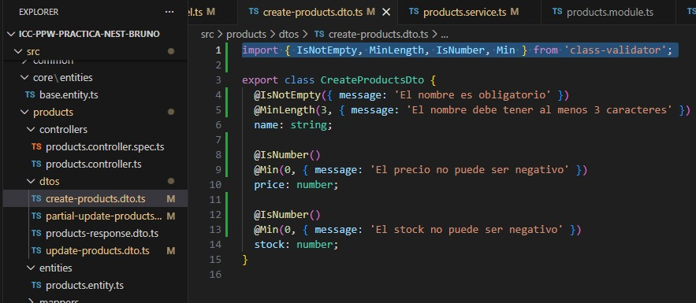
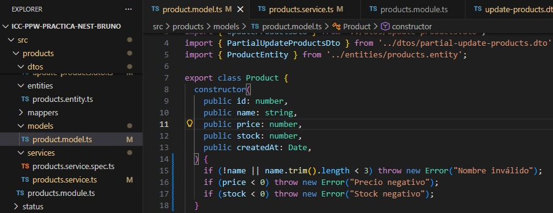
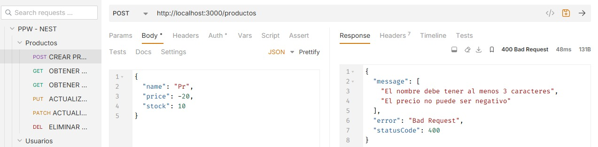
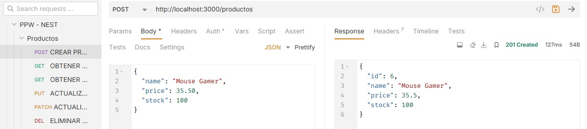

# Programación y Plataformas Web

# **NestJS – Modelos de Dominio, DTOs y Validación con class-validator**

<div align="center">
  
  
</div>

## **Práctica 6 (NestJS): Diseño de Modelos, DTOs y Validación Profesional**

### **Autor**

**Pablo Torres**

📧 [ptorresp@ups.edu.ec](mailto:ptorresp@ups.edu.ec)

💻 GitHub: PabloT18


# **1. Introducción**

Hasta la práctica 5, tu backend NestJS ya incluía:

* Controladores
* Servicios
* Repositorios TypeORM
* Entidades persistentes
* Conexión real a PostgreSQL

Pero **todo esto es vulnerable** si no validas correctamente lo que entra a tu API.

A partir de este tema aprenderás:

1. Validar DTOs con `class-validator`
2. Convertir DTOs → Dominio → Entidad con métodos factory
3. Aplicar reglas de negocio en el modelo de dominio
4. Mantener separadas las capas:

   * DTO
   * Dominio
   * Entidad TypeORM
5. Integrar Pipes de validación en el controlador

Este es el estándar profesional en NestJS.


# **2. Instalación: class-validator + class-transformer**

Ejecutar:

```bash
pnpm add class-validator class-transformer
```

NestJS ya reconoce automáticamente estas dependencias.


# **3. Diferencia entre: DTO – Dominio – Entidad**

| Capa                | Propósito                                                  |
| ------------------- | ---------------------------------------------------------- |
| **DTO**             | Datos que entran y salen de la API. Validación sintáctica. |
| **Dominio**         | Reglas de negocio, invariantes, comportamiento.            |
| **Entidad TypeORM** | Representa tabla en la base de datos. Persistencia.        |

### **Nunca debes usar una entidad como DTO**

Ni un DTO como modelo de dominio.

Cada capa tiene responsabilidad única.


# **4. DTOs con validación (class-validator)**

NestJS valida automáticamente si se usa el Pipe global o `@UsePipes(new ValidationPipe())`.

## **4.1 CreateUserDto**

Archivo:
`src/users/dtos/create-user.dto.ts`

```ts


  @IsNotEmpty({ message: 'El nombre es obligatorio' })
  @MinLength(3)
  @MaxLength(150)
  name: string;

  @IsNotEmpty()
  @IsEmail({}, { message: 'Debe ingresar un email válido' })
  @MaxLength(150)
  email: string;

  @IsNotEmpty()
  @MinLength(8, { message: 'La contraseña debe tener al menos 8 caracteres' })
  password: string;

```


## **4.2 UpdateUserDto (PUT)**

```ts


  @IsNotEmpty()
  @MinLength(3)
  @MaxLength(150)
  name: string;

  @IsNotEmpty()
  @IsEmail()
  @MaxLength(150)
  email: string;

  @IsNotEmpty()
  @MinLength(8)
  password: string;

```


## **4.3 PartialUpdateUserDto (PATCH)**

Los campos son opcionales, pero si vienen deben ser válidos.

```ts


  @IsOptional()
  @MinLength(3)
  @MaxLength(150)
  name?: string;

  @IsOptional()
  @IsEmail()
  @MaxLength(150)
  email?: string;

  @IsOptional()
  @MinLength(8)
  password?: string;

```


## **4.4 UserResponseDto**

```ts
export class UserResponseDto {
  id: number;
  name: string;
  email: string;
  createdAt: string;
}
```

Nunca exponer:

* password
* deleted
* updatedAt


# **5. Activar Validación en el Controlador**

En NestJS, basta con el pipe global en `main.ts`:

Archivo:
`src/main.ts`

```ts
import { ValidationPipe } from '@nestjs/common';

async function bootstrap() {
  const app = await NestFactory.create(AppModule);

  app.useGlobalPipes(
    new ValidationPipe({
      whitelist: true,        // elimina propiedades no permitidas
      forbidNonWhitelisted: true, // error si envían campos extra
      transform: true,        // transforma tipos
    }),
  );

  await app.listen(3000);
}
bootstrap();
```

Resultado cuando se envía un POST inválido:

```json
{
  "statusCode": 400,
  "message": [
    "El nombre es obligatorio",
    "Debe ingresar un email válido",
    "La contraseña debe tener al menos 8 caracteres"
  ],
  "error": "Bad Request"
}
```


# **6. Diseño del Modelo de Dominio**

El dominio **no es la entidad** ni el DTO.

Se encarga de lógica de negocio como:

* validar email
* validar longitudes
* preparar datos antes de persistir

Archivo:
`src/users/models/user.model.ts`

```ts
export class User {

  constructor(
    public id: number,
    public name: string,
    public email: string,
    public password: string,
    public createdAt: Date,
  ) {

    if (!name || name.trim().length < 3) {
      throw new Error("Nombre inválido");
    }

    if (!email || !email.includes("@")) {
      throw new Error("Email inválido");
    }

    if (!password || password.length < 8) {
      throw new Error("Password inválido");
    }
  }
```


### **Factory Methods**

```ts
static fromDto(dto: CreateUserDto): User {
  return new User(0, dto.name, dto.email, dto.password, new Date());
}

static fromEntity(entity: UserEntity): User {
  return new User(
    entity.id,
    entity.name,
    entity.email,
    entity.password,
    entity.createdAt,
  );
}

toEntity(): UserEntity {
  const entity = new UserEntity();
  if (this.id > 0) {
    entity.id = this.id;
  }
  entity.name = this.name;
  entity.email = this.email;
  entity.password = this.password;
  return entity;
}

toResponseDto(): UserResponseDto {
  return {
    id: this.id,
    name: this.name,
    email: this.email,
    createdAt: this.createdAt.toISOString(),
  };
}
```


### **Update y Partial Update**

```ts
update(dto: UpdateUserDto): User {
  this.name = dto.name;
  this.email = dto.email;
  this.password = dto.password;
  return this;
}

partialUpdate(dto: PartialUpdateUserDto): User {
  if (dto.name !== undefined) this.name = dto.name;
  if (dto.email !== undefined) this.email = dto.email;
  if (dto.password !== undefined) this.password = dto.password;
  return this;
}
```


# **7. Validación a nivel de Servicio**

Los servicios NO deben confiar en que el controlador validó todo.

Ejemplo regla: email único.

Archivo:
`src/users/services/users.service.ts`

```ts
if (await this.userRepository.exist({ where: { email: dto.email } })) {
  throw new BadRequestException("El email ya está registrado");
}
```

Luego el flujo:

```ts
const user = User.fromDto(dto);
const entity = user.toEntity();
const saved = await this.userRepository.save(entity);
return User.fromEntity(saved).toResponseDto();
```


Esto genera una respuesta JSON:

```json
{
  "statusCode": 400,
  "message": "El email ya está registrado",
  "error": "Bad Request"
}
``` 

Correspondiente a:
[text](06_modelos_dtos_validacion.md) 


# **8. Validación en la base de datos (TypeORM + PostgreSQL)**

La entidad `UserEntity` ya tiene:

* `nullable: false`
* `unique: true`
* `varchar(150)`
* `@CreateDateColumn()`

Por lo que PostgreSQL refuerza:

* email único
* campos obligatorios
* límites de longitud
* tipos correctos


# **9. Flujo completo de validación**

```
Cliente
   ↓
DTO con class-validator (validación sintáctica)
   ↓
Dominio (reglas de negocio)
   ↓
Entidad TypeORM
   ↓
Repositorio → PostgreSQL (constraints reales)
   ↓
Entidad persistida
   ↓
Dominio
   ↓
DTO de respuesta
   ↓
Cliente
```


# **10. Actividad práctica**

El estudiante debe replicar todo el módulo para:

```
products/
```

Implementando:


## **10.1. Crear DTOs con validación**

* CreateProductDto
* UpdateProductDto
* PartialUpdateProductDto
* ProductResponseDto

Reglas mínimas:

* name → obligatorio, mínimo 3
* price → mínimo 0
* stock → mínimo 0


## **10.2. Crear modelo de dominio Product**

Con métodos:

* `Product.fromDto()`
* `Product.fromEntity()`
* `product.toEntity()`
* `product.toResponseDto()`
* `product.update()`
* `product.partialUpdate()`


## **10.3. Usar ValidationPipe en el controlador**

```ts
@Post()
create(@Body() dto: CreateProductDto) {
  return this.service.create(dto);
}
```

(Dado que el pipe global ya está en main.ts)


## **10.4. Validación de reglas de negocio (servicio)**

Ejemplo:

* precio no negativo
* stock no negativo


## **10.5. Validar errores desde Thunder Client / Postman**

Enviar:

```json
{ "price": -20, "name": "" }
```

Debe fallar.


# **11. Resultados y Evidencias**

El estudiante entrega:

1. Captura de DTOs con validaciones



2. Captura del modelo de dominio Product



3. Captura de error JSON al enviar producto inválido



4. Captura de CRUD funcionando con datos válidos

