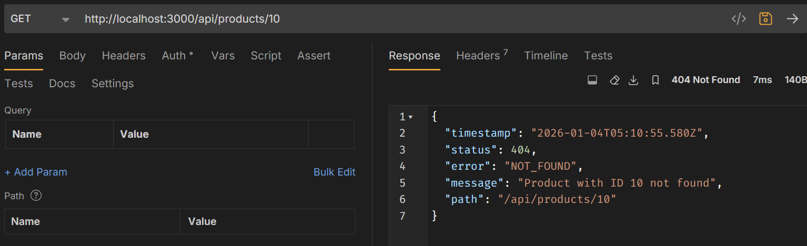
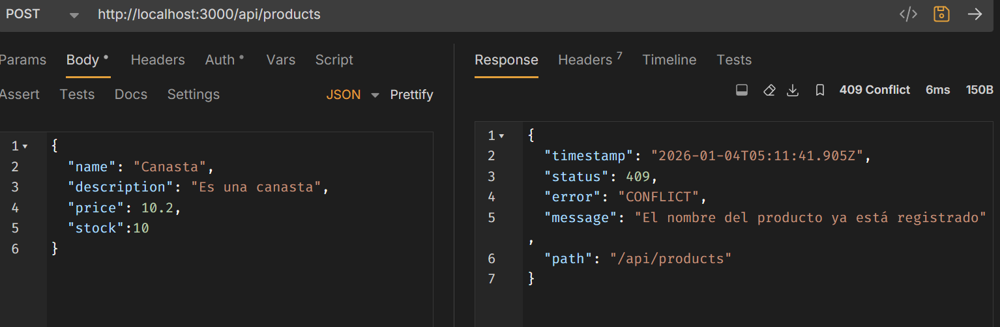
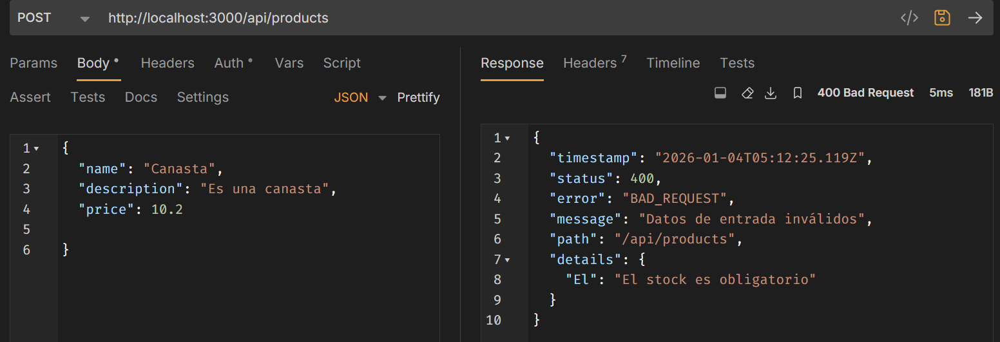

# Programación y Plataformas Web

# **NestJS – Control Global de Errores y Excepciones**

<div align="center">
  
</div>

## Práctica 7 (NestJS): Manejo Global de Errores y Excepciones

### Autores

**Pablo Torres**
📧 [ptorresp@ups.edu.ec](mailto:ptorresp@ups.edu.ec)
💻 GitHub: PabloT18

# Introducción

En los temas anteriores, el backend ya cuenta con:

- controladores limpios
- servicios con lógica de negocio
- DTOs validados
- persistencia real con TypeORM
- arquitectura MVCS

Sin embargo, **un backend no es profesional** si:

- cada error se maneja distinto
- se devuelve texto plano
- se exponen mensajes internos
- se usan `try/catch` en cada método

En este tema se implementa un **sistema global de manejo de errores**, usando los mecanismos nativos de NestJS, manteniendo:

- coherencia
- extensibilidad
- separación de responsabilidades
- un único formato de respuesta

Aunque NEST si maneja errores de forma automática, este enfoque personalizado permite:

- definir excepciones semánticas
- controlar el formato de respuesta
- separar dominio e infraestructura
- evitar duplicación de código

# 1. Estructura del módulo `exceptions`

Se utilizará una estructura clara y escalable:

```
src/
└── exceptions/
    ├── base/
    │   └── application.exception.ts
    │
    ├── domain/
    │   ├── not-found.exception.ts
    │   ├── conflict.exception.ts
    │   └── bad-request.exception.ts
    │
    ├── filters/
    │   └── all-exceptions.filter.ts
    │
    └── interfaces/
        └── error-response.interface.ts
```

Esta estructura:

- evita clases genéricas mal definidas
- permite crecer sin romper código
- separa dominio, infraestructura y transporte

# 2. Excepción base de la aplicación

## `ApplicationException`

Archivo:
`exceptions/base/application.exception.ts`

```typescript
export abstract class ApplicationException extends HttpException {
  constructor(message: string, name: string, status: HttpStatus) {
    super(message, status);
  }
}
```

Características:

- es la raíz de todas las excepciones del sistema
- extiende de `HttpException` de NestJS
- obliga a definir un `HttpStatus`
- evita el uso de `HttpException` genérica directamente
- no genera respuesta HTTP directamente

# 3. Excepciones de dominio

Las excepciones de dominio **representan errores del negocio**, no técnicos.

## 3.1 Recurso no encontrado

**Descripción:**  
Se lanza cuando se intenta acceder a un recurso que no existe en la base de datos o en el sistema.

**Cuándo usarla:**

- Al buscar una entidad por ID y no se encuentra
- Al intentar actualizar o eliminar un recurso inexistente
- En operaciones que requieren que el recurso exista previamente

**Dónde se usa:**

- En servicios, dentro de métodos como `findById()`, `update()`, `delete()`
- Después de consultas a repositorios que retornan `undefined`

**Ejemplo de uso:**

```typescript
// En un servicio
async findById(id: number): Promise<Product> {
  const product = await this.productRepository.findOne({ where: { id } });

  if (!product) {
    throw new NotFoundException(`Producto no encontrado con ID: ${id}`);
  }

  return product;
}
```

Archivo:
`exceptions/domain/not-found.exception.ts`

```typescript
import { HttpStatus } from "@nestjs/common";
import { ApplicationException } from "../base/application.exception";

export class NotFoundException extends ApplicationException {
  constructor(message: string) {
    super(message, HttpStatus.NOT_FOUND);
  }
}
```

## 3.2 Conflicto de estado

**Descripción:**  
Se lanza cuando existe un conflicto con el estado actual del recurso, generalmente por duplicación de datos únicos o violación de restricciones de integridad.

**Cuándo usarla:**

- Al intentar crear un recurso con un identificador único ya existente (email, username, código)
- Cuando se intenta realizar una operación que violaría una restricción de unicidad
- Al detectar conflictos de concurrencia o versiones

**Dónde se usa:**

- En servicios, dentro de métodos `create()` o `register()`
- Antes de persistir datos, validando unicidad
- En operaciones de registro de usuarios o creación de entidades con campos únicos

**Ejemplo de uso:**

```typescript
// En un servicio
async register(userDto: CreateUserDto): Promise<User> {
  const existingUser = await this.userRepository.findOne({
    where: { email: userDto.email }
  });

  if (existingUser) {
    throw new ConflictException(
      `El email ${userDto.email} ya está registrado`
    );
  }

  return this.userRepository.save(userDto);
}
```

Archivo:
`exceptions/domain/conflict.exception.ts`

```typescript
import { HttpStatus } from "@nestjs/common";
import { ApplicationException } from "../base/application.exception";

export class ConflictException extends ApplicationException {
  constructor(message: string) {
    super(message, HttpStatus.CONFLICT);
  }
}
```

## 3.3 Solicitud inválida (Bad Request)

**Descripción:**  
Se lanza cuando la solicitud del cliente no puede ser procesada debido a datos inválidos, malformados o que no cumplen con las expectativas del servidor. Es la excepción general para errores de validación de negocio y datos.

**Cuándo usarla:**

- Cuando los datos son técnicamente válidos pero violan reglas de negocio
- Al detectar operaciones no permitidas según el estado actual del sistema
- Cuando se incumplen condiciones del dominio (stock insuficiente, saldo negativo, edad mínima)
- Para errores de validación que no son capturados por decoradores de class-validator
- Cuando la estructura de los datos es correcta pero los valores no son aceptables

**Dónde se usa:**

- En servicios, dentro de la lógica de negocio y validaciones
- Después de validaciones específicas del dominio o del sistema
- En operaciones complejas que requieren verificar múltiples condiciones
- Como alternativa general a errores de validación no cubiertos por DTOs

**Ejemplo de uso:**

```typescript
// En un servicio
async createOrder(orderDto: CreateOrderDto): Promise<Order> {
  const product = await this.findProductById(orderDto.productId);

  if (product.stock < orderDto.quantity) {
    throw new BadRequestException(
      `Stock insuficiente. Disponible: ${product.stock}, ` +
      `solicitado: ${orderDto.quantity}`
    );
  }

  if (orderDto.quantity < 1) {
    throw new BadRequestException('La cantidad debe ser al menos 1');
  }

  return this.orderRepository.save(orderDto);
}
```

Archivo:
`exceptions/domain/bad-request.exception.ts`

```typescript
import { HttpStatus } from "@nestjs/common";
import { ApplicationException } from "../base/application.exception";

export class BadRequestException extends ApplicationException {
  constructor(message: string) {
    super(message, HttpStatus.BAD_REQUEST);
  }
}
```

Estas excepciones:

- se lanzan desde **services**
- no conocen controladores
- no construyen respuestas

# 4. Contrato de respuesta de error

## `ErrorResponse`

Archivo:
`exceptions/interfaces/error-response.interface.ts`

```typescript
export interface ErrorResponse {
  timestamp: string;
  status: number;
  error: string;
  message: string;
  path: string;
  details?: Record<string, string>;
}
```

Este objeto:

- define el **único formato de error**
- soporta errores simples y de validación
- no expone información interna
- es reutilizable en todo el sistema

# 5. Filter global de excepciones

## `AllExceptionsFilter`

Archivo:
`exceptions/filters/all-exceptions.filter.ts`

```typescript
import {
  ExceptionFilter,
  Catch,
  ArgumentsHost,
  HttpException,
  HttpStatus,
} from "@nestjs/common";
import { Request, Response } from "express";
import { ErrorResponse } from "../interfaces/error-response.interface";

@Catch()
export class AllExceptionsFilter implements ExceptionFilter {
  catch(exception: unknown, host: ArgumentsHost) {
    const ctx = host.switchToHttp();
    const response = ctx.getResponse<Response>();
    const request = ctx.getRequest<Request>();

    let status: number;
    let message: string;
    let details: Record<string, string> | undefined;

    if (exception instanceof HttpException) {
      status = exception.getStatus();
      const exceptionResponse = exception.getResponse();

      if (
        typeof exceptionResponse === "object" &&
        "message" in exceptionResponse
      ) {
        const response = exceptionResponse as any;

        // Caso: Error de validación con class-validator
        if (Array.isArray(response.message)) {
          message = "Datos de entrada inválidos";
          details = this.extractValidationErrors(response.message);
        } else {
          message = response.message || exception.message;
        }
      } else {
        message = exception.message;
      }
    } else {
      // Error no controlado
      status = HttpStatus.INTERNAL_SERVER_ERROR;
      message = "Error interno del servidor";
    }

    const errorResponse: ErrorResponse = {
      timestamp: new Date().toISOString(),
      status,
      error: HttpStatus[status] || "Internal Server Error",
      message,
      path: request.url,
      ...(details && { details }),
    };

    response.status(status).json(errorResponse);
  }

  private extractValidationErrors(messages: string[]): Record<string, string> {
    const errors: Record<string, string> = {};

    messages.forEach((msg) => {
      // Los mensajes de class-validator tienen el formato:
      // "property debe cumplir X condición"
      const parts = msg.split(" ");
      const property = parts[0];
      errors[property] = msg;
    });

    return errors;
  }
}
```

### Mejora avanzada para errores de validación

NestJS con `class-validator` y `ValidationPipe` genera errores estructurados. Para extraerlos correctamente:

```typescript
// Versión mejorada del método extractValidationErrors
private extractValidationErrors(messages: any): Record<string, string> {
  const errors: Record<string, string> = {};

  if (Array.isArray(messages)) {
    messages.forEach((msg) => {
      if (typeof msg === 'string') {
        const parts = msg.split(' ');
        errors[parts[0]] = msg;
      } else if (typeof msg === 'object' && msg.property && msg.constraints) {
        // Formato completo de ValidationError
        const firstConstraint = Object.values(msg.constraints)[0];
        errors[msg.property] = firstConstraint as string;
      }
    });
  }

  return errors;
}
```

# 6. Configuración del filter en el módulo

Para que el filter global funcione, debe registrarse en el módulo principal:

Archivo:
`main.ts`

```typescript
import { NestFactory } from "@nestjs/core";
import { ValidationPipe } from "@nestjs/common";
import { AppModule } from "./app.module";
import { AllExceptionsFilter } from "./exceptions/filters/all-exceptions.filter";

async function bootstrap() {
  const app = await NestFactory.create(AppModule);

  // Registrar el filter global
  app.useGlobalFilters(new AllExceptionsFilter());

  // Configurar ValidationPipe para DTOs
  app.useGlobalPipes(
    new ValidationPipe({
      whitelist: true,
      forbidNonWhitelisted: true,
      transform: true,
    })
  );

  await app.listen(3000);
}
bootstrap();
```

O alternativamente, usando un provider en el módulo:

Archivo:
`app.module.ts`

```typescript
import { Module } from "@nestjs/common";
import { APP_FILTER } from "@nestjs/core";
import { AllExceptionsFilter } from "./exceptions/filters/all-exceptions.filter";

@Module({
  providers: [
    {
      provide: APP_FILTER,
      useClass: AllExceptionsFilter,
    },
  ],
})
export class AppModule {}
```

# 7. Uso desde los servicios

Antes de aplicar el manejo global, lanzábamos una excepción genérica no controlada:

```typescript
  async findOne(id: number): Promise<UserResponseDto> {
    const entity = await this.userRepository.findOne({ where: { id } });

    if (!entity) {
      throw new NotFoundException(`User with ID ${id} not found`);
    }

    return User.fromEntity(entity).toResponseDto();
  }
```

Lo que nos daba una respuesta de error inconsistente como:

```json
{
  "message": "User with ID 10 not found",
  "error": "Not Found",
  "statusCode": 404
}
```

Genera un `404 Not Found` genérico. Pero la información es simple y no estructurada. En Servidores robustos, esto no es suficiente.

Ejemplo real en un servicio:

Borramos la importación innecesaria generica de las excepciones

```typescript
import {
  BadRequestException,
  Injectable,
  NotFoundException,
} from "@nestjs/common";
```

y usamos nuestra excepción personalizada:

```typescript
import { NotFoundException } from "src/exceptions/domain/not-found.exception";
```

```typescript
async findOne(id: number): Promise<UserResponseDto> {
  const user = await this.userRepository.findOne({ where: { id } });

  if (!user) {
    throw new NotFoundException(`Usuario no encontrado con ID: ${id}`);
  }

  return User.fromEntity(user).toResponseDto();
}
```

Lo que nos da una respuesta de error consistente como:

```json
{
  "timestamp": "2025-12-26T20:48:20.032Z",
  "status": 404,
  "error": "NOT_FOUND",
  "message": "Usuario no encontrado con ID: 10",
  "path": "/api/users/10"
}
```

Aquí se genera un `404 Not Found` con un mensaje claro y sin exponer detalles internos. Dando a entender al cliente que el recurso no existe y que pide algo incorrecto.

El atributo `path` en situaciones reales es muy útil para debugging en el cliente. Pero dependiendo del caso de uso, se puede omitir si no es necesario.

El servicio:

- **no captura**
- **no construye respuesta HTTP**
- **solo expresa el error**

# 8. Validación automática de DTOs

## ¿Cómo funciona la validación de DTOs en NestJS?

Cuando se envía una petición POST con datos mal formados:

**Request:**

```http
POST /api/users
Content-Type: application/json

{
  "name": "",
  "email": null,
  "password": "********"
}
```

El proceso automático es:

### 1. Los decoradores de validación en el DTO

```typescript
import { IsNotEmpty, IsEmail, MinLength } from "class-validator";

export class CreateUserDto {
  @IsNotEmpty({ message: "El nombre es obligatorio" })
  name: string;

  @IsNotEmpty({ message: "El email es obligatorio" })
  @IsEmail({}, { message: "El email debe ser válido" })
  email: string;

  @IsNotEmpty({ message: "La contraseña es obligatoria" })
  @MinLength(6, { message: "La contraseña debe tener al menos 6 caracteres" })
  password: string;
}
```

### 2. El controlador recibe el DTO

```typescript
@Post()
async create(@Body() createUserDto: CreateUserDto): Promise<UserResponseDto> {
  const created = await this.userService.create(createUserDto);
  return created;
}
```

Al usar `@Body()` con un DTO y tener `ValidationPipe` configurado globalmente, NestJS automáticamente:

1. Valida cada campo del DTO según sus decoradores
2. Si hay errores, **NO llama al servicio**
3. Lanza una excepción: `BadRequestException` (de NestJS, no la nuestra)
4. Esta excepción es capturada por el `AllExceptionsFilter`

### 3. El filter procesa los errores de validación

En el `AllExceptionsFilter`:

```typescript
if (exception instanceof HttpException) {
  status = exception.getStatus();
  const exceptionResponse = exception.getResponse();

  if (typeof exceptionResponse === "object" && "message" in exceptionResponse) {
    const response = exceptionResponse as any;

    // Caso: Error de validación con class-validator
    if (Array.isArray(response.message)) {
      message = "Datos de entrada inválidos";
      details = this.extractValidationErrors(response.message);
    }
  }
}
```

El método `extractValidationErrors` transforma los mensajes de error:

```typescript
private extractValidationErrors(messages: any): Record<string, string> {
  const errors: Record<string, string> = {};

  if (Array.isArray(messages)) {
    messages.forEach((msg) => {
      if (typeof msg === 'object' && msg.property && msg.constraints) {
        const firstConstraint = Object.values(msg.constraints)[0];
        errors[msg.property] = firstConstraint as string;
      }
    });
  }

  return errors;
}
```

### 4. La respuesta mejora automáticamente

**Response:**

```json
{
  "timestamp": "2025-12-26T20:51:19.224Z",
  "status": 400,
  "error": "BAD_REQUEST",
  "message": "Datos de entrada inválidos",
  "path": "/api/users",
  "details": {
    "name": "name must be longer than or equal to 3 characters",
    "El": "El nombre es obligatorio",
    "email": "email should not be empty",
    "Debe": "Debe ingresar un email válido"
  }
}
```


Para el ejemplo de ConflictException, la respuesta sería:

```json
{
  "timestamp": "2025-12-26T20:52:45.123Z",
  "status": 409,
  "error": "CONFLICT",
  "message": "El email ya esta registrado",
  "path": "/api/users"
}
```


Se observa el status **409** y el mensaje claro.

## ¿Por qué aparece el campo `details`?

El campo `details` aparece porque:

1. **Hay múltiples errores de validación**: Los campos `name` y `email` fallaron
2. **El filter los recopila**: El método `extractValidationErrors` procesa cada error
3. **Se incluye en la respuesta**: Si hay `details`, se agrega al objeto `ErrorResponse`
4. **El cliente recibe toda la información**: Puede mostrar errores específicos por campo en su interfaz

## Flujo completo de validación

```
Request con datos inválidos
 ↓
Controller
 ↓
ValidationPipe valida automáticamente
 ↓
¿Hay errores?
 ↓ (Sí)
BadRequestException (de NestJS)
 ↓
AllExceptionsFilter
 ↓
Detecta formato de validación
 ↓
extractValidationErrors → Record<string, string>
 ↓
ErrorResponse con details
 ↓
Cliente recibe JSON estructurado
```

### Ventajas de este enfoque

**Cero código de validación en servicios**

- Los servicios asumen que los datos ya están validados
- No hay `if (name.length === 0)` en cada método

  **Respuestas consistentes**

- Todos los errores de validación usan el mismo formato
- El frontend sabe exactamente cómo interpretar errores

  **Mensajes personalizados**

- Cada decorador define su propio mensaje
- No hay mensajes técnicos genéricos

  **Escalable**

- Agregar nuevas validaciones solo requiere agregar decoradores
- No hay que modificar filters ni servicios

  **Separación de responsabilidades**

- Validación estructural → decoradores en DTOs
- Validación de negocio → servicios con excepciones de dominio
- Formato de respuesta → AllExceptionsFilter

# 9. Flujo completo en ejecución

Ahora que se ha explicado cómo funciona la validación automática de DTOs, se puede visualizar el flujo completo del sistema de manejo de errores en dos escenarios:

## Escenario 1: Error de validación (datos mal formados)

**Request:**

```http
POST /api/users
Content-Type: application/json

{
  "name": "",
  "email": null,
  "password": "********"
}
```

**Flujo:**

```
Request HTTP con datos inválidos
 ↓
Controller
 ↓
ValidationPipe detecta errores
 ↓
BadRequestException (NestJS nativa)
 ↓
AllExceptionsFilter.catch()
 ↓
Detecta array de mensajes de validación
 ↓
extractValidationErrors → details
 ↓
ErrorResponse (con details)
 ↓
Response HTTP 400
```

**Response:**

```json
{
  "timestamp": "2025-12-26T15:12:42.301Z",
  "status": 400,
  "error": "Bad Request",
  "message": "Datos de entrada inválidos",
  "path": "/api/users",
  "details": {
    "name": "El nombre es obligatorio",
    "email": "El email es obligatorio"
  }
}
```

**¿Por qué sale así?**

1. **El campo `details` aparece**: Porque hay múltiples errores de validación y el filter los extrae
2. **Los mensajes son personalizados**: Provienen de los decoradores en el DTO
3. **Status 400**: Indica que el cliente envió datos inválidos
4. **El servicio nunca se ejecutó**: La validación ocurre ANTES de llegar al servicio

## Escenario 2: Error de dominio (recurso no encontrado)

**Request:**

```http
GET /api/users/999
```

**Flujo:**

```
Request HTTP
 ↓
Controller
 ↓
Service.findOne(999)
 ↓
Repository.findOne({ where: { id: 999 } }) → undefined
 ↓
NotFoundException("Usuario no encontrado con ID: 999")
 ↓
AllExceptionsFilter.catch()
 ↓
exception instanceof HttpException → true
 ↓
ErrorResponse (sin details)
 ↓
Response HTTP 404
```

**Response:**

```json
{
  "timestamp": "2025-12-26T15:07:20.967Z",
  "status": 404,
  "error": "Not Found",
  "message": "Usuario no encontrado con ID: 999",
  "path": "/api/users/999"
}
```

**¿Por qué sale así?**

1. **No hay campo `details`**: Es un error simple, no de validación de múltiples campos
2. **Status 404**: La excepción `NotFoundException` define este status
3. **Mensaje claro**: El servicio lanza la excepción con un mensaje específico
4. **Sin stack trace**: Solo información necesaria para el cliente

## Comparación de ambos escenarios

| Aspecto               | Validación de DTOs             | Excepción de Dominio                                    |
| --------------------- | ------------------------------ | ------------------------------------------------------- |
| **Cuándo ocurre**     | Antes del servicio             | Dentro del servicio                                     |
| **Tipo de excepción** | `BadRequestException` (NestJS) | `NotFoundException`, `ConflictException`, etc. (custom) |
| **Cómo se detecta**   | `ValidationPipe` + decoradores | Lanzada explícitamente en servicio                      |
| **Campo details**     | Presente (Record de errores)   | Ausente                                                 |
| **Ejemplo de status** | 400 Bad Request                | 404 Not Found, 409 Conflict                             |

## Ventajas del flujo unificado

Este flujo es:

- **Limpio**: Los controladores y servicios no manejan errores manualmente
- **Mantenible**: Agregar nuevos tipos de error solo requiere una nueva excepción
- **Escalable**: El formato de respuesta es consistente sin importar el tipo de error
- **Reutilizable**: El mismo filter funciona para toda la aplicación
- **Profesional**: Las respuestas están estandarizadas y son predecibles para el cliente

## Código del controlador (sin manejo de errores)

Gracias a este sistema, los controladores quedan extremadamente simples:

```typescript
@Post()
async create(
  @Body() createUserDto: CreateUserDto  // ← Validación automática
): Promise<UserResponseDto> {
  const created = await this.userService.create(createUserDto);
  return created;
  // ← Sin try/catch, sin manejo manual
}

@Get(':id')
async findOne(@Param('id') id: number): Promise<UserResponseDto> {
  return this.userService.findOne(id);
  // ← Si no existe, el servicio lanza NotFoundException
  // ← El filter se encarga del resto
}
```

El controlador solo:

- Define rutas
- Delega al servicio
- Retorna respuestas exitosas

Todos los errores se manejan globalmente de forma automática.

# 10. Buenas prácticas reforzadas

- Un solo formato de error
- Sin `try/catch` en controladores
- Excepciones semánticas
- Separación dominio / transporte
- Validación estructurada
- Preparado para frontend real

# 11. Actividad práctica

El estudiante debe:

1. Implementar el sistema de manejo global de errores
2. Usarlas desde servicios reales de **`Productos`**
3. Probar:
   - producto inexistente
   - conflicto lógico (Crear una regla de negocio como: "No se puede crear un producto con nombre duplicado")
   - error de validación (enviar datos mal formados)
4. Verificar que **todas** las respuestas cumplen el mismo formato
5. Capturar evidencias desde Bruno para cada caso de prueba

**3 Capturas en total:**

- Captura 1: Error 404 (producto no encontrado)



- Captura 2: Error 409 (conflicto de negocio)



- Captura 3: Error 400 (validación con details)


