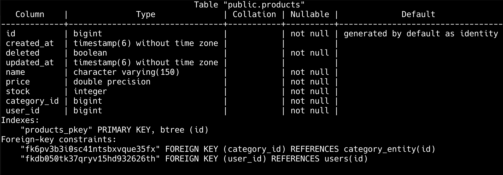
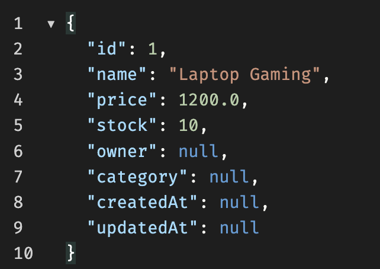
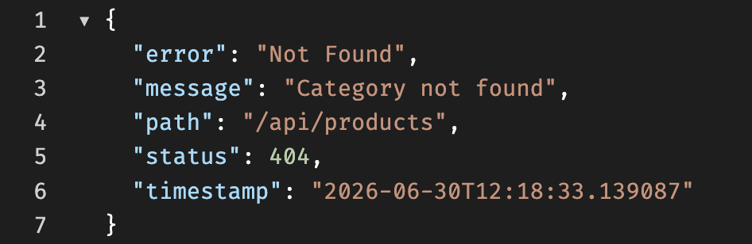

# Programación y Plataformas Web

# Frameworks Backend: Spring Boot – Relaciones entre Entidades JPA

<div align="center">
  
  
</div>

---

# Práctica 8 (Spring Boot): Relaciones ManyToOne, Foreign Keys y Consultas Relacionales

### Autores

**Pablo Torres**

[ptorresp@ups.edu.ec](mailto:ptorresp@ups.edu.ec)

GitHub: PabloT18

---

# 1. Introducción

En las prácticas anteriores se implementó:

* controladores
* servicios
* DTOs con validación
* modelos de dominio
* entidades persistentes
* repositorios JPA
* conexión a PostgreSQL
* eliminado lógico mediante `deleted`
* manejo global de errores y excepciones

Hasta este punto, las entidades principales funcionan de manera independiente.

Sin embargo, en una aplicación real los datos suelen estar relacionados.

Un producto no debería existir aislado. Puede estar asociado a:

* un usuario que lo registra
* una categoría a la que pertenece

En esta práctica se implementan relaciones entre entidades usando JPA.

Se trabajará con relaciones:

```txt
User 1 ──── N Product
Category 1 ──── N Product
```

Esto significa:

```txt
Un usuario puede registrar muchos productos.
Una categoría puede tener muchos productos.
Un producto pertenece a un usuario.
Un producto pertenece a una categoría.
```

En esta práctica se trabajará con:

* `@ManyToOne`
* `@JoinColumn`
* claves foráneas
* consultas relacionales desde repositorios
* DTOs con IDs de relaciones
* respuestas anidadas
* validación de existencia de relaciones
* eliminado lógico en entidades relacionadas

Todavía no se implementa:

* relación `ManyToMany`
* tabla intermedia
* productos con múltiples categorías

Eso se trabajará en la práctica 9.

---

# 2. Flujo después de aplicar relaciones

Ahora el flujo será:

```txt
Cliente
  ↓
ProductsController
  ↓
CreateProductDto
  ↓
ProductService
  ↓
ProductServiceImpl
  ↓
valida UserEntity
  ↓
valida CategoryEntity
  ↓
ProductEntity
  ↓
ProductRepository
  ↓
PostgreSQL
  ↓
ProductResponseDto con datos anidados
  ↓
Cliente
```

El producto ya no se crea únicamente con sus datos propios.

Ahora se debe validar que existan las entidades relacionadas antes de guardar.

---

## 2.1. Responsabilidad de cada clase

| Clase                | Responsabilidad                                    |
| -------------------- | -------------------------------------------------- |
| `ProductEntity`      | Representar la tabla `products` y sus relaciones   |
| `UserEntity`         | Representar la tabla `users`                       |
| `CategoryEntity`     | Representar la tabla `categories`                  |
| `ProductRepository`  | Consultar productos y sus relaciones               |
| `UserRepository`     | Validar existencia del usuario                     |
| `CategoryRepository` | Validar existencia de la categoría                 |
| `ProductServiceImpl` | Orquestar la creación y consulta con relaciones    |
| `CreateProductDto`   | Recibir datos del producto y los IDs relacionados  |
| `ProductResponseDto` | Devolver producto con usuario y categoría anidados |
| `NotFoundException`  | Reportar relaciones inexistentes                   |
| `ConflictException`  | Reportar conflictos de negocio                     |

---

# 3. Tipos de relaciones en JPA

JPA permite representar asociaciones entre entidades.

| Relación        | Anotación     | Ejemplo                      |
| --------------- | ------------- | ---------------------------- |
| Uno a uno       | `@OneToOne`   | Usuario - Perfil             |
| Uno a muchos    | `@OneToMany`  | Categoría - Productos        |
| Muchos a uno    | `@ManyToOne`  | Producto - Categoría         |
| Muchos a muchos | `@ManyToMany` | Producto - Varias categorías |

En esta práctica se usará principalmente:

```java
@ManyToOne
```

Porque desde `ProductEntity` se referencian entidades padre:

```txt
Muchos productos → un usuario
Muchos productos → una categoría
```

---

# 4. Estructura de carpetas requerida

Se trabajará con tres módulos:

```txt
users/
products/
categories/
```

Estructura general:

```txt
src/main/java/ec/edu/ups/icc/fundamentos01/
├── core/
│   ├── entities/
│   │   └── BaseEntity.java
│   └── exceptions/
│
├── users/
│   ├── entities/
│   │   └── UserEntity.java
│   └── repositories/
│       └── UserRepository.java
│
├── categories/
│   ├── controllers/
│   │   └── CategoriesController.java
│   ├── dtos/
│   │   ├── CreateCategoryDto.java
│   │   ├── UpdateCategoryDto.java
│   │   └── CategoryResponseDto.java
│   ├── entities/
│   │   └── CategoryEntity.java
│   ├── repositories/
│   │   └── CategoryRepository.java
│   └── services/
│       ├── CategoryService.java
│       └── CategoryServiceImpl.java
│
└── products/
    ├── controllers/
    │   └── ProductsController.java
    ├── dtos/
    │   ├── CreateProductDto.java
    │   ├── UpdateProductDto.java
    │   ├── PartialUpdateProductDto.java
    │   └── ProductResponseDto.java
    ├── entities/
    │   └── ProductEntity.java
    ├── model/
    │   └── ProductModel.java
    ├── repositories/
    │   └── ProductRepository.java
    └── services/
        ├── ProductService.java
        └── ProductServiceImpl.java
```

---

# 5. Entidad base `BaseEntity`

Todas las entidades deben seguir heredando de `BaseEntity`.

Archivo:

```txt
core/entities/BaseEntity.java
```

---

# 6. Entidad UserEntity

La entidad `UserEntity` ya existe desde prácticas anteriores.

---

# 7. Nueva entidad CategoryEntity

Se crea un nuevo módulo llamado:

```txt
categories/
```

La categoría permitirá clasificar productos.

Archivo:

```txt
categories/entities/CategoryEntity.java
```

Código:

```java
/*
 * Entidad JPA del recurso categories.
 *
 * Representa la tabla categories en PostgreSQL.
 * Una categoría puede estar asociada a muchos productos,
 * pero en esta práctica la relación se define desde ProductEntity.
 */
@Entity
@Table(name = "categories")
public class CategoryEntity extends BaseEntity {

    @Column(nullable = false, unique = true, length = 120)
    private String name;

    @Column(length = 500)
    private String description;

    // Constructor vacío

    // Constructor lleno

    // Getters y setters
}
```

---

## 7.1. Explicación

La categoría tiene:

| Campo         | Función                      |
| ------------- | ---------------------------- |
| `id`          | Heredado de `BaseEntity`     |
| `name`        | Nombre único de la categoría |
| `description` | Descripción opcional         |
| `createdAt`   | Heredado de `BaseEntity`     |
| `updatedAt`   | Heredado de `BaseEntity`     |
| `deleted`     | Eliminado lógico heredado    |

No se agregará todavía relación bidireccional.

La relación se manejará desde `ProductEntity` usando `@ManyToOne`.

---

# 8. ProductEntity con relaciones ManyToOne

La entidad `ProductEntity` se actualiza para tener relación con usuario y categoría.

Archivo:

```txt
products/entities/ProductEntity.java
```

Código:

```java
/*
 * Entidad JPA del recurso products.
 *
 * Representa la tabla products en PostgreSQL.
 * Cada producto pertenece a un usuario y a una categoría.
 */
@Entity
@Table(name = "products")
public class ProductEntity extends BaseEntity {

    @Column(nullable = false, length = 150)
    private String name;

    @Column(nullable = false)
    private Double price;

    @Column(nullable = false)
    private Integer stock;

    /*
     * Relación muchos a uno con UserEntity.
     *
     * Muchos productos pueden pertenecer a un usuario.
     * La columna user_id se crea en la tabla products.
     */
    @ManyToOne(optional = false, fetch = FetchType.LAZY)
    @JoinColumn(name = "user_id", nullable = false)
    private UserEntity owner;

    /*
     * Relación muchos a uno con CategoryEntity.
     *
     * Muchos productos pueden pertenecer a una categoría.
     * La columna category_id se crea en la tabla products.
     */
    @ManyToOne(optional = false, fetch = FetchType.LAZY)
    @JoinColumn(name = "category_id", nullable = false)
    private CategoryEntity category;

    // Constructor vacío

    // Constructor lleno

    // Getters y setters
}
```

Al crear estas realciones en la tabla de base de datos, se crean los campos `user_id` y `category_id` como claves foráneas. 


---

## 8.1. Explicación de `@ManyToOne`

```java
@ManyToOne(optional = false, fetch = FetchType.LAZY)
```

Indica que muchos productos pueden estar asociados a una misma entidad relacionada.

En este caso:

```txt
Muchos productos → un usuario
Muchos productos → una categoría
```

`optional = false` indica que el producto no puede existir sin esa relación.

`fetch = FetchType.LAZY` indica que la entidad relacionada se carga solo cuando se accede a ella.

---

## 8.2. Explicación de `@JoinColumn`

```java
@JoinColumn(name = "user_id", nullable = false)
```

Define la columna de clave foránea en la tabla `products`.

Resultado conceptual:

```txt
products.user_id     → users.id
products.category_id → categories.id
```

---

## 8.3. Resultado esperado en PostgreSQL

Hibernate generará una estructura similar a:

```sql
CREATE TABLE products (
    id BIGSERIAL PRIMARY KEY,
    name VARCHAR(150) NOT NULL,
    price DOUBLE PRECISION NOT NULL,
    stock INTEGER NOT NULL,
    created_at TIMESTAMP,
    updated_at TIMESTAMP,
    deleted BOOLEAN DEFAULT FALSE,
    user_id BIGINT NOT NULL,
    category_id BIGINT NOT NULL,
    CONSTRAINT fk_products_users FOREIGN KEY (user_id) REFERENCES users(id),
    CONSTRAINT fk_products_categories FOREIGN KEY (category_id) REFERENCES categories(id)
);
```

El nombre real de las restricciones puede variar porque Hibernate puede generarlas automáticamente.

---

# 9. Estrategias de carga: LAZY y EAGER

Las relaciones pueden cargarse de dos formas:

```txt
LAZY
EAGER
```

---

## 9.1. FetchType.LAZY

```java
@ManyToOne(fetch = FetchType.LAZY)
private UserEntity owner;
```

Con `LAZY`, la entidad relacionada no se carga automáticamente.

Se carga cuando se accede a ella:

```java
entity.getOwner().getName();
```

Ventajas:

* evita cargar datos innecesarios
* mejora rendimiento en listados grandes
* reduce consumo de memoria
* es recomendable para APIs REST

---

## 9.2. FetchType.EAGER

```java
@ManyToOne(fetch = FetchType.EAGER)
private UserEntity owner;
```

Con `EAGER`, la entidad relacionada se carga automáticamente junto con el producto.

Puede ser útil en casos específicos, pero debe usarse con cuidado porque puede generar consultas pesadas o carga innecesaria.

---

## 9.3. Recomendación

Para esta práctica se usará:

```java
FetchType.LAZY
```

Porque permite controlar cuándo se accede a los datos relacionados.

---

# 10. DTOs para categorías

## 10.1. CreateCategoryDto

Archivo:

```txt
categories/dtos/CreateCategoryDto.java
```

Código:

```java
/*
 * DTO utilizado para recibir los datos necesarios
 * para crear una categoría.
 */
public class CreateCategoryDto {

    @NotBlank(message = "El nombre es obligatorio")
    @Size(min = 3, max = 120, message = "El nombre debe tener entre 3 y 120 caracteres")
    private String name;

    @Size(max = 500, message = "La descripción no debe superar los 500 caracteres")
    private String description;

    // Constructor vacío

    // Constructor lleno

    // Getters y setters
}
```

---

## 10.2. UpdateCategoryDto

Archivo:

```txt
categories/dtos/UpdateCategoryDto.java
```

Código:

```java
/*
 * DTO utilizado para actualizar completamente una categoría.
 */
public class UpdateCategoryDto {

    @NotBlank(message = "El nombre es obligatorio")
    @Size(min = 3, max = 120, message = "El nombre debe tener entre 3 y 120 caracteres")
    private String name;

    @Size(max = 500, message = "La descripción no debe superar los 500 caracteres")
    private String description;

    // Constructor vacío

    // Constructor lleno

    // Getters y setters
}
```

---

## 10.3. CategoryResponseDto

Archivo:

```txt
categories/dtos/CategoryResponseDto.java
```

Código:

```java
/*
 * DTO utilizado para devolver los datos públicos
 * de una categoría.
 */
public class CategoryResponseDto {

    private Long id;

    private String name;

    private String description;

    // Constructor vacío

    // Constructor lleno

    // Getters y setters
}
```

---

# 11. DTOs de productos con relaciones

## 11.1. CreateProductDto

Archivo:

```txt
products/dtos/CreateProductDto.java
```

Código:

```java
/*
 * DTO utilizado para recibir los datos necesarios
 * para crear un producto.
 *
 * Incluye userId y categoryId porque el producto
 * debe relacionarse con un usuario y una categoría existentes.
 */
public class CreateProductDto {

    @NotBlank(message = "El nombre es obligatorio")
    @Size(min = 3, max = 150, message = "El nombre debe tener entre 3 y 150 caracteres")
    private String name;

    @NotNull(message = "El precio es obligatorio")
    @DecimalMin(value = "0.0", inclusive = true, message = "El precio no puede ser negativo")
    private Double price;

    @NotNull(message = "El stock es obligatorio")
    @Min(value = 0, message = "El stock no puede ser negativo")
    private Integer stock;

    @NotNull(message = "El ID del usuario es obligatorio")
    private Long userId;

    @NotNull(message = "El ID de la categoría es obligatorio")
    private Long categoryId;

    // Constructor vacío

    // Constructor lleno

    // Getters y setters
}
```

---

## 11.2. UpdateProductDto

Archivo:

```txt
products/dtos/UpdateProductDto.java
```

Código:

```java
/*
 * DTO utilizado para actualizar completamente un producto.
 *
 * Permite actualizar los datos editables del producto
 * y cambiar la categoría asociada.
 *
 * No permite cambiar el usuario propietario.
 */
public class UpdateProductDto {

    @NotBlank(message = "El nombre es obligatorio")
    @Size(min = 3, max = 150, message = "El nombre debe tener entre 3 y 150 caracteres")
    private String name;

    @NotNull(message = "El precio es obligatorio")
    @DecimalMin(value = "0.0", inclusive = true, message = "El precio no puede ser negativo")
    private Double price;

    @NotNull(message = "El stock es obligatorio")
    @Min(value = 0, message = "El stock no puede ser negativo")
    private Integer stock;

    @NotNull(message = "El ID de la categoría es obligatorio")
    private Long categoryId;

    // Constructor vacío

    // Constructor lleno

    // Getters y setters
}
```

---

## 11.3. PartialUpdateProductDto

Archivo:

```txt
products/dtos/PartialUpdateProductDto.java
```

Código:

```java
/*
 * DTO utilizado para actualizar parcialmente un producto.
 *
 * Solo se actualizan los campos enviados.
 */
public class PartialUpdateProductDto {

    @Size(min = 3, max = 150, message = "El nombre debe tener entre 3 y 150 caracteres")
    private String name;

    @DecimalMin(value = "0.0", inclusive = true, message = "El precio no puede ser negativo")
    private Double price;

    @Min(value = 0, message = "El stock no puede ser negativo")
    private Integer stock;

    private Long categoryId;

    // Constructor vacío

    // Constructor lleno

    // Getters y setters
}
```

---

## 11.4. ProductResponseDto

Archivo:

```txt
products/dtos/ProductResponseDto.java
```

Código:

```java
/*
 * DTO utilizado para devolver al cliente los datos públicos
 * de un producto, incluyendo información resumida
 * del usuario propietario y de la categoría.
 */
public class ProductResponseDto {

    private Long id;

    private String name;

    private Double price;

    private Integer stock;

    private UserResponseDto owner;

    private CategoryResponseDto category;

    private LocalDateTime createdAt;

    private LocalDateTime updatedAt;
    
    // Constructor vacío

    // Constructor lleno

    // Getters y setters
}
```

---

## 11.5. Respuesta JSON esperada

```json
{
  "id": 1,
  "name": "Laptop Gaming",
  "price": 1200.0,
  "stock": 10,
  "owner": {
    "id": 1,
    "name": "Juan Pérez",
    "email": "juan@ups.edu.ec"
  },
  "category": {
    "id": 2,
    "name": "Electrónicos",
    "description": "Dispositivos electrónicos"
  },
  "createdAt": "2026-01-15T10:30:00",
  "updatedAt": "2026-01-15T10:30:00"
}
```

---

# 12. Repositorios actualizados

## 12.1. UserRepository

Archivo:

```txt
users/repositories/UserRepository.java
```

Código:

```java
/*
 * Repositorio encargado de gestionar la persistencia
 * de usuarios usando Spring Data JPA.
 */
@Repository
public interface UserRepository extends JpaRepository<UserEntity, Long> {

    // otros metodos ...


    boolean existsByIdAndDeletedFalse(Long id);

}
```

---

## 12.2. CategoryRepository

Archivo:

```txt
categories/repositories/CategoryRepository.java
```

Código:

```java
/*
 * Repositorio encargado de gestionar la persistencia
 * de categorías usando Spring Data JPA.
 */
@Repository
public interface CategoryRepository extends JpaRepository<CategoryEntity, Long> {

    Optional<CategoryEntity> findByNameIgnoreCaseAndDeletedFalse(String name);

    boolean existsByNameIgnoreCaseAndDeletedFalse(String name);

    boolean existsByIdAndDeletedFalse(Long id);

    List<CategoryEntity> findByDeletedFalse();
}
```

---

## 12.3. ProductRepository

Archivo:

```txt
products/repositories/ProductRepository.java
```

Código:

```java
/*
 * Repositorio encargado de gestionar la persistencia
 * de productos usando Spring Data JPA.
 *
 * Incluye consultas usando relaciones con UserEntity y CategoryEntity.
 */
@Repository
public interface ProductRepository extends JpaRepository<ProductEntity, Long> {

    Optional<ProductEntity> findByNameIgnoreCaseAndDeletedFalse(String name);

    List<ProductEntity> findByDeletedFalse();

    Optional<ProductEntity> findByIdAndDeletedFalse(Long id);

    List<ProductEntity> findByOwner_IdAndDeletedFalse(Long ownerId);

    List<ProductEntity> findByCategory_IdAndDeletedFalse(Long categoryId);

    List<ProductEntity> findByCategory_NameIgnoreCaseAndDeletedFalse(String categoryName);
}
```

---

## 12.4. Explicación de consultas relacionales

Este método:

```java
List<ProductEntity> findByOwner_IdAndDeletedFalse(Long ownerId);
```

indica:

```txt
Buscar productos cuyo owner.id sea igual al valor recibido
y cuyo deleted sea false.
```

Este método:

```java
List<ProductEntity> findByCategory_IdAndDeletedFalse(Long categoryId);
```

indica:

```txt
Buscar productos cuya category.id sea igual al valor recibido
y cuyo deleted sea false.
```

Spring Data JPA genera las consultas automáticamente usando los nombres de los atributos.

---

# 13. Servicio de categorías

## 13.1. CategoryService

Archivo:

```txt
categories/services/CategoryService.java
```

Código:

```java
/*
 * Servicio que define las operaciones disponibles
 * para la gestión de categorías.
 */
public interface CategoryService {

    List<CategoryResponseDto> findAll();

    CategoryResponseDto findOne(Long id);

    CategoryResponseDto create(CreateCategoryDto dto);

    CategoryResponseDto update(Long id, UpdateCategoryDto dto);

    void delete(Long id);
}
```

---

## 13.2. CategoryServiceImpl

Archivo:

```txt
categories/services/CategoryServiceImpl.java
```

Código base:

```java
/*
 * Implementación del servicio de categorías.
 *
 * Usa CategoryRepository para persistir datos en PostgreSQL.
 */
@Service
public class CategoryServiceImpl implements CategoryService {

    private final CategoryRepository categoryRepository;

    public CategoryServiceImpl(CategoryRepository categoryRepository) {
        this.categoryRepository = categoryRepository;
    }

    @Override
    public List<CategoryResponseDto> findAll() {
        return categoryRepository.findByDeletedFalse()
                .stream()
                .map(this::toResponse)
                .toList();
    }

    @Override
    public CategoryResponseDto findOne(Long id) {
        CategoryEntity entity = categoryRepository.findById(id)
                .orElseThrow(() -> new NotFoundException("Category not found"));

        if (entity.isDeleted()) {
            throw new NotFoundException("Category not found");
        }

        return toResponse(entity);
    }

    @Override
    public CategoryResponseDto create(CreateCategoryDto dto) {

        if (categoryRepository.existsByNameIgnoreCaseAndDeletedFalse(dto.getName())) {
            throw new ConflictException("Category name already registered");
        }

        CategoryEntity entity = new CategoryEntity();

        entity.setName(dto.getName());
        entity.setDescription(dto.getDescription());

        CategoryEntity saved = categoryRepository.save(entity);

        return toResponse(saved);
    }

    @Override
    public CategoryResponseDto update(Long id, UpdateCategoryDto dto) {
        CategoryEntity entity = categoryRepository.findById(id)
                .orElseThrow(() -> new NotFoundException("Category not found"));

        if (entity.isDeleted()) {
            throw new NotFoundException("Category not found");
        }

        entity.setName(dto.getName());
        entity.setDescription(dto.getDescription());

        CategoryEntity saved = categoryRepository.save(entity);

        return toResponse(saved);
    }

    @Override
    public void delete(Long id) {
        CategoryEntity entity = categoryRepository.findById(id)
                .orElseThrow(() -> new NotFoundException("Category not found"));

        if (entity.isDeleted()) {
            throw new NotFoundException("Category not found");
        }

        entity.setDeleted(true);

        categoryRepository.save(entity);
    }


    /// Este método es privado porque solo se utiliza dentro de esta clase
    //  para convertir una entidad de categoría en un DTO de respuesta. 
    //  Puede estar en una clase Mapper
    private CategoryResponseDto toResponse(CategoryEntity entity) {
        CategoryResponseDto dto = new CategoryResponseDto();

        dto.setId(entity.getId());
        dto.setName(entity.getName());
        dto.setDescription(entity.getDescription());

        return dto;
    }
}
```

---

# 14. ProductService actualizado

## 14.1. ProductService

Archivo:

```txt
products/services/ProductService.java
```

Código:

```java
/*
 * Servicio que define las operaciones disponibles
 * para la gestión de productos.
 */
public interface ProductService {

    // Otras operaciones ...

    List<ProductResponseDto> findByUserId(Long userId);

    List<ProductResponseDto> findByCategoryId(Long categoryId);

}
```

---

## 14.2. ProductServiceImpl

Archivo:

```txt
products/services/ProductServiceImpl.java
```

Código inicial:

```java
/*
 * Implementación del servicio de productos.
 *
 * Gestiona productos con relaciones hacia usuarios y categorías.
 */
@Service
public class ProductServiceImpl implements ProductService {

    private final ProductRepository productRepository;

    private final UserRepository userRepository;

    private final CategoryRepository categoryRepository;

    public ProductServiceImpl(
            ProductRepository productRepository,
            UserRepository userRepository,
            CategoryRepository categoryRepository
    ) {
        this.productRepository = productRepository;
        this.userRepository = userRepository;
        this.categoryRepository = categoryRepository;
    }
```

---


## 14.3. findByUserId

```java
/*
 * Retorna los productos activos creados por un usuario.
 *
 * Primero valida que el usuario exista y no esté eliminado.
 */
@Override
public List<ProductResponseDto> findByUserId(Long userId) {
        if (!userRepository.existsByIdAndDeletedFalse(userId)) {
            throw new NotFoundException("User not found");
        }

        List<ProductEntity> list = productRepository.findByOwner_IdAndDeletedFalse(userId);

        return list
                .stream()
                .map(ProductMapper::toModelFromEntity)
                .map(ProductMapper::toResponse)
                .toList();
}
```

---

## 14.4. findByCategoryId

```java
/*
 * Retorna los productos activos asociados a una categoría.
 *
 * Primero valida que la categoría exista y no esté eliminada.
 */
@Override
public List<ProductResponseDto> findByCategoryId(Long categoryId) {

    if (!categoryRepository.existsByIdAndDeletedFalse(categoryId)) {
        throw new NotFoundException("Category not found");
    }

    return productRepository.findByCategory_IdAndDeletedFalse(categoryId)
            .stream()
            .map(this::toResponse)
            .toList();
}
```

---

## 14.5. create

```java
/*
 * Crea un producto asociado a un usuario y a una categoría.
 *
 * Valida:
 * - que el usuario exista
 * - que la categoría exista
 * - que no exista un producto activo con el mismo nombre
 */
@Override
public ProductResponseDto create(CreateProductDto dto) {

        // 1 Encontramos el user
    UserEntity owner = userRepository.findById(dto.getUserId())
            .orElseThrow(() -> new NotFoundException("User not found"));

    if (owner.isDeleted()) {
        throw new NotFoundException("User not found");
    }

        // 2 Encontramos la categoria
    CategoryEntity category = categoryRepository.findById(dto.getCategoryId())
            .orElseThrow(() -> new NotFoundException("Category not found"));

    if (category.isDeleted()) {
        throw new NotFoundException("Category not found");
    }

// validadacion de negocio, por ejemplo que no exista un producto  con el mismo nombre
    if (productRepository.findByNameIgnoreCaseAndDeletedFalse(dto.getName()).isPresent()) {
        throw new ConflictException("Product name already registered");
    }


        // Genereamos la entidad a partir del DTO

    ProductEntity entity = new ProductEntity();

    entity.setName(dto.getName());
    entity.setPrice(dto.getPrice());
    entity.setStock(dto.getStock());
    entity.setOwner(owner);
    entity.setCategory(category);

 ProductEntity savedEntity = productRepository.save(entity);

        ProductModel savedModel = ProductMapper.toModelFromEntity(savedEntity);

        return ProductMapper.toResponse(savedModel);
}
```

---

## 14.6. update

```java
/*
 * Actualiza completamente un producto activo.
 *
 * No permite cambiar el usuario propietario.
 * Sí permite cambiar la categoría.
 */
@Override
public ProductResponseDto update(Long id, UpdateProductDto dto) {

    ProductEntity entity = productRepository.findByIdAndDeletedFalse(id)
            .orElseThrow(() -> new NotFoundException("Product not found"));

    CategoryEntity category = categoryRepository.findById(dto.getCategoryId())
            .orElseThrow(() -> new NotFoundException("Category not found"));

    if (category.isDeleted()) {
        throw new NotFoundException("Category not found");
    }

    entity.setName(dto.getName());
    entity.setPrice(dto.getPrice());
    entity.setStock(dto.getStock());
    entity.setCategory(category);

        ProductEntity savedEntity = productRepository.save(entity);

        ProductModel model = ProductMapper.toModelFromEntity(savedEntity);

        return ProductMapper.toResponse(model);
}
```

---

## 14.7. partialUpdate

```java
/*
 * Actualiza parcialmente un producto activo.
 *
 * Solo modifica los campos enviados en el DTO.
 */
@Override
public ProductResponseDto partialUpdate(Long id, PartialUpdateProductDto dto) {

    ProductEntity entity = productRepository.findByIdAndDeletedFalse(id)
            .orElseThrow(() -> new NotFoundException("Product not found"));

    if (dto.getName() != null) {
        entity.setName(dto.getName());
    }

    if (dto.getPrice() != null) {
        entity.setPrice(dto.getPrice());
    }

    if (dto.getStock() != null) {
        entity.setStock(dto.getStock());
    }

    if (dto.getCategoryId() != null) {
        CategoryEntity category = categoryRepository.findById(dto.getCategoryId())
                .orElseThrow(() -> new NotFoundException("Category not found"));

        if (category.isDeleted()) {
            throw new NotFoundException("Category not found");
        }

        entity.setCategory(category);
    }

       ProductEntity savedEntity = productRepository.save(entity);

        ProductModel model = ProductMapper.toModelFromEntity(savedEntity);

        return ProductMapper.toResponse(model);
}
```

---

```

---

## 14.11. Método helper `toResponse`

```java
/*
 * Convierte ProductEntity a ProductResponseDto.
 *
 * Incluye datos anidados del usuario propietario y de la categoría.
 */
private ProductResponseDto toResponse(ProductEntity entity) {

    ProductResponseDto dto = new ProductResponseDto();

    dto.setId(entity.getId());
    dto.setName(entity.getName());
    dto.setPrice(entity.getPrice());
    dto.setStock(entity.getStock());
    dto.setCreatedAt(entity.getCreatedAt());
    dto.setUpdatedAt(entity.getUpdatedAt());

    ProductResponseDto.UserSummaryDto ownerDto = new ProductResponseDto.UserSummaryDto();

    ownerDto.setId(entity.getOwner().getId());
    ownerDto.setName(entity.getOwner().getName());
    ownerDto.setEmail(entity.getOwner().getEmail());

    dto.setOwner(ownerDto);

    ProductResponseDto.CategorySummaryDto categoryDto = new ProductResponseDto.CategorySummaryDto();

    categoryDto.setId(entity.getCategory().getId());
    categoryDto.setName(entity.getCategory().getName());
    categoryDto.setDescription(entity.getCategory().getDescription());

    dto.setCategory(categoryDto);

    return dto;
}
```

---

# 15. Controladores

## 15.1. CategoriesController

Archivo:

```txt
categories/controllers/CategoriesController.java
```

Código:

```java
/*
 * Controlador REST encargado de exponer los endpoints HTTP
 * para la gestión de categorías.
 */
@RestController
@RequestMapping("/categories")
public class CategoriesController {

    private final CategoryService service;

    public CategoriesController(CategoryService service) {
        this.service = service;
    }

    @GetMapping
    public List<CategoryResponseDto> findAll() {
        return service.findAll();
    }

    @GetMapping("/{id}")
    public CategoryResponseDto findOne(@PathVariable Long id) {
        return service.findOne(id);
    }

    @PostMapping
    public CategoryResponseDto create(@Valid @RequestBody CreateCategoryDto dto) {
        return service.create(dto);
    }

    @PutMapping("/{id}")
    public CategoryResponseDto update(
            @PathVariable Long id,
            @Valid @RequestBody UpdateCategoryDto dto
    ) {
        return service.update(id, dto);
    }

    @DeleteMapping("/{id}")
    public void delete(@PathVariable Long id) {
        service.delete(id);
    }
}
```

---

## 15.2. ProductsController

Archivo:

```txt
products/controllers/ProductsController.java
```

Código:

```java
/*
 * Controlador REST encargado de exponer los endpoints HTTP
 * para la gestión de productos.
 *
 * El context-path global es /api.
 * Por eso aquí no se coloca /api en el RequestMapping.
 */
@RestController
@RequestMapping("/products")
public class ProductsController {

    // Otros endpoints ...

     /*
     * Endpoint para buscar productos por id de usuario.
     *
     * GET /products/user/{userId}
     */
    @GetMapping("/user/{userId}")
    public List<ProductResponseDto> findByUserId(@PathVariable Long userId) {
        return service.findByUserId(userId);
    }

    /*
     * Endpoint para buscar productos por id de categoría.
     *
     * GET /products/category/{categoryId}
     */
    @GetMapping("/category/{categoryId}")
    public List<ProductResponseDto> findByCategoryId(@PathVariable Long categoryId) {
        return service.findByCategoryId(categoryId);
    }
}
```

---

# 16. Endpoints disponibles

Como el context-path global es:

```txt
/api
```

las rutas finales son:

## Categorías

| Método | Ruta                   | Descripción                       |
| ------ | ---------------------- | --------------------------------- |
| GET    | `/api/categories`      | Lista categorías                  |
| GET    | `/api/categories/{id}` | Obtiene una categoría             |
| POST   | `/api/categories`      | Crea una categoría                |
| PUT    | `/api/categories/{id}` | Actualiza una categoría           |
| DELETE | `/api/categories/{id}` | Elimina lógicamente una categoría |

## Productos

| Método | Ruta                                  | Descripción                      |
| ------ | ------------------------------------- | -------------------------------- |
| GET    | `/api/products`                       | Lista productos activos          |
| GET    | `/api/products/{id}`                  | Obtiene un producto              |
| GET    | `/api/products/user/{userId}`         | Lista productos de un usuario    |
| GET    | `/api/products/category/{categoryId}` | Lista productos de una categoría |
| POST   | `/api/products`                       | Crea producto con relaciones     |
| PUT    | `/api/products/{id}`                  | Actualiza producto completo      |
| PATCH  | `/api/products/{id}`                  | Actualiza producto parcialmente  |
| DELETE | `/api/products/{id}`                  | Elimina lógicamente un producto  |

---

# 17. Pruebas sugeridas en Postman / Bruno

## Crear categoría

Método:

```txt
POST
```

Ruta:

```txt
/api/categories
```

Body:

```json
{
  "name": "Electrónicos",
  "description": "Dispositivos electrónicos"
}
```

---

## Crear producto con relaciones

Método:

```txt
POST
```

Ruta:

```txt
/api/products
```

Body:

```json
{
  "name": "Laptop Gaming",
  "price": 1200.0,
  "stock": 10,
  "userId": 1,
  "categoryId": 1
}
```

Si la respuesta sale con campos en null 



deberan agregan en el mapper de ProductResponseDto los objetos anidados owner y category.
---

## Listar productos

Método:

```txt
GET
```

Ruta:

```txt
/api/products
```

---

## Consultar productos por usuario

Método:

```txt
GET
```

Ruta:

```txt
/api/products/user/1
```

---

## Consultar productos por categoría

Método:

```txt
GET
```

Ruta:

```txt
/api/products/category/1
```

---

## Crear producto con usuario inexistente

Método:

```txt
POST
```

Ruta:

```txt
/api/products
```

Body:

```json
{
  "name": "Monitor 4K",
  "price": 500.0,
  "stock": 5,
  "userId": 999,
  "categoryId": 1
}
```

Resultado esperado:

```txt
404 Not Found
```

---

## Crear producto con categoría inexistente

Método:

```txt
POST
```

Ruta:

```txt
/api/products
```

Body:

```json
{
  "name": "Monitor 4K",
  "price": 500.0,
  "stock": 5,
  "userId": 1,
  "categoryId": 999
}
```

Resultado esperado:

```txt
404 Not Found
```


---

# 18. Consultas SQL esperadas

Al crear un producto con usuario y categoría, Hibernate generará consultas similares a:

```sql
SELECT * FROM users WHERE id = ?;
SELECT * FROM categories WHERE id = ?;
INSERT INTO products (
    name,
    price,
    stock,
    user_id,
    category_id,
    created_at,
    deleted
) VALUES (?, ?, ?, ?, ?, ?, ?);
```

Al consultar un producto y acceder a sus relaciones, se pueden generar consultas adicionales por `LAZY loading`:

```sql
SELECT * FROM products WHERE id = ?;
SELECT * FROM users WHERE id = ?;
SELECT * FROM categories WHERE id = ?;
```

---

# 19. Verificación en PostgreSQL

Entrar a PostgreSQL:

```bash
docker exec -it postgres-dev psql -U ups -d devdb
```

Listar tablas:

```sql
\dt
```

Revisar estructura de productos:

```sql
\d products
```

Consultar productos con sus relaciones:

```sql
SELECT 
    p.id,
    p.name,
    p.price,
    p.stock,
    p.user_id,
    u.name AS user_name,
    p.category_id,
    c.name AS category_name
FROM products p
INNER JOIN users u ON p.user_id = u.id
INNER JOIN categories c ON p.category_id = c.id;
```

---

# 20. Actividad práctica

Se debe implementar relaciones básicas en el módulo de productos.

---

## 20.1. Crear módulo `categories`

Crear:

```txt
CategoryEntity
CreateCategoryDto
UpdateCategoryDto
CategoryResponseDto
CategoryRepository
CategoryService
CategoryServiceImpl
CategoriesController
```

---

## 20.2. Actualizar `ProductEntity`

Agregar relaciones:

```java
@ManyToOne
private UserEntity owner;

@ManyToOne
private CategoryEntity category;
```

Con sus respectivos `@JoinColumn`.

---

## 20.3. Actualizar DTOs de producto

Agregar en `CreateProductDto`:

```txt
userId
categoryId
```

Agregar en `UpdateProductDto`:

```txt
categoryId
```

Agregar en `ProductResponseDto`:

```txt
owner
category
```

como objetos anidados.

---

## 20.4. Actualizar `ProductRepository`

Agregar consultas:

```txt
findByOwner_IdAndDeletedFalse
findByCategory_IdAndDeletedFalse
findByIdAndDeletedFalse
findByDeletedFalse
```

---

## 20.5. Actualizar `ProductServiceImpl`

Validar:

* usuario inexistente
* usuario eliminado
* categoría inexistente
* categoría eliminada
* producto inexistente
* producto eliminado
* nombre de producto duplicado

---

## 20.6. Probar endpoints relacionales

Probar:

```txt
POST /api/categories
POST /api/products
GET /api/products
GET /api/products/user/{userId}
GET /api/products/category/{categoryId}
```

---

# 21. Resultados y evidencias

En la nueva entrada del README, se debe agregar:

- 3 captruas 
- 1 explicación

## Captura de descripcion de la tabla `products` en PostgreSQL


## Captura de respuesta en bruno o postmand de la creación de Producto con sus relaciones 

Debe evidenciar:

* objeto anidado `owner`
* objeto anidado `category`
* campos de fecha

---

## Captura de consulta de productos por categoría

Ejemplo:

```txt
GET /api/products/category/1
```


---

## Explicación breve

Se debe explicar:

```txt
¿Cómo se relaciona ProductEntity con UserEntity y CategoryEntity usando @ManyToOne y @JoinColumn?
```
