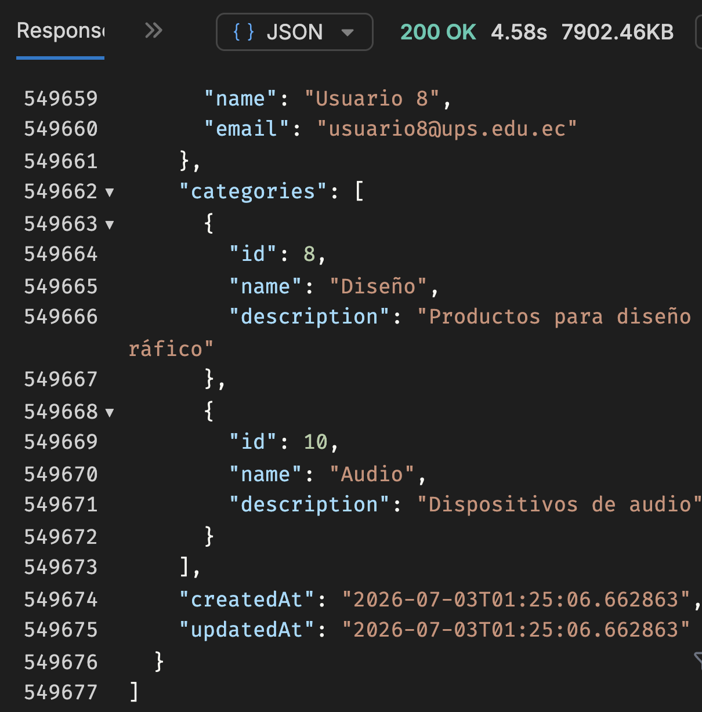
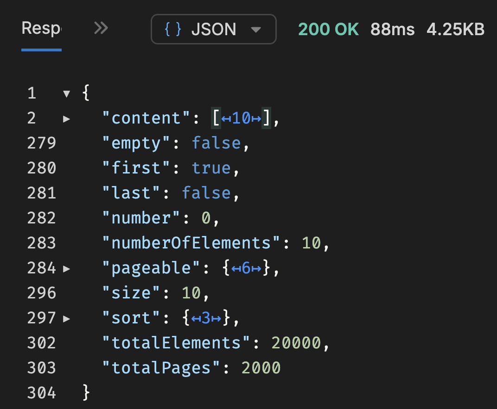
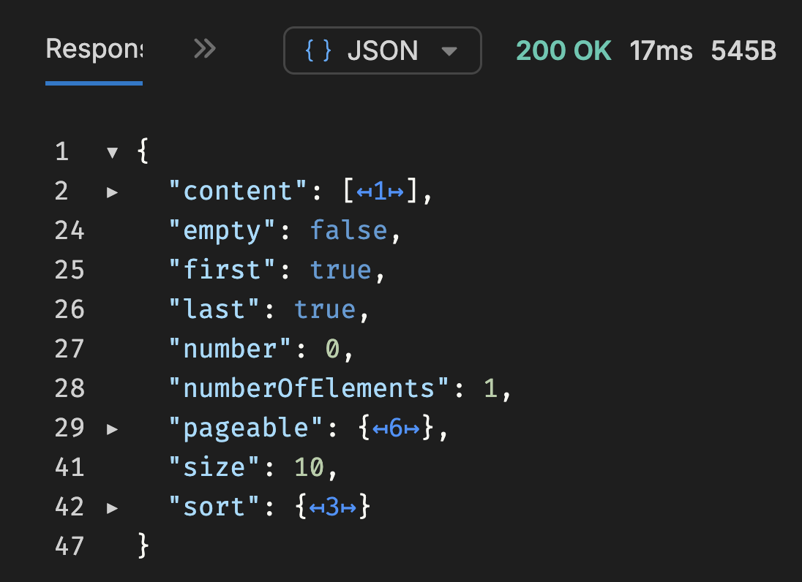

# Programación y Plataformas Web

# Frameworks Backend: Spring Boot – Paginación con Spring Data JPA

<div align="center">
  
  
</div>

---

# Práctica 10 (Spring Boot): Paginación de Productos con Page, Slice y Pageable

### Autores

**Pablo Torres**

[ptorresp@ups.edu.ec](mailto:ptorresp@ups.edu.ec)

GitHub: PabloT18

---

# 1. Introducción

En la práctica anterior se trabajó con consultas relacionadas usando:

* `@PathVariable`
* `@RequestParam`
* `@ModelAttribute`
* filtros dinámicos
* consultas personalizadas con `@Query`
* relaciones entre productos, usuarios y categorías
* relación muchos a muchos entre productos y categorías

Hasta este punto, la API ya puede consultar productos relacionados desde distintos contextos:

```txt
GET /api/users/{id}/products
GET /api/categories/{id}/products
```

También puede aplicar filtros como:

```txt
name
minPrice
maxPrice
userId
categoryId
```

Sin embargo, todavía existe un problema importante: las consultas devuelven todos los registros encontrados.

En una aplicación real, esto no es suficiente ni adecuado porque puede generar:

* respuestas demasiado grandes
* alto consumo de memoria
* consultas lentas
* sobrecarga de red
* mala experiencia de usuario
* problemas al trabajar con miles o millones de registros

En esta práctica se implementa paginación usando Spring Data JPA.

Se trabajará con:

* `Page`
* `Slice`
* `Pageable`
* `PageRequest`
* `Sort`
* endpoints paginados separados
* validación de parámetros de paginación
* productos con relaciones anidadas

En esta práctica se mantendrá el endpoint normal:

```txt
GET /api/products
```

y se agregarán endpoints nuevos para paginación:

```txt
GET /api/products/page
GET /api/products/slice
```

Al final, la actividad práctica consistirá en aplicar el mismo concepto al endpoint:

```txt
GET /api/categories/{id}/products
```

creando versiones paginadas.

---

# 2. Problema actual

Actualmente, el método `findAll()` de productos puede devolver todos los productos activos:

```java
@Override
public List<ProductResponseDto> findAll() {

    return productRepository.findAll()
            .stream()
            .filter(entity -> !entity.isDeleted())
            .map(ProductMapper::toModelFromEntity)
            .map(ProductMapper::toResponse)
            .toList();
}
```

Este enfoque funciona con pocos registros, pero no escala correctamente.

Si existen 10 productos, no hay problema.

Si existen 10 000 productos, la API intentará:

```txt
1. Consultar todos los productos
2. Cargar todos los registros en memoria
3. Mapear todos los productos a DTOs
4. Enviar todo el JSON al cliente
```

Esto afecta rendimiento y consumo de recursos.

La solución es paginar los resultados.

---

# 3. Flujo después de aplicar paginación

El flujo será:

```txt
Cliente
  ↓
ProductsController
  ↓
PaginationDto
  ↓
ProductService
  ↓
ProductServiceImpl
  ↓
Pageable
  ↓
ProductRepository
  ↓
PostgreSQL
  ↓
Page<ProductEntity> / Slice<ProductEntity>
  ↓
ProductMapper
  ↓
Page<ProductResponseDto> / Slice<ProductResponseDto>
  ↓
Cliente
```

El controlador recibe los parámetros de paginación.

El servicio valida y construye el `Pageable`.

El repositorio ejecuta la consulta paginada.

Spring Data JPA genera automáticamente el `LIMIT`, `OFFSET` y, en el caso de `Page`, también la consulta de conteo.

---

## 3.1. Responsabilidad de cada clase

| Clase                 | Responsabilidad                              |
| --------------------- | -------------------------------------------- |
| `ProductsController`  | Exponer endpoints normales y paginados       |
| `PaginationDto`       | Recibir parámetros `page`, `size`, `sortBy`  |
| `ProductService`      | Definir operaciones paginadas                |
| `ProductServiceImpl`  | Validar paginación y construir `Pageable`    |
| `ProductRepository`   | Ejecutar consultas paginadas                 |
| `ProductMapper`       | Convertir entidades o modelos a DTOs         |
| `ProductResponseDto`  | Devolver producto con `owner` y `categories` |
| `BadRequestException` | Reportar parámetros de paginación inválidos  |

---

# 4. Conceptos principales

## 4.1. Pageable

`Pageable` es el objeto que Spring Data JPA usa para saber:

```txt
qué página consultar
cuántos elementos traer
cómo ordenar los resultados
```

Ejemplo conceptual:

```java
Pageable pageable = PageRequest.of(0, 10, Sort.by("name").ascending());
```

Esto significa:

```txt
Página: 0
Tamaño: 10
Orden: name ascendente
```

---

## 4.2. Page

`Page` representa una respuesta paginada completa.

Incluye:

* lista de datos
* número de página actual
* tamaño de página
* total de elementos
* total de páginas
* si es primera página
* si es última página

Ejemplo:

```java
Page<ProductEntity> page = productRepository.findActivePage(pageable);
```

`Page` ejecuta normalmente dos consultas:

```txt
1. Consulta de datos con LIMIT y OFFSET
2. Consulta COUNT para saber el total de registros
```

Se usa cuando el frontend necesita mostrar:

```txt
Página 1 de 20
Total de registros: 200
```

---

## 4.3. Slice

`Slice` representa una respuesta paginada más ligera.

Incluye:

* lista de datos
* número de página actual
* tamaño de página
* si existe página siguiente
* si existe página anterior

No incluye:

* total de elementos
* total de páginas

Ejemplo:

```java
Slice<ProductEntity> slice = productRepository.findActiveSlice(pageable);
```

`Slice` es más eficiente porque no necesita ejecutar una consulta `COUNT`.

Se usa cuando el cliente solo necesita avanzar o retroceder:

```txt
Siguiente página
Página anterior
Scroll infinito
```

---

## 4.4. Diferencia entre Page y Slice

| Aspecto                     | Page                   | Slice                      |
| --------------------------- | ---------------------- | -------------------------- |
| Incluye datos               | Sí                     | Sí                         |
| Incluye total elementos     | Sí                     | No                         |
| Incluye total páginas       | Sí                     | No                         |
| Permite saber última página | Sí                     | Parcial                    |
| Ejecuta COUNT               | Sí                     | No                         |
| Más completo                | Sí                     | No                         |
| Más liviano                 | No                     | Sí                         |
| Uso recomendado             | Tablas administrativas | Scroll o navegación simple |

---

# 5. Endpoint donde se aplicará paginación

No se paginarán todos los endpoints en esta práctica.

Se aplicará primero sobre productos porque es el recurso con más relaciones:

```txt
ProductEntity
  ├── owner: UserEntity
  └── categories: Set<CategoryEntity>
```

Se mantendrá el endpoint normal:

```txt
GET /api/products
```

y se agregarán dos endpoints nuevos:

```txt
GET /api/products/page
GET /api/products/slice
```

Esto permite comparar:

```txt
findAll normal
findAll paginado con Page
findAll paginado con Slice
```

---

# 6. DTO para paginación

Se creará un DTO reutilizable para recibir los parámetros de paginación desde query params.

Archivo:

```txt
core/dtos/PaginationDto.java
```

Código:

```java
/*
 * DTO utilizado para recibir parámetros de paginación
 * desde query params.
 *
 * Ejemplo:
 * /api/products/page?page=0&size=10&sortBy=name&direction=asc
 */
public class PaginationDto {

    @Min(value = 0, message = "La página debe ser mayor o igual a 0")
    private int page = 0;

    @Min(value = 1, message = "El tamaño debe ser mayor o igual a 1")
    @Max(value = 100, message = "El tamaño no debe superar 100 registros")
    private int size = 10;

    private String sortBy = "id";

    private String direction = "asc";

    // Constructor vacío

    // Constructor lleno

    // Getters y setters
}
```

---

## 6.1. Parámetros soportados

| Parámetro   | Descripción                      | Valor por defecto |
| ----------- | -------------------------------- | ----------------- |
| `page`      | Número de página                 | `0`               |
| `size`      | Cantidad de registros por página | `10`              |
| `sortBy`    | Campo por el cual se ordena      | `id`              |
| `direction` | Dirección de ordenamiento        | `asc`             |

---

## 6.2. Ejemplos de uso

```txt
GET /api/products/page
GET /api/products/page?page=0&size=5
GET /api/products/page?page=1&size=10&sortBy=price&direction=desc
GET /api/products/slice?page=0&size=10&sortBy=createdAt&direction=desc
```

---

# 7. Validación de `PaginationDto`

Como `PaginationDto` llega desde query params, se usará:

```java
@Valid
@ModelAttribute
```

Ejemplo:

```java
@GetMapping("/page")
public Page<ProductResponseDto> findAllPage(
        @Valid @ModelAttribute PaginationDto pagination
) {
    return productService.findAllPage(pagination);
}
```

Si el cliente envía:

```txt
GET /api/products/page?page=-1&size=0
```

Spring Boot debe devolver:

```txt
400 Bad Request
```

Esto funcionará con el handler `BindException` creado en la práctica anterior.

---

# 8. Page, Slice y Pageable, Sort

Estas interfaces y clases son parte de Spring Data JPA y permiten implementar paginación de manera sencilla.

Se deben importar:

```java
import org.springframework.data.domain.Page;
import org.springframework.data.domain.Pageable;
import org.springframework.data.domain.Slice;
import org.springframework.data.domain.PageRequest; 
import org.springframework.data.domain.Sort;
```


# 9. Actualización de ProductRepository


Se agregarán dos consultas nuevas:

```txt
findActivePage
findActiveSlice
```

Ambas consultan solo productos activos:

```txt
deleted = false
```

Archivo:

```txt
products/repositories/ProductRepository.java
```


Código:

```java
/*
 * Repositorio encargado de gestionar la persistencia
 * de productos usando Spring Data JPA.
 */
@Repository
public interface ProductRepository extends JpaRepository<ProductEntity, Long> {

    // Otros métodos existentes

    /*
     * Consulta productos activos usando Page.
     *
     * Page ejecuta consulta de datos y consulta COUNT.
     */
    @Query(
            value = """
                    SELECT p
                    FROM ProductEntity p
                    WHERE p.deleted = false
                    """,
            countQuery = """
                    SELECT COUNT(p)
                    FROM ProductEntity p
                    WHERE p.deleted = false
                    """
    )
    Page<ProductEntity> findActivePage(Pageable pageable);

    /*
     * Consulta productos activos usando Slice.
     *
     * Slice no necesita total de registros.
     */
    @Query("""
            SELECT p
            FROM ProductEntity p
            WHERE p.deleted = false
            """)
    Slice<ProductEntity> findActiveSlice(Pageable pageable);
}
```

---

## 9.1. Por qué se usa `Pageable`

El parámetro:

```java
Pageable pageable
```

permite que Spring Data JPA reciba:

```txt
page
size
sort
```

y los traduzca a SQL.

Ejemplo:

```txt
GET /api/products/page?page=0&size=5&sortBy=price&direction=desc
```

se traduce conceptualmente a:

```sql
SELECT *
FROM products
WHERE deleted = false
ORDER BY price DESC
LIMIT 5 OFFSET 0;
```

---

# 11. Actualización de ProductService

Archivo:

```txt
products/services/ProductService.java
```

Agregar los métodos nuevos:

```java
/*
 * Servicio que define las operaciones disponibles
 * para la gestión de productos.
 */
public interface ProductService {

    // Métodos existentes 

    /*
     * Retorna productos activos usando Page.
     */
    Page<ProductResponseDto> findAllPage(PaginationDto pagination);

    /*
     * Retorna productos activos usando Slice.
     */
    Slice<ProductResponseDto> findAllSlice(PaginationDto pagination);
}
```

---

# 12. Actualización de ProductServiceImpl

Archivo:

```txt
products/services/ProductServiceImpl.java
```

La clase ya debe tener:

```java
private final ProductRepository productRepository;
private final UserRepository userRepository;
private final CategoryRepository categoryRepository;
```

Agregar los métodos paginados:

```java
/*
 * Retorna productos activos usando Page.
 *
 * Incluye metadatos completos:
 * totalElements, totalPages, number, size, first, last.
 */
@Override
@Transactional(readOnly = true)
public Page<ProductResponseDto> findAllPage(PaginationDto pagination) {

    Pageable pageable = createPageable(pagination);

    return productRepository.findActivePage(pageable)
            .map(ProductMapper::toModelFromEntity).map(ProductMapper::toResponse)
}

/*
 * Retorna productos activos usando Slice.
 *
 * No incluye totalElements ni totalPages.
 * Es más liviano para navegación secuencial.
 */
@Override
@Transactional(readOnly = true)
public Slice<ProductResponseDto> findAllSlice(PaginationDto pagination) {

    Pageable pageable = createPageable(pagination);

    return productRepository.findActiveSlice(pageable)
          .map(ProductMapper::toModelFromEntity).map(ProductMapper::toResponse)
}
```

---

## 12.1. Helper para construir Pageable

Agregar en `ProductServiceImpl`:

```java
/*
 * Construye el objeto Pageable validando:
 * página, tamaño, campo de ordenamiento y dirección.
 */
private Pageable createPageable(PaginationDto pagination) {

    String sortBy = normalizeSortBy(pagination.getSortBy());

    Sort.Direction direction = normalizeDirection(pagination.getDirection());

    Sort sort = Sort.by(direction, sortBy);

    return PageRequest.of(
            pagination.getPage(),
            pagination.getSize(),
            sort
    );
}
```

---

## 12.2. Helper para validar `sortBy`

```java
/*
 * Valida que el campo de ordenamiento exista y esté permitido.
 *
 * Se usa lista blanca para evitar ordenar por campos inexistentes
 * o por relaciones complejas no preparadas para esta práctica.
 */
private String normalizeSortBy(String sortBy) {

    if (sortBy == null || sortBy.isBlank()) {
        return "id";
    }

    Set<String> allowedFields = Set.of(
            "id",
            "name",
            "price",
            "stock",
            "createdAt",
            "updatedAt"
    );

    if (!allowedFields.contains(sortBy)) {
        throw new BadRequestException("Campo de ordenamiento no permitido: " + sortBy);
    }

    return sortBy;
}
```

---

## 12.3. Helper para validar dirección

```java
/*
 * Convierte la dirección recibida por query param
 * en Sort.Direction.
 */
private Sort.Direction normalizeDirection(String direction) {

    if (direction == null || direction.isBlank()) {
        return Sort.Direction.ASC;
    }

    if (direction.equalsIgnoreCase("asc")) {
        return Sort.Direction.ASC;
    }

    if (direction.equalsIgnoreCase("desc")) {
        return Sort.Direction.DESC;
    }

    throw new BadRequestException("Dirección de ordenamiento no válida: " + direction);
}
```

---

## 12.4. Por qué no ordenar por `owner.name` o `categories.name`

En esta práctica se permite ordenar solamente por campos directos de `ProductEntity`:

```txt
id
name
price
stock
createdAt
updatedAt
```

No se recomienda ordenar todavía por:

```txt
owner.name
categories.name
```

porque esos campos pertenecen a entidades relacionadas.

Ordenar por relaciones requiere consultas específicas con `JOIN`, posibles duplicados y validación adicional.


---

# 13. Actualización de ProductsController

Se mantienen los endpoints existentes.

Archivo:

```txt
products/controllers/ProductsController.java
```

Código:

```java
/*
 * Controlador REST encargado de exponer endpoints HTTP
 * para la gestión de productos.
 */
    /*
     * Endpoint normal.
     *
     * GET /api/products
     *
     * Se mantiene sin paginación para comparar con los endpoints paginados.
     */
    @GetMapping
    public List<ProductResponseDto> findAll() {
        return service.findAll();
    }

    /*
     * Endpoint paginado usando Page.
     *
     * GET /api/products/page
     * GET /api/products/page?page=0&size=5
     * GET /api/products/page?page=0&size=5&sortBy=price&direction=desc
     */
    @GetMapping("/page")
    public Page<ProductResponseDto> findAllPage(
            @Valid @ModelAttribute PaginationDto pagination
    ) {
        return service.findAllPage(pagination);
    }

    /*
     * Endpoint paginado usando Slice.
     *
     * GET /api/products/slice
     * GET /api/products/slice?page=0&size=5
     * GET /api/products/slice?page=0&size=5&sortBy=createdAt&direction=desc
     */
    @GetMapping("/slice")
    public Slice<ProductResponseDto> findAllSlice(
            @Valid @ModelAttribute PaginationDto pagination
    ) {
        return service.findAllSlice(pagination);
    }

    /*
     * Los demás endpoints CRUD se mantienen igual.
     */
}
```


# 14. Endpoints disponibles


## Productos sin paginación

| Método | Ruta            | Descripción                       |
| ------ | --------------- | --------------------------------- |
| GET    | `/api/products` | Lista todos los productos activos |

---

## Productos con Page

| Método | Ruta                                                           | Descripción                                |
| ------ | -------------------------------------------------------------- | ------------------------------------------ |
| GET    | `/api/products/page`                                           | Página inicial con valores por defecto     |
| GET    | `/api/products/page?page=0&size=5`                             | Primera página con 5 registros             |
| GET    | `/api/products/page?page=1&size=10`                            | Segunda página con 10 registros            |
| GET    | `/api/products/page?page=0&size=5&sortBy=price&direction=desc` | Productos ordenados por precio descendente |
| GET    | `/api/products/page?page=0&size=5&sortBy=name&direction=asc`   | Productos ordenados por nombre ascendente  |

---

## Productos con Slice

| Método | Ruta                                                                | Descripción                           |
| ------ | ------------------------------------------------------------------- | ------------------------------------- |
| GET    | `/api/products/slice`                                               | Slice inicial con valores por defecto |
| GET    | `/api/products/slice?page=0&size=5`                                 | Primer slice con 5 registros          |
| GET    | `/api/products/slice?page=1&size=5`                                 | Segundo slice con 5 registros         |
| GET    | `/api/products/slice?page=0&size=5&sortBy=createdAt&direction=desc` | Slice ordenado por fecha descendente  |


---
# 15. Carga Masiva de Datos

Crearemos un script SQL para insertar varios registros de prueba en la base de datos.

`seed_data`

Ver el archivo en 

[seed_data](files/seed_data.sql)


## Ejecución dentro del contenedor Docker

Desde la carpeta donde está el archivo:

docker exec -i postgres-dev psql -U ups -d devdb < seed_data.sql
---

# 16. Respuesta del endpoint normal 

# Problema detectado en el endpoint `GET /api/products`

Consumir un endpoint `GET all` sin paginación no es adecuado cuando la tabla ya contiene muchos registros.



En la prueba realizada, la respuesta del endpoint tardó aproximadamente:

```txt
4.58 segundos
```

y devolvió un tamaño de respuesta de:

```txt
7902.46 KB
```

Esto evidencia un problema de rendimiento importante, porque el backend está enviando todos los productos en una sola respuesta. Además, cada producto incluye información relacionada como:

```txt
owner
categories
```

Por tanto, el tamaño del JSON crece rápidamente.

Este comportamiento afecta directamente a:

* tiempo de respuesta del backend
* consumo de memoria del servidor
* tráfico de red
* tiempo de carga en el cliente
* procesamiento del JSON en el navegador o cliente REST
* experiencia de usuario

Aunque el endpoint responda con `200 OK`, no significa que esté bien diseñado. Una respuesta de casi 8 MB y más de 4 segundos para un listado general indica que el endpoint no escala correctamente.

El problema principal es que el endpoint está funcionando como:

```txt
GET /api/products
```

devolviendo todos los registros existentes.

En una API real, este tipo de consulta debe evitarse cuando existe un volumen alto de datos. La solución correcta es aplicar paginación para limitar la cantidad de registros devueltos por cada solicitud.

Por ejemplo:

```txt
GET /api/products/page?page=0&size=20
```

De esta forma, el cliente recibe solo una parte controlada de los datos, reduciendo el tamaño de la respuesta, mejorando el tiempo de carga y evitando sobrecargar la base de datos, el backend y el cliente.

Este caso justifica la necesidad de implementar paginación usando `Page` o `Slice` en Spring Data JPA.


# 17. Respuesta esperadas aplicando paginación

La solución es implementar paginación usando `Page` o `Slice`. Esto permite al cliente solicitar solo una parte de los registros, mejorando el rendimiento y reduciendo el tamaño de la respuesta.

### Respuesta con Page


Ejemplo:

```txt
GET /api/products/page?page=0&size=2&sortBy=price&direction=desc
```

Respuesta esperada:



el tamaño de la respuesta es más pequeno que la respuesta normal. 


---

## Respuesta con con Slice

Ejemplo:

```txt
GET /api/products/slice?page=0&size=2&sortBy=createdAt&direction=desc
```

Respuesta esperada:



La diferencia principal es que `Slice` no devuelve:

```txt
totalElements
totalPages
```

El tiempo de respuesta de `Slice` es más rápido porque no ejecuta la consulta `COUNT`.

y el tamaño de la respuesta es más pequeño.


---

# 18. SQL esperado

## 18.1. Consulta con Page

Cuando se usa:

```txt
GET /api/products/page?page=0&size=5
```

Hibernate genera una consulta similar a:

```sql
SELECT 
    p.*
FROM products p
WHERE p.deleted = false
ORDER BY p.id ASC
LIMIT 5 OFFSET 0;
```

Además, para `Page`, se genera una consulta adicional:

```sql
SELECT COUNT(*)
FROM products p
WHERE p.deleted = false;
```

---

## 18.2. Consulta con Slice

Cuando se usa:

```txt
GET /api/products/slice?page=0&size=5
```

Hibernate genera una consulta similar a:

```sql
SELECT 
    p.*
FROM products p
WHERE p.deleted = false
ORDER BY p.id ASC
LIMIT 6 OFFSET 0;
```

Spring puede traer un registro adicional para saber si existe una siguiente página.

Por eso `Slice` puede responder:

```txt
hasNext = true
```

sin ejecutar un `COUNT`.

---


# 19. Aplicación posterior a productos por categoría

En la práctica anterior ya existe este endpoint:

```txt
GET /api/categories/{id}/products
```

Ese endpoint devuelve productos de una categoría con filtros opcionales.


La actividad final será crear endpoints paginados equivalentes:

```txt
GET /api/categories/{id}/products/page
GET /api/categories/{id}/products/slice
```

El endpoint normal debe mantenerse:

```txt
GET /api/categories/{id}/products
```

De esta forma quedan habilitadas ambas opciones:

```txt
consulta normal
consulta paginada con Page
consulta paginada con Slice
```

---

# 20. Actividad práctica

Se debe aplicar paginación al endpoint de productos por categoría.

---

## 20.1. Mantener endpoint existente

El endpoint actual debe conservarse:

```txt
GET /api/categories/{id}/products
```

Este endpoint seguirá devolviendo:

```java
List<ProductResponseDto>
```

---

## 20.2. Crear endpoints paginados

Archivo:

```txt
categories/controllers/CategoryProductsController.java
```

Agregar:

```java
/*
 * Endpoint paginado con Page para productos de una categoría.
 *
 * GET /api/categories/{id}/products/page
 * GET /api/categories/{id}/products/page?page=0&size=5
 * GET /api/categories/{id}/products/page?name=laptop&minPrice=500&page=0&size=5
 */
@GetMapping("/{id}/products/page")
public Page<ProductResponseDto> findProductsByCategoryPage(...)
      {}


/*
 * Endpoint paginado con Slice para productos de una categoría.
 *
 * GET /api/categories/{id}/products/slice
 * GET /api/categories/{id}/products/slice?page=0&size=5
 */
@GetMapping("/{id}/products/slice")
public Slice<ProductResponseDto> findProductsByCategorySlice(
      ){
}
```

---

## 20.3. Actualizar ProductService

Archivo:

```txt
products/services/ProductService.java
```

Agregar:

```java
/*
 * Retorna productos de una categoría con filtros y Page.
 */
Page<ProductResponseDto> findByCategoryIdWithFiltersPage();

/*
 * Retorna productos de una categoría con filtros y Slice.
 */
Slice<ProductResponseDto> findByCategoryIdWithFiltersSlice();
```

---

## 20.4. Actualizar ProductRepository

Archivo:

```txt
products/repositories/ProductRepository.java
```

Agregar versión con `Page`

Agregar versión con `Slice`


---

## 20.5. Actualizar ProductServiceImpl

Archivo:

```txt
products/services/ProductServiceImpl.java
```

Agregar:

```java
/*
 * Retorna productos activos de una categoría usando Page.
 *
 * Mantiene los filtros de la práctica anterior y agrega paginación.
 */
@Override
@Transactional(readOnly = true)
public Page<ProductResponseDto> findByCategoryIdWithFiltersPage(
        Long categoryId,
        ProductFilterByCategoryDto filters,
        PaginationDto pagination
) {
    if (!categoryRepository.existsByIdAndDeletedFalse(categoryId)) {
        throw new NotFoundException("Category not found");
    }

    validateCategoryFilters(filters);

    String name = normalizeName(filters.getName());

    Pageable pageable = createPageable(pagination);

    return .....
}

/*
 * Retorna productos activos de una categoría usando Slice.
 *
 * No calcula totalElements ni totalPages.
 */
@Override
@Transactional(readOnly = true)
public Slice<ProductResponseDto> findByCategoryIdWithFiltersSlice(
        Long categoryId,
        ProductFilterByCategoryDto filters,
        PaginationDto pagination
) {
    if (!categoryRepository.existsByIdAndDeletedFalse(categoryId)) {
        throw new NotFoundException("Category not found");
    }

    validateCategoryFilters(filters);

    String name = normalizeName(filters.getName());

    Pageable pageable = createPageable(pagination);

    return ....
}
```

---

## 20.6. Helper para validar filtros de categoría

Si todavía no existe, crear en `ProductServiceImpl`:


# 22. Resultados y evidencias

En la nueva entrada del README, se debe agregar:

---


## Captura de respuesta con Page

Ejemplo:

```txt
GET /api/products/page?page=0&size=5
```

Debe evidenciar:

```txt
content
totalElements
totalPages
number
size
first
last
```

---

## Captura de respuesta con Slice

Ejemplo:

```txt
GET /api/products/slice?page=0&size=5
```

Debe evidenciar que no aparece:

```txt
totalElements
totalPages
```

---

## Captura de error por paginación inválida

Ejemplo:

```txt
GET /api/products/page?page=-1&size=0
```

Debe responder:

```txt
400 Bad Request
```

con formato estándar de `ErrorResponse`.

---

## Captura de endpoint de categoría paginado

Ejemplo:

```txt
GET /api/categories/2/products/page?page=110&size=5
```

Debe evidenciar:

* productos filtrados por categoría
* paginación aplicada
* metadatos de `Page`


## Captura de endpoint de categoría paginado

Ejemplo:

```txt
GET /api/categories/2/products/slice?page=10&size=5
```

Debe evidenciar:

* productos filtrados por categoría
* paginación aplicada
* metadatos de `Slcie`
---

## Explicación breve

El estudiante debe explicar:

```txt
¿Cuál es la diferencia entre Page y Slice?
```

También debe explicar:

```txt
¿Por qué la paginación debe aplicarse en el repositorio y no después de traer todos los datos en memoria?
```
