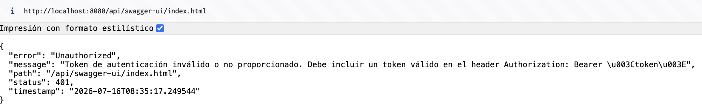
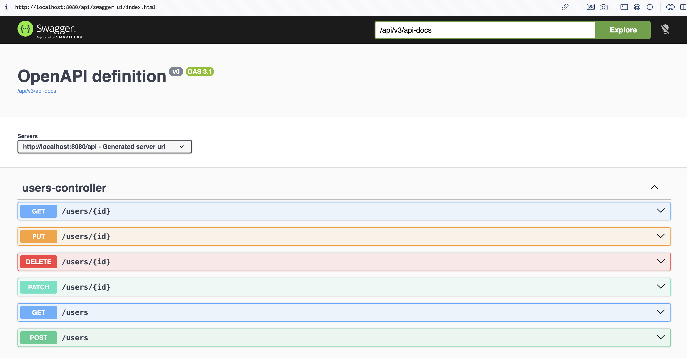
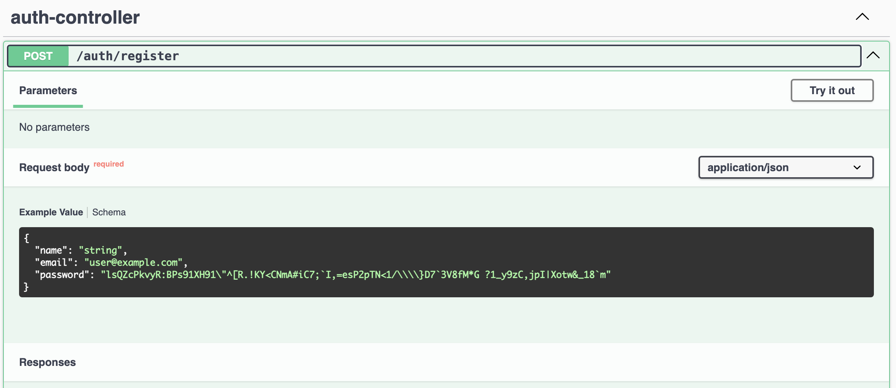
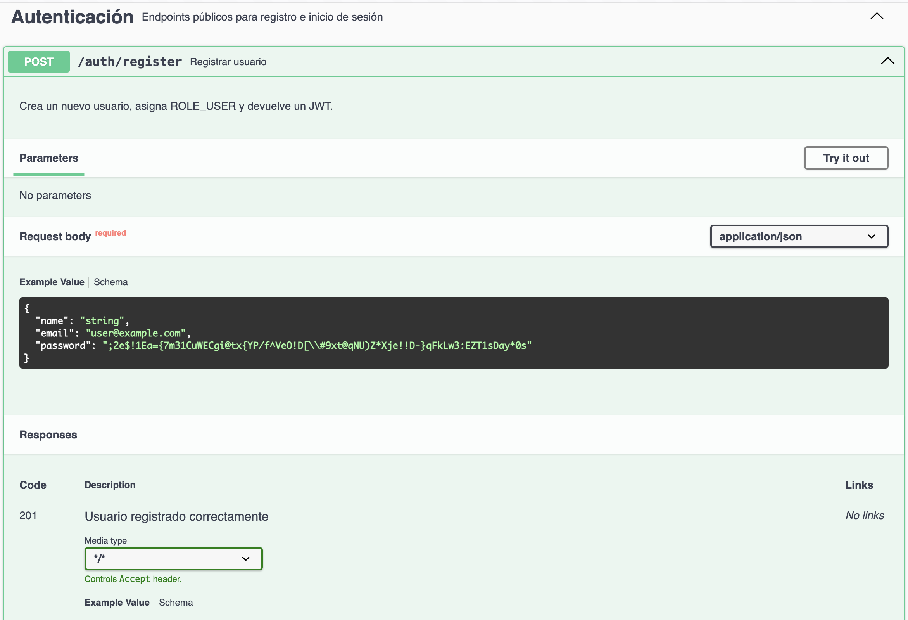

# Programación y Plataformas Web

# Spring Boot – Documentación de API con Swagger y OpenAPI

<div align="center">
  
  
</div>

---

# Práctica 15 (Spring Boot): Documentación de Endpoints con Swagger, OpenAPI y Seguridad JWT

### Autores

**Pablo Torres**

[ptorresp@ups.edu.ec](mailto:ptorresp@ups.edu.ec)

GitHub: PabloT18

---

# 1. Introducción

En las prácticas anteriores se implementó una API REST con:

* CRUD completo
* relaciones entre entidades
* filtros
* paginación
* autenticación con JWT
* autorización por roles
* validación de ownership

Hasta este punto, el backend ya tiene varios endpoints:

```txt
POST /api/auth/register
POST /api/auth/login
GET /api/users/me
GET /api/products/page
GET /api/products/slice
GET /api/products
POST /api/products
PUT /api/products/{id}
PATCH /api/products/{id}
DELETE /api/products/{id}
```

Sin embargo, todavía existe un problema importante: la API no cuenta con una documentación interactiva.

Cuando una API crece, no basta con que los endpoints funcionen. También es necesario que otros desarrolladores puedan entender:

```txt
qué endpoints existen
qué método HTTP usa cada endpoint
qué parámetros recibe
qué body espera
qué respuestas devuelve
qué endpoints son públicos
qué endpoints requieren token
qué errores pueden ocurrir
```

Para resolver esto se usará Swagger mediante OpenAPI.

---

# 2. ¿Qué es Swagger?

Swagger es un conjunto de herramientas que permite documentar, visualizar y probar APIs REST.

En Spring Boot normalmente se usa mediante la librería `springdoc-openapi`, que genera automáticamente documentación OpenAPI a partir de:

* controladores
* rutas
* métodos HTTP
* DTOs
* validaciones
* respuestas
* anotaciones de documentación

La documentación se puede ver en una interfaz web llamada Swagger UI.

---

# 3. ¿Qué es OpenAPI?

OpenAPI es una especificación estándar para describir APIs REST.

Permite representar una API en formato JSON o YAML.

Por ejemplo, una API puede ser descrita con información como:

```txt
ruta
método HTTP
parámetros
request body
response body
códigos de estado
seguridad
schemas
```

Swagger UI usa esa descripción OpenAPI para mostrar una documentación visual e interactiva.

---

# 4. Swagger vs OpenAPI

| Concepto | Descripción |
| -------- | ----------- |
| OpenAPI | Especificación estándar para describir APIs REST |
| Swagger UI | Interfaz visual para leer y probar la documentación |
| springdoc-openapi | Librería que integra OpenAPI y Swagger UI en Spring Boot |

En esta práctica se usará:

```txt
springdoc-openapi
```

para generar la documentación y visualizarla con:

```txt
Swagger UI
```

---

# 5. Objetivo de la práctica

El objetivo es implementar documentación interactiva para la API.

Al finalizar la práctica, la aplicación permitirá:

```txt
ver documentación de endpoints
consultar schemas de DTOs
probar endpoints públicos
probar endpoints protegidos con JWT
agregar botón Authorize en Swagger
documentar respuestas HTTP
documentar seguridad por Bearer Token
```

---

# 6. Flujo general de Swagger en el proyecto

```txt
Cliente / Desarrollador
  ↓
Swagger UI
  ↓
OpenAPI JSON
  ↓
Springdoc analiza controladores
  ↓
Detecta rutas, métodos, DTOs y respuestas
  ↓
Genera documentación interactiva
```

Swagger no reemplaza a Postman o Bruno, pero ayuda a tener una documentación viva dentro del propio backend.

---

# 7. Dependencia en Gradle

Archivo:

```txt
build.gradle.kts
```

Agregar la dependencia:

```kotlin
dependencies {
    // Otras dependencias existentes...

    // OpenAPI + Swagger UI
    implementation("org.springdoc:springdoc-openapi-starter-webmvc-ui:3.0.3")
}
```

Si el proyecto todavía usa Spring Boot 3, puede usarse una versión de la línea `2.8.x`.

Para esta práctica, considerando el proyecto con Spring Boot 4, se usará:

```txt
3.0.3
```

---

# 8. Primera ejecución de Swagger

Después de agregar la dependencia, ejecutar la aplicación:

```bash
./gradlew bootRun
```

Si el proyecto tiene `server.servlet.context-path=/api`, Swagger estará disponible en:

```txt
http://localhost:8080/api/swagger-ui/index.html
```

También se puede probar:

```txt
http://localhost:8080/api/swagger-ui.html
```

El documento OpenAPI en formato JSON estará disponible en:

```txt
http://localhost:8080/api/v3/api-docs
```

Si el proyecto no tiene context path `/api`, las rutas serían:

```txt
http://localhost:8080/swagger-ui/index.html
http://localhost:8080/v3/api-docs
```

---

# 9. Problema con Spring Security

Como el proyecto ya tiene Spring Security configurado, todos los endpoints no públicos están protegidos.

En prácticas anteriores se configuró algo similar a:

```java
.anyRequest().authenticated()
```

Esto significa que Swagger también puede quedar bloqueado si no se permite explícitamente.



Por eso, primero se configurará Swagger como público.

---

# 10. Permitir Swagger públicamente

En el archivo de configuración de seguridad: 

```java

                    .requestMatchers(
                            "/swagger-ui/**",
                            "/swagger-ui.html",
                            "/v3/api-docs/**"
                    ).permitAll()

                    /*
                     * Endpoints públicos de monitoreo.
                     */
                    .requestMatchers("/status/**").permitAll()
                    .requestMatchers("/actuator/**").permitAll()

```

Importante:

Si el proyecto tiene context path `/api`, no se debe escribir `/api/swagger-ui/**` en `requestMatchers`.

Se mantiene:

```java
"/swagger-ui/**"
"/v3/api-docs/**"
```

porque Spring Security evalúa las rutas internas de la aplicación.

---

# 11. Resultado de la primera configuración

Después de esta configuración, Swagger UI debe abrir correctamente.

Ruta esperada:

```txt
http://localhost:8080/api/swagger-ui/index.html
```

En esta primera etapa:

```txt
Swagger UI es público
la documentación se puede visualizar
los endpoints públicos se pueden probar
los endpoints protegidos aparecen documentados
los endpoints protegidos todavía requieren token
```



Si se intenta consumir un endpoint protegido desde Swagger sin token, debe responder:

```txt
401 Unauthorized
```

Esto es correcto.


---

# 12. Configuración básica de OpenAPI

Ahora se agregará una clase de configuración para personalizar la documentación.

Archivo:

```txt
security/config/OpenApiConfig.java
```

Código:

```java
/*
 * Configuración general de OpenAPI.
 *
 * Esta clase personaliza la información que aparece
 * en Swagger UI:
 * - título
 * - versión
 * - descripción
 * - servidor base
 * - esquema de seguridad JWT
 */
@Configuration
public class OpenApiConfig {

    /*
     * Nombre del esquema de seguridad.
     *
     * Este nombre se usará luego en @SecurityRequirement.
     */
    public static final String SECURITY_SCHEME_NAME = "bearerAuth";

    @Bean
    public OpenAPI customOpenAPI() {

        /*
         * Información general de la API.
         */
        Info info = new Info()
                .title("API de Programación y Plataformas Web")
                .version("1.0.0")
                .description("""
                        Documentación interactiva de la API REST desarrollada en Spring Boot.
                        
                        Esta API incluye:
                        - autenticación con JWT
                        - autorización por roles
                        - validación de ownership
                        - paginación
                        - manejo global de errores
                        """);

        /*
         * Servidor base.
         *
         * Si el proyecto usa context-path /api, se coloca /api.
         * Esto permite que Swagger construya correctamente las rutas.
         */
        Server localServer = new Server()
                .url("/api")
                .description("Servidor local");

        /*
         * Esquema de seguridad Bearer JWT.
         *
         * Esto habilita el botón Authorize en Swagger UI.
         */
        SecurityScheme bearerScheme = new SecurityScheme()
                .name(SECURITY_SCHEME_NAME)
                .type(SecurityScheme.Type.HTTP)
                .scheme("bearer")
                .bearerFormat("JWT")
                .description("Ingrese el JWT generado en /auth/login");

        Components components = new Components()
                .addSecuritySchemes(SECURITY_SCHEME_NAME, bearerScheme);

        return new OpenAPI()
                .info(info)
                .servers(List.of(localServer))
                .components(components);
    }
}
```

Imports necesarios:

```java
import io.swagger.v3.oas.models.Components;
import io.swagger.v3.oas.models.OpenAPI;
import io.swagger.v3.oas.models.info.Info;
import io.swagger.v3.oas.models.security.SecurityScheme;
import io.swagger.v3.oas.models.servers.Server;
import org.springframework.context.annotation.Bean;
import org.springframework.context.annotation.Configuration;
```

---

# 13. ¿Qué hace esta configuración?

La clase `OpenApiConfig` permite que Swagger muestre información más clara de la API.

También habilita el botón:

```txt
Authorize
```

Ese botón permite registrar un token JWT dentro de Swagger UI.

Después de autorizar el token, Swagger enviará automáticamente el header:

```http
Authorization: Bearer <token>
```

en cada endpoint protegido que tenga configurado el requisito de seguridad.

---

# 14. Configurar seguridad en Swagger

El botón `Authorize` ya estará disponible, pero todavía se debe indicar qué controladores o endpoints requieren ese esquema de seguridad.

Para eso se usa:

```java
@SecurityRequirement(name = "bearerAuth")
```

Este nombre debe coincidir con el definido en:

```java
public static final String SECURITY_SCHEME_NAME = "bearerAuth";
```

---

# 15. Documentar AuthController

El controlador de autenticación contiene endpoints públicos.

No se debe colocar `@SecurityRequirement` en todo el `AuthController`, porque login y register no requieren token.

Antes de agregar la documentación, el controlador se ve así:




Archivo:

```txt
security/controllers/AuthController.java
```

Código recomendado:

```java
/*
 * Controlador REST para autenticación.
 *
 * Estos endpoints son públicos:
 * - register
 * - login
 *
 * Por eso NO se usa @SecurityRequirement a nivel de clase.
 */
@Tag(
        name = "Autenticación",
        description = "Endpoints públicos para registro e inicio de sesión"
)
@RestController
@RequestMapping("/auth")
public class AuthController {

  
    /*
     * Registra un nuevo usuario.
     */
    @Operation(
            summary = "Registrar usuario",
            description = "Crea un nuevo usuario, asigna ROLE_USER y devuelve un JWT."
    )
    @ApiResponses(value = {
            @ApiResponse(
                    responseCode = "201",
                    description = "Usuario registrado correctamente"
            ),
            @ApiResponse(
                    responseCode = "400",
                    description = "Datos de entrada inválidos"
            ),
            @ApiResponse(
                    responseCode = "409",
                    description = "El email ya está registrado"
            )
    })
    @PostMapping("/register")
    // Metodo para registrar usuario
       

    /*
     * Inicia sesión.
     */
    @Operation(
            summary = "Iniciar sesión",
            description = "Valida credenciales y devuelve un JWT para consumir endpoints protegidos."
    )
    @ApiResponses(value = {
            @ApiResponse(
                    responseCode = "200",
                    description = "Login correcto"
            ),
            @ApiResponse(
                    responseCode = "400",
                    description = "Datos de entrada inválidos"
            ),
            @ApiResponse(
                    responseCode = "401",
                    description = "Credenciales inválidas"
            )
    })
    @PostMapping("/login")
   // Metodo para iniciar sesión
}
```


Imports principales:

```java
import io.swagger.v3.oas.annotations.Operation;
import io.swagger.v3.oas.annotations.responses.ApiResponse;
import io.swagger.v3.oas.annotations.responses.ApiResponses;
import io.swagger.v3.oas.annotations.tags.Tag;
import jakarta.validation.Valid;
import org.springframework.http.HttpStatus;
import org.springframework.http.ResponseEntity;
import org.springframework.web.bind.annotation.*;
```


Después de esta documentación, Swagger mostrará claramente que los endpoints de `AuthController` de la sigueinte manera:




---

# 16. Documentar ProductsController con seguridad JWT

Los endpoints de productos requieren token.

Por eso se puede colocar:

```java
@SecurityRequirement(name = "bearerAuth")
```

a nivel de clase.

Archivo:

```txt
products/controllers/ProductsController.java
```

Código recomendado:

```java
/*
 * Controlador REST encargado de exponer endpoints HTTP
 * para la gestión de productos.
 *
 * Todos los endpoints de este controlador requieren JWT,
 * porque el proyecto usa .anyRequest().authenticated().
 */
@Tag(
        name = "Productos",
        description = "Gestión de productos con paginación, roles y ownership"
)
@SecurityRequirement(name = "bearerAuth")
@RestController
@RequestMapping("/products")
public class ProductsController {

    /*
     * Endpoint administrativo.
     *
     * Solo ROLE_ADMIN puede consumir este endpoint.
     */
    @Operation(
            summary = "Listar todos los productos",
            description = """
                    Devuelve todos los productos activos sin paginación.
                    
                    Este endpoint es administrativo y requiere ROLE_ADMIN.
                    Para consultas normales se recomienda usar /products/page o /products/slice.
                    """
    )
    @ApiResponses(value = {
            @ApiResponse(
                    responseCode = "200",
                    description = "Listado completo de productos"
            ),
            @ApiResponse(
                    responseCode = "401",
                    description = "Token ausente o inválido"
            ),
            @ApiResponse(
                    responseCode = "403",
                    description = "El usuario no tiene ROLE_ADMIN"
            )
    })
    @GetMapping
    @PreAuthorize("hasRole('ADMIN')")
   // Metodo para listar todos los productos

    /*
     * Endpoint paginado con Page.
     */
    @Operation(
            summary = "Listar productos con Page",
            description = """
                    Devuelve productos activos usando Page.
                    
                    Incluye metadatos como:
                    - totalElements
                    - totalPages
                    - number
                    - size
                    - first
                    - last
                    """
    )
    @ApiResponses(value = {
            @ApiResponse(
                    responseCode = "200",
                    description = "Página de productos obtenida correctamente"
            ),
            @ApiResponse(
                    responseCode = "400",
                    description = "Parámetros de paginación inválidos"
            ),
            @ApiResponse(
                    responseCode = "401",
                    description = "Token ausente o inválido"
            )
    })
    @GetMapping("/page")
    // Metodo para listar productos con paginación Page

    /*
     * Endpoint paginado con Slice.
     */
    @Operation(
            summary = "Listar productos con Slice",
            description = """
                    Devuelve productos activos usando Slice.
                    
                    No calcula totalElements ni totalPages.
                    Es útil para navegación simple o scroll infinito.
                    """
    )
    @ApiResponses(value = {
            @ApiResponse(
                    responseCode = "200",
                    description = "Slice de productos obtenido correctamente"
            ),
            @ApiResponse(
                    responseCode = "400",
                    description = "Parámetros de paginación inválidos"
            ),
            @ApiResponse(
                    responseCode = "401",
                    description = "Token ausente o inválido"
            )
    })
    @GetMapping("/slice")
    // Metodo para listar productos con paginación Slice

    /*
     * Crear producto.
     *
     * El owner se toma desde el usuario autenticado.
     */
    @Operation(
            summary = "Crear producto",
            description = """
                    Crea un producto asociado al usuario autenticado.
                    
                    El cliente no debe enviar userId.
                    El owner se obtiene desde el JWT mediante @AuthenticationPrincipal.
                    """
    )
    @ApiResponses(value = {
            @ApiResponse(
                    responseCode = "201",
                    description = "Producto creado correctamente"
            ),
            @ApiResponse(
                    responseCode = "400",
                    description = "Datos de entrada inválidos"
            ),
            @ApiResponse(
                    responseCode = "401",
                    description = "Token ausente o inválido"
            ),
            @ApiResponse(
                    responseCode = "409",
                    description = "Nombre de producto ya registrado"
            )
    })
    @PostMapping
    @ResponseStatus(HttpStatus.CREATED)
// Metodo para crear producto

    /*
     * Actualizar producto.
     *
     * Se valida ownership en el servicio.
     */
    @Operation(
            summary = "Actualizar producto",
            description = """
                    Actualiza completamente un producto.
                    
                    Reglas:
                    - ROLE_USER solo puede actualizar productos propios.
                    - ROLE_ADMIN puede actualizar cualquier producto.
                    """
    )
    @ApiResponses(value = {
            @ApiResponse(
                    responseCode = "200",
                    description = "Producto actualizado correctamente"
            ),
            @ApiResponse(
                    responseCode = "400",
                    description = "Datos de entrada inválidos"
            ),
            @ApiResponse(
                    responseCode = "401",
                    description = "Token ausente o inválido"
            ),
            @ApiResponse(
                    responseCode = "403",
                    description = "El usuario no es propietario del producto"
            ),
            @ApiResponse(
                    responseCode = "404",
                    description = "Producto no encontrado"
            )
    })
    @PutMapping("/{id}")
    // Metodo para actualizar producto

    /*
     * Eliminar producto.
     */
    @Operation(
            summary = "Eliminar producto",
            description = """
                    Elimina lógicamente un producto.
                    
                    Reglas:
                    - ROLE_USER solo puede eliminar productos propios.
                    - ROLE_ADMIN puede eliminar cualquier producto.
                    """
    )
    @ApiResponses(value = {
            @ApiResponse(
                    responseCode = "204",
                    description = "Producto eliminado correctamente"
            ),
            @ApiResponse(
                    responseCode = "401",
                    description = "Token ausente o inválido"
            ),
            @ApiResponse(
                    responseCode = "403",
                    description = "El usuario no es propietario del producto"
            ),
            @ApiResponse(
                    responseCode = "404",
                    description = "Producto no encontrado"
            )
    })
    @DeleteMapping("/{id}")
    @ResponseStatus(HttpStatus.NO_CONTENT)
        // Metodo para eliminar producto
}
```

Imports principales:

```java
import ec.edu.ups.icc.fundamentos01.core.dtos.PaginationDto;
import ec.edu.ups.icc.fundamentos01.products.dtos.CreateProductDto;
import ec.edu.ups.icc.fundamentos01.products.dtos.ProductResponseDto;
import ec.edu.ups.icc.fundamentos01.products.dtos.UpdateProductDto;
import ec.edu.ups.icc.fundamentos01.products.services.ProductService;
import ec.edu.ups.icc.fundamentos01.security.services.UserDetailsImpl;
import io.swagger.v3.oas.annotations.Operation;
import io.swagger.v3.oas.annotations.responses.ApiResponse;
import io.swagger.v3.oas.annotations.responses.ApiResponses;
import io.swagger.v3.oas.annotations.security.SecurityRequirement;
import io.swagger.v3.oas.annotations.tags.Tag;
import jakarta.validation.Valid;
import org.springframework.data.domain.Page;
import org.springframework.data.domain.Slice;
import org.springframework.http.HttpStatus;
import org.springframework.security.access.prepost.PreAuthorize;
import org.springframework.security.core.annotation.AuthenticationPrincipal;
import org.springframework.web.bind.annotation.*;
```

---

# 17. Documentar DTOs con @Schema

Swagger puede detectar automáticamente los DTOs, pero se puede mejorar la documentación usando:

```java
@Schema
```

---

## 17.1. LoginRequestDto documentado

Archivo:

```txt
security/dtos/LoginRequestDto.java
```

Código:

```java
/*
 * DTO usado para recibir credenciales de login.
 */
@Schema(description = "Datos requeridos para iniciar sesión")
public class LoginRequestDto {

    @Schema(
            description = "Correo institucional o personal del usuario",
            example = "usera@ups.edu.ec"
    )
    @NotBlank(message = "El email es obligatorio")
    @Email(message = "Debe ingresar un email válido")
    private String email;

    @Schema(
            description = "Contraseña del usuario",
            example = "Password123"
    )
    @NotBlank(message = "La contraseña es obligatoria")
    @Size(min = 8, message = "La contraseña debe tener al menos 8 caracteres")
    private String password;

    public LoginRequestDto() {
    }

    // Constructor lleno

    // Getters y setters
}
```

Import:

```java
import io.swagger.v3.oas.annotations.media.Schema;
```

---

## 17.2. RegisterRequestDto documentado

Archivo:

```txt
security/dtos/RegisterRequestDto.java
```

Código:

```java
/*
 * DTO usado para registrar usuarios desde /auth/register.
 */
@Schema(description = "Datos requeridos para registrar un usuario")
public class RegisterRequestDto {

    @Schema(
            description = "Nombre completo del usuario",
            example = "Usuario A"
    )
    @NotBlank(message = "El nombre es obligatorio")
    @Size(min = 3, max = 150, message = "El nombre debe tener entre 3 y 150 caracteres")
    private String name;

    @Schema(
            description = "Email del usuario",
            example = "usera@ups.edu.ec"
    )
    @NotBlank(message = "El email es obligatorio")
    @Email(message = "Debe ingresar un email válido")
    @Size(max = 150, message = "El email no debe superar los 150 caracteres")
    private String email;

    @Schema(
            description = "Contraseña segura con mayúscula, minúscula y número",
            example = "Password123"
    )
    @NotBlank(message = "La contraseña es obligatoria")
    @Size(min = 8, max = 100, message = "La contraseña debe tener entre 8 y 100 caracteres")
    @Pattern(
            regexp = "^(?=.*[0-9])(?=.*[a-z])(?=.*[A-Z]).*$",
            message = "La contraseña debe contener al menos una mayúscula, una minúscula y un número"
    )
    private String password;

    public RegisterRequestDto() {
    }

    // Constructor lleno

    // Getters y setters
}
```

---

## 17.3. PaginationDto documentado

Archivo:

```txt
core/dtos/PaginationDto.java
```

Código:

```java
/*
 * DTO utilizado para recibir parámetros de paginación
 * desde query params.
 */
@Schema(description = "Parámetros para paginación y ordenamiento")
public class PaginationDto {

    @Schema(
            description = "Número de página, iniciando en 0",
            example = "0"
    )
    @Min(value = 0, message = "La página debe ser mayor o igual a 0")
    private int page = 0;

    @Schema(
            description = "Cantidad de registros por página",
            example = "5"
    )
    @Min(value = 1, message = "El tamaño debe ser mayor o igual a 1")
    @Max(value = 100, message = "El tamaño no debe superar 100 registros")
    private int size = 10;

    @Schema(
            description = "Campo por el cual se ordenan los resultados",
            example = "price"
    )
    private String sortBy = "id";

    @Schema(
            description = "Dirección de ordenamiento",
            example = "desc"
    )
    private String direction = "asc";

    public PaginationDto() {
    }

    // Constructor lleno

    // Getters y setters
}
```

---

# 18. Configuración opcional en application.yml

Archivo:

```txt
src/main/resources/application.yml
```

Agregar:

```yaml
springdoc:
    api-docs:
        path: /v3/api-docs
    swagger-ui:
        path: /swagger-ui.html
        operations-sorter: method
        tags-sorter: alpha
        try-it-out-enabled: true
```

Explicación:

| Propiedad | Descripción |
| --------- | ----------- |
| `api-docs.path` | Ruta donde se genera el JSON OpenAPI |
| `swagger-ui.path` | Ruta principal de Swagger UI |
| `operations-sorter` | Ordena operaciones por método HTTP |
| `tags-sorter` | Ordena tags alfabéticamente |
| `try-it-out-enabled` | Permite probar endpoints desde Swagger |

---

# 19. Uso de Swagger con JWT

- 19.1. Iniciar sesión
- 19.2. Copiar token
- 19.3. Usar botón Authorize
- 19.4. Probar endpoint protegido
- 19.5. Probar endpoint protegido sin Authorize


# 20. ¿Conviene dejar Swagger público en producción?

En desarrollo y en ambiente académico, dejar Swagger público facilita pruebas y revisión.

En producción, depende del contexto.

Opciones posibles:

| Opción | Uso recomendado |
| ------ | --------------- |
| Swagger público | Desarrollo, pruebas, entorno académico |
| Swagger protegido | Producción interna |
| Swagger deshabilitado | Producción pública sensible |

En esta práctica se deja Swagger UI público, pero los endpoints siguen protegidos por JWT.

---

# 21. Proteger Swagger con rol ADMIN

Cambiar el acceso a Swagger en `SecurityConfig`, realizar el cambio del endpoint de Swagger a protegido con `hasRole('ADMIN')`:


# 22. Buenas prácticas de documentación

## 22.1. Documentar qué hace el endpoint

Usar:

```java
@Operation(
        summary = "Crear producto",
        description = "Crea un producto asociado al usuario autenticado."
)
```

---

## 22.2. Documentar posibles respuestas

Usar:

```java
@ApiResponses(value = {
        @ApiResponse(responseCode = "201", description = "Producto creado correctamente"),
        @ApiResponse(responseCode = "400", description = "Datos inválidos"),
        @ApiResponse(responseCode = "401", description = "Token ausente o inválido")
})
```

---

## 22.3. Documentar DTOs

Usar:

```java
@Schema(description = "Datos requeridos para crear un producto")
```

y en los campos:

```java
@Schema(description = "Nombre del producto", example = "Laptop Lenovo")
```

---

## 22.4. Documentar seguridad

Usar:

```java
@SecurityRequirement(name = "bearerAuth")
```

en controladores protegidos.

---


# 23. Resultados y evidencias

En la nueva entrada del README, se debe agregar:

---

## Captura de Swagger UI cargado

Ruta:

```txt
/api/swagger-ui/index.html
```

Debe evidenciar:

```txt
lista de controladores
endpoints agrupados por tags
```

---

## Captura del JSON OpenAPI

Ruta:

```txt
/api/v3/api-docs
```

Debe evidenciar:

```txt
openapi
paths
components
```

---

## Captura de AuthController documentado

Debe evidenciar:

```txt
POST /api/auth/register
POST /api/auth/login
descripciones de endpoints
```

---

## Captura del botón Authorize

Debe evidenciar:

```txt
bearerAuth
JWT
```

---

## Captura de endpoint protegido sin token

Endpoint:

```txt
GET /api/products/page?page=0&size=5
```

Debe evidenciar:

```txt
401 Unauthorized
```

---

## Captura de endpoint protegido con token desde Swagger

Endpoint:

```txt
GET /api/products/page?page=0&size=5
```

Debe evidenciar:

```txt
200 OK
```

---

## Captura de endpoint ADMIN con usuario normal

Endpoint:

```txt
GET /api/products
```

Usar token con:

```txt
ROLE_USER
```

Debe evidenciar:

```txt
403 Forbidden
```

---

## Captura de endpoint ADMIN con usuario administrador

Endpoint:

```txt
GET /api/products
```

Usar token con:

```txt
ROLE_ADMIN
```

Debe evidenciar:

```txt
200 OK
```

---

## Explicación breve

Se debe  responder:


```txt
¿Cuál es la diferencia entre Swagger UI y OpenAPI?
```

También debe responder:

```txt
¿Por qué Swagger puede ser público pero los endpoints seguir protegidos?
```

Y:

```txt
¿Cómo se configura Swagger para enviar un JWT en Authorization: Bearer?
```
