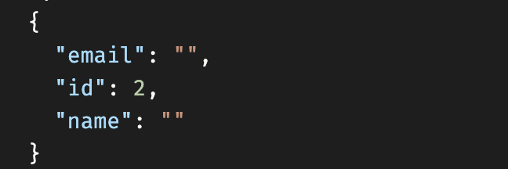
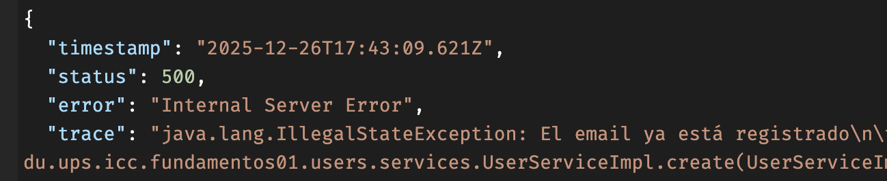

# Programación y Plataformas Web

# **Spring Boot – Modelos de Dominio, DTOs y Validación con Jakarta Validation**

<div align="center">
  
  
</div>

## **Práctica 6 (Spring Boot): Diseño de Modelos, DTOs y Validación Profesional**

### **Autor**

**Pablo Torres**

📧 [ptorresp@ups.edu.ec](mailto:ptorresp@ups.edu.ec)

💻 GitHub: PabloT18

---

# **1. Introducción**

En las prácticas anteriores se implementó:

* Controladores
* Servicios
* Entidades persistentes
* Repositorios JPA
* Conexión a PostgreSQL

Sin embargo, aún falta un componente esencial de toda API profesional:

## **Validar correctamente los datos que entran y salen del sistema.**

A partir de este tema aprenderás:

1. Cómo diseñar **DTOs con validación**
2. Cómo crear **modelos de dominio** que apliquen reglas de negocio
3. Cómo evitar que entren datos inválidos a la capa de persistencia
4. Cómo integrar validación automática en controladores y servicios
5. Cómo mantener separadas las capas DTO → Dominio → Entidad

Esta estructura es obligatoria en APIs bien diseñadas.


# **2. Instalación: Dependencias necesarias**

Spring Boot utiliza **Jakarta Validation (Bean Validation)** para validar DTOs.

En `build.gradle.kts` agrega:

```kts
dependencies {
    implementation("org.springframework.boot:spring-boot-starter-validation")
}
```

Spring Boot activará automáticamente el validador.


# **3. Diferencia entre: DTO – Modelo – Entidad**

| Capa                  | Propósito                                              |
| --------------------- | ------------------------------------------------------ |
| **DTO**               | Lo que entra y sale por la API. Validación sintáctica. |
| **Modelo de Dominio** | Reglas de negocio, invariantes, comportamiento.        |
| **Entidad JPA**       | Representa una tabla de base de datos. Persistencia.   |

### **Nunca deben mezclarse.**


# **4. Diseño de DTOs con Validación**

Los DTOs se validan **antes de llegar al servicio**, evitando lógica innecesaria.

## **4.1 CreateUserDto**

Sin validaciones nos permite ingresar datos inválidos, usuarios con emails erróneos, contraseñas débiles, etc.



se ingreslo un usuario inválido:

```json
{
  "name": "",
  "email": "correo-invalido",
  "password": "123"
}
```

Para evitar esto, agregamos validaciones con anotaciones de Jakarta Validation.

Archivo: `users/dtos/CreateUserDto.java`

```java
public class CreateUserDto {

    @NotBlank(message = "El nombre es obligatorio")
    @Size(min = 3, max = 150, message = "El nombre debe tener entre 3 y 150 caracteres")
    public String name;

    @NotBlank(message = "El email es obligatorio")
    @Email(message = "Debe ingresar un email válido")
    @Size(max = 150)
    public String email;

    @NotBlank(message = "La contraseña es obligatoria")
    @Size(min = 8, message = "La contraseña debe tener al menos 8 caracteres")
    public String password;
}
```


## **4.2 UpdateUserDto**

Archivo: `users/dtos/UpdateUserDto.java`

```java
public class UpdateUserDto {

    @NotBlank
    @Size(min = 3, max = 150)
    public String name;

    @NotBlank
    @Email
    @Size(max = 150)
    public String email;

    @NotBlank
    @Size(min = 8)
    public String password;
}
```


## **4.3 PartialUpdateUserDto (PATCH)**

Archivo: `users/dtos/PartialUpdateUserDto.java`

```java
public class PartialUpdateUserDto {

    @Size(min = 3, max = 150)
    public String name;

    @Email
    @Size(max = 150)
    public String email;

    @Size(min = 8)
    public String password;
}
```

### Reglas:

* **Todos los campos son opcionales**
* Solo se validan si se envían


## **4.4 UserResponseDto**

```java
public class UserResponseDto {
    public int id;
    public String name;
    public String email;
    public String createdAt;
}
```

### Nunca exponer:

* password
* deleted
* updatedAt


# **5. Activar Validación en Controladores**

Spring Boot valida automáticamente si:

1. Se usa `@Valid` o `@Validated`
2. Se recibe un DTO en el controlador

Ejemplo:

```java
@PostMapping
public UserResponseDto create(@Valid @RequestBody CreateUserDto dto) {
    return service.create(dto);
}
```

Si la validación falla, Spring genera automáticamente:

```json
{
  "errors": [
    "El nombre es obligatorio",
    "El email es inválido"
  ]
}
```

> Respuesta HTTP: `400 Bad Request` que deberemos capturar y manejar antes de enviar ya que no es amigable para el cliente.

> No incluye stack trace real, ni que campo falló.

```json
{
  "timestamp": "2025-12-26T17:36:43.035Z",
  "status": 400,
  "error": "Bad Request",
  "trace": "org.springframework.web....."
}
```


# **6. Diseño de Modelo de Dominio**

El **modelo de dominio** aplica reglas de negocio que NO pertenecen a DTOs ni entidades.

Archivo: `users/models/User.java`

```java
public class User {

    private int id;
    private String name;
    private String email;
    private String password;
    private LocalDateTime createdAt;

    public User(int id, String name, String email, String password) {
        if (name == null || name.isBlank())
            throw new IllegalArgumentException("Nombre inválido");

        if (email == null || !email.contains("@"))
            throw new IllegalArgumentException("Email inválido");

        if (password == null || password.length() < 8)
            throw new IllegalArgumentException("Password inválido");

        this.id = id;
        this.name = name;
        this.email = email;
        this.password = password;
        this.createdAt = LocalDateTime.now();
    }

    // Factory methods...
```

### Propósito del dominio:

* Garantizar estados válidos
* Ser independiente de la BD
* Permitir agregación de reglas de negocio


# **7. Factory Methods para conversión**

El dominio debe saber construirse desde:

### (1) un DTO

### (2) una entidad

### (3) a qué entidad debe convertirse

Ejemplo:

```java
public static User fromDto(CreateUserDto dto) {
    return new User(0, dto.name, dto.email, dto.password);
}

public static User fromEntity(UserEntity entity) {
    return new User(
        entity.getId().intValue(),
        entity.getName(),
        entity.getEmail(),
        entity.getPassword()
    );
}

public UserEntity toEntity() {
    UserEntity entity = new UserEntity();
    if (id > 0) entity.setId((long) id);
    entity.setName(this.name);
    entity.setEmail(this.email);
    entity.setPassword(this.password);
    return entity;
}
```


# **8. Validación en el Servicio**

El servicio valida:

* duplicados
* existencia de registros
* integridad del negocio

Ejemplo:

```java
@Override
public UserResponseDto create(CreateUserDto dto) {

    // Regla: email único
    if (userRepo.findByEmail(dto.email).isPresent()) {
        throw new IllegalStateException("El email ya está registrado");
    }

    User user = User.fromDto(dto);

    UserEntity saved = userRepo.save(user.toEntity());

    return UserMapper.toResponse(User.fromEntity(saved));
}
```

Aunque en el stack trace se vea `IllegalStateException`, este error debe ser capturado y manejado para enviar una respuesta amigable al cliente.



en trace esta un mensaje no amigable para el cliente.


# **9. Validación en Repositorio / BD**

Hibernate + PostgreSQL refuerzan:

* UNIQUE email
* NOT NULL
* longitud máxima
* tipos correctos

Esto garantiza datos consistentes aunque falle el servicio.


# **10. Flujo completo de validación**

```
Cliente
   ↓
DTO con @Valid  (validación sintáctica)
   ↓
Modelo de Dominio (reglas de negocio)
   ↓
toEntity()
   ↓
Repositorio (constraints de BD)
   ↓
UserEntity persistido
   ↓
fromEntity()
   ↓
toResponseDto()
   ↓
Cliente
```


# **11. Actividad práctica**

El estudiante debe implementar lo siguiente para el módulo:

```
products/
```

## **11.1 Crear DTOs con validación**

* CreateProductDto
* UpdateProductDto
* PartialUpdateProductDto
* ProductResponseDto

Reglas mínimas:

* `name` → obligatorio, min 3
* `price` → mínimo 0
* `stock` → mínimo 0


## **11.2 Crear modelo de dominio Product**

Con métodos:

* `Product.fromDto()`
* `Product.fromEntity()`
* `product.toEntity()`
* `product.toResponseDto()`
* `product.update()`
* `product.partialUpdate()`


## **11.3 Integrar validación en ProductController**

Usar:

```java
@PostMapping
public ProductResponseDto create(@Valid @RequestBody CreateProductDto dto)
```


## **11.4 Validar reglas de dominio**

Ejemplo:

* no stock negativo
* no precio negativo


## **11.5 Validar casos erróneos desde Postman**

Debe generar errores automáticos al enviar:

* `price: -5`
* `stock: -1`
* `""` como nombre
* email inválido


# **12. Resultados y evidencias**

El estudiante entrega:

1. Captura de DTOs con validaciones
2. Captura del modelo de dominio completo
3. Captura de la respuesta de error al enviar un POST inválido
4. Captura del CRUD de productos validado correctamente

