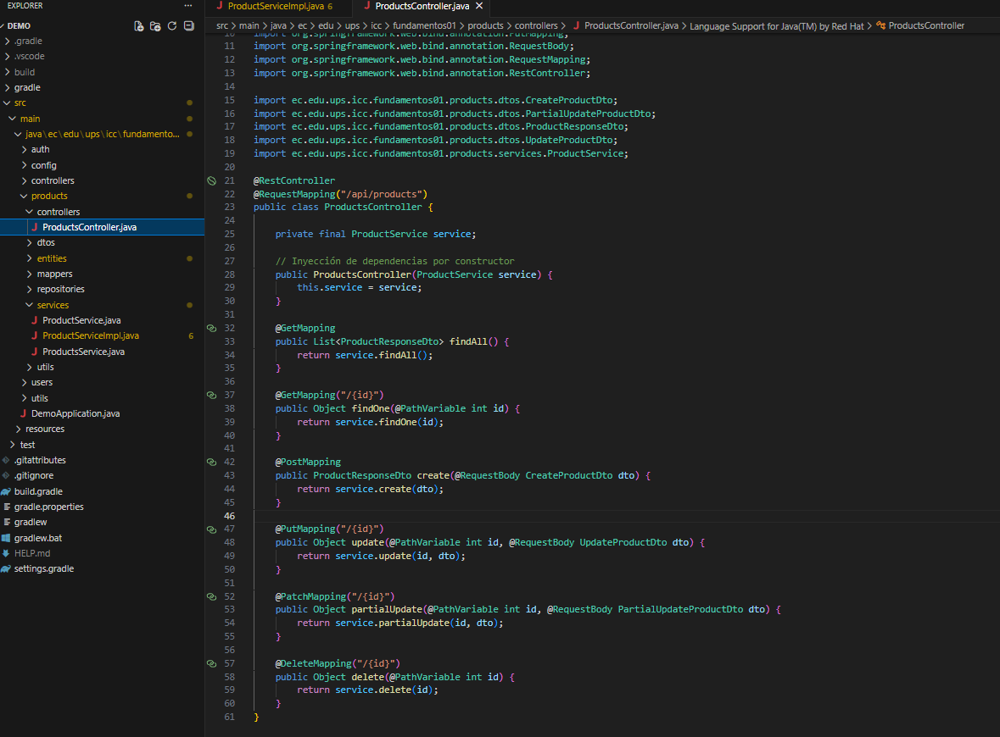
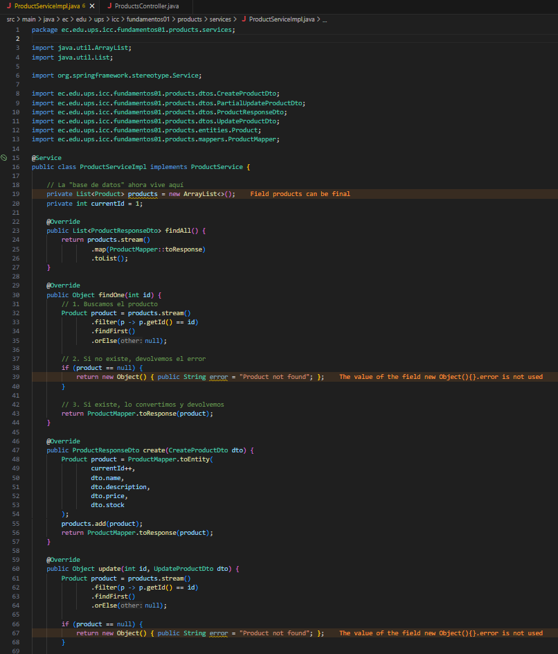
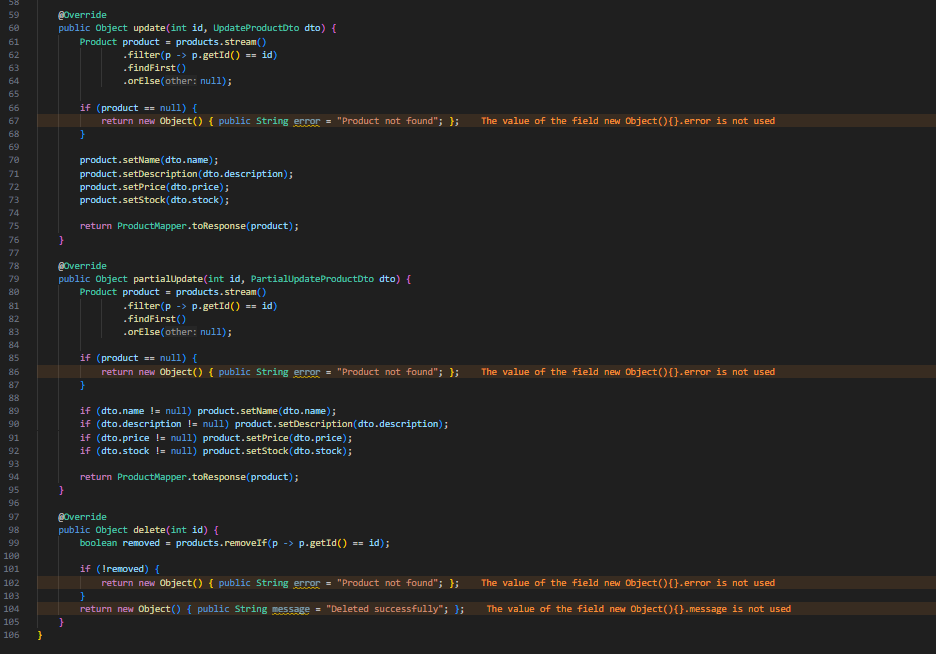

# Programación y Plataformas Web

# Frameworks Backend: Spring Boot – Servicios, Lógica de Negocio e Inyección de Dependencias

<div align="center">
  
</div>


# Práctica 4 (Spring Boot): Controladores + Servicios + Lógica de Negocio

### Autores

**Pablo Torres**

 📧 [ptorresp@ups.edu.ec](mailto:ptorresp@ups.edu.ec)

 💻 GitHub: PabloT18

---

# 1. Introducción

En la práctica anterior (Práctica 3) se implementó un **CRUD REST completo** colocando toda la lógica dentro del controlador:

* creación de usuarios
* búsqueda
* actualización
* eliminación
* manejo del listado en memoria

Este enfoque funciona para aprender los endpoints, pero **no escala** en proyectos reales.

En esta práctica se introduce:

* servicios (`@Service`)
* inyección de dependencias
* separación de responsabilidades (SRP)
* traslado de la lógica del controlador al servicio
* arquitectura MVCS aplicada correctamente

El módulo de trabajo sigue siendo **users/**.
En la parte práctica se replica todo para **products/**.


# 2. Estructura del módulo con servicios

Carpeta objetivo:

```
src/main/java/ec/edu/ups/icc/fundamentos01/users/
```

La estructura ahora incluye:

```
users/
 ├── controllers/
 ├── dtos/
 ├── entities/
 ├── mappers/
 ├── services/
 │     ├── UserService.java
 │     └── UserServiceImpl.java
```

En este tema:

* el controlador queda reducido a **enrutar solicitudes y llamar al servicio**
* la lógica de negocio se mueve a **UserServiceImpl**
* la lista en memoria ahora vive dentro del **servicio**


# 3. Definición del Servicio (Interfaz)

Archivo:
`services/UserService.java`

Su función es declarar **qué operaciones ofrece el módulo**, sin implementar nada aún.

```java

public interface UserService {

    List<UserResponseDto> findAll();

    Object findOne(int id);

    UserResponseDto create(CreateUserDto dto);

    Object update(int id, UpdateUserDto dto);

    Object partialUpdate(int id, PartialUpdateUserDto dto);

    Object delete(int id);
}
```


# 4. Implementación del Servicio

Archivo:
`services/UserServiceImpl.java`

Aquí se mueve toda la lógica antes ubicada en el controlador:

```java

@Service
public class UserServiceImpl implements UserService {

    private List<User> users = new ArrayList<>();
    private int currentId = 1;

    @Override
    public List<UserResponseDto> findAll() {
        return users.stream().map(UserMapper::toResponse).toList();
    }

    @Override
    public Object findOne(int id) {
        return users.stream()
                .filter(u -> u.getId() == id)
                .findFirst()
                .map(UserMapper::toResponse)
                .orElseGet(() -> new Object() { public String error = "User not found"; });
    }

    @Override
    public UserResponseDto create(CreateUserDto dto) {
        User user = UserMapper.toEntity(currentId++, dto.name, dto.email);
        users.add(user);
        return UserMapper.toResponse(user);
    }

    @Override
    public Object update(int id, UpdateUserDto dto) {
        User user = users.stream().filter(u -> u.getId() == id).findFirst().orElse(null);
        if (user == null) return new Object() { public String error = "User not found"; };

        user.setName(dto.name);
        user.setEmail(dto.email);

        return UserMapper.toResponse(user);
    }

    @Override
    public Object partialUpdate(int id, PartialUpdateUserDto dto) {
        User user = users.stream().filter(u -> u.getId() == id).findFirst().orElse(null);
        if (user == null) return new Object() { public String error = "User not found"; };

        if (dto.name != null) user.setName(dto.name);
        if (dto.email != null) user.setEmail(dto.email);

        return UserMapper.toResponse(user);
    }

    @Override
    public Object delete(int id) {
        boolean removed = users.removeIf(u -> u.getId() == id);
        if (!removed) return new Object() { public String error = "User not found"; };

        return new Object() { public String message = "Deleted successfully"; };
    }
}
```


# 5. Inyección del Servicio en el Controlador

Archivo:
`controllers/UsersController.java`

El controlador ahora queda limpio:

```java
//.....
public class UsersController {

    private final UserService service;

    public UsersController(UserService service) {
        this.service = service;
    }

   // TODO: actualizar endpoints que llaman a service
}
```


# 6. ¿Por qué se implementa así?

Separar controlador → servicio cumple estos objetivos:

### Mantener el controlador pequeño

El controlador solo enruta solicitudes y devuelve respuestas.

### Reutilizar lógica

Si otro controlador necesitara lógica de usuarios, solo depende del servicio.

### Facilitar pruebas unitarias

El servicio se puede probar sin levantar el servidor.

### Preparar el camino para una base de datos real

Pronto se reemplazará:

```
List<User> users
```

por:

```
UserRepository (Spring Data JPA)
```

y el controlador seguirá funcionando igual.


# 7. Flujo completo después de aplicar servicios

```
Cliente
  ↓
Controlador (recibe DTO)
  ↓ llama →
Servicio (reglas, validaciones, lógica)
  ↓ usa →
Entidad + Mapper
  ↓
Controlador (retorna DTO de respuesta)
  ↓
Cliente
```

Esto refleja el patrón MVCS aplicado correctamente.


# 8. Endpoints disponibles

| Método | Ruta             | Descripción                |
| ------ | ---------------- | -------------------------- |
| GET    | `/api/users`     | Lista usuarios             |
| GET    | `/api/users/:id` | Obtiene usuario            |
| POST   | `/api/users`     | Crea usuario               |
| PUT    | `/api/users/:id` | Reemplaza usuario completo |
| PATCH  | `/api/users/:id` | Actualiza parcialmente     |
| DELETE | `/api/users/:id` | Elimina usuario            |


# 9. Actividad práctica

Los estudiantes deben replicar toda la estructura anterior para el módulo:

```
products/
```

Creando:

```
controllers/
dtos/
entities/
mappers/
services/
    ProductService.java
    ProductServiceImpl.java
```

Y deben implementar **los mismos 6 endpoints REST**, trasladando la lógica del controlador al servicio.


# 10. Resultados y evidencias

Cada estudiante debe entregar:

### 2. Captura del `constructor`  archivo

`products.controller.java`

 

### 3. Captura completa del archivo

`ProductServiceImpl.java`





### 4. Explicación breve

1. ¿Por qué se usa un servicio?
Se utiliza para cumplir con el principio de Separación de Responsabilidades.

Centralización de la Lógica de Negocio: El servicio contiene el "corazón" de la aplicación (cálculos, validaciones complejas, transformaciones de datos). El controlador no debe saber cómo se crea un producto, solo pedir que se cree.

Reutilización: Si en el futuro necesitas crear un producto desde otro lugar (por ejemplo, una tarea programada o un importador de Excel), puedes llamar al mismo método create() del servicio sin pasar por una petición HTTP.

Testabilidad: Es mucho más fácil probar una clase pura (el servicio) que probar un controlador que depende de objetos HTTP complejos (Request/Response).

2. ¿Qué ventajas aporta MVCS (Modelo-Vista-Controlador-Servicio)?
El patrón MVCS añade la capa de Servicios al MVC tradicional para resolver el problema de los "Controladores Obesos" (Fat Controllers). Sus ventajas son:

Escalabilidad: Permite que la aplicación crezca sin que el código se vuelva inmanejable. Cada capa tiene un propósito único.

Independencia de Datos: Ahora mismo usas un array en memoria. Gracias a MVCS, mañana puedes conectar una base de datos real (MySQL, MongoDB) modificando solo el Servicio. El Controlador ni se enterará del cambio.

Mantenibilidad: Si hay un error en el cálculo de precios, sabes exactamente dónde buscar (en el Servicio), sin tener que navegar entre código de rutas o validaciones HTTP.

3. ¿Por qué el controlador ahora está más limpio?
Porque ha delegado toda la responsabilidad operativa.

Delegación: El controlador ahora actúa como un simple "recepcionista" o "policía de tráfico". Su único trabajo es recibir la petición, validar el formato (DTO) y pasársela al experto (el Servicio).

Inyección de Dependencias: Gracias al constructor private readonly service: ProductsService, NestJS se encarga de instanciar la clase. No hay new ProductsService() ni lógica de inicialización ensuciando el código.

Legibilidad: Al leer el controlador, ves de un vistazo qué rutas existen (@Get, @Post) sin distraerte con bucles for, if o manipulación de arrays. Esto sigue el principio de "Skinny Controller" (Controlador delgado).