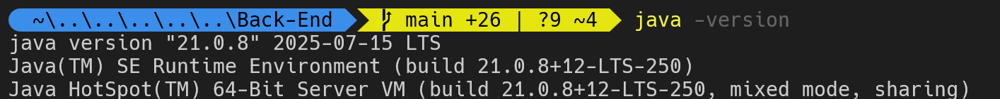
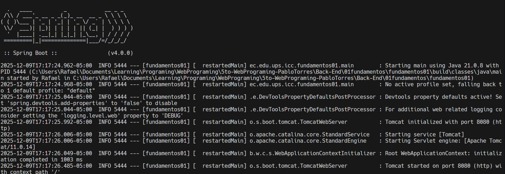
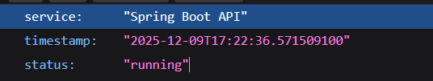
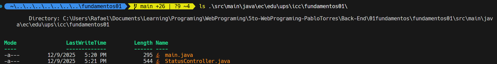

# Captura de verifición de Java

# Captura del servidor Spring Boot ejecutandose:

# Captura del endpoint /api/status funcionando en el navegador o Postman o Bruno

# Captura del siguiente comando en terminal

# Resumen 

Entendí que el endpoint es una ruta que el servidor responde con un mensaje o datos cuando alguien la visita. Spring Boot se encarga de levantar el servidor y organizar todo para que los endpoints funcionen sin complicarse con configuraciones manuales.