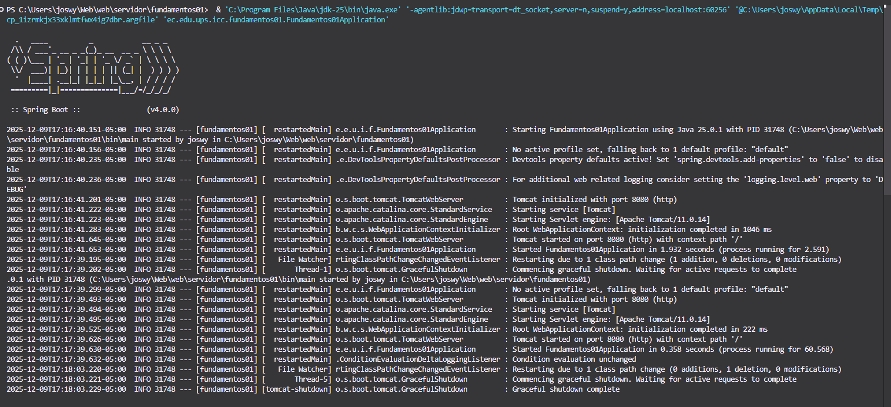
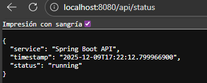
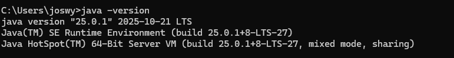
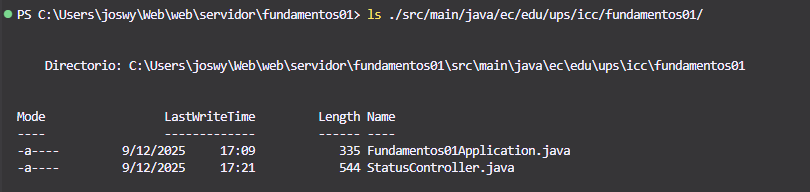

# Programación y Plataformas Web

# Frameworks Backend: Spring Boot – Instalación y Configuración

<div align="center">
  
</div>


## Práctica 1 (Spring Boot): Instalación, Configuración Inicial y Primer Endpoint

### Autor
*Miguel Ángel Vanegas*   
📧 mvanegasp@est.ups.edu.ec  
💻 GitHub: [MiguelV145](https://github.com/MiguelV145)  
*Jose Vanegas*  
📧 jvanegasp1@est.ups.edu.ec   
💻 GitHub: [josevac1](https://github.com/josevac1)
---

# 1. Introducción al framework

**Spring Boot** es un framework moderno que permite construir aplicaciones Java para la web de manera ágil, estructurada y con características listas para producción. Está diseñado bajo una filosofía denominada *opinionated*, donde gran parte de la configuración se proporciona por defecto con el fin de simplificar el inicio del proyecto y acelerar el desarrollo.

Spring Boot se caracteriza por:

* proporcionar servidores embebidos (Tomcat, Jetty)
* iniciar aplicaciones mediante un ejecutable único (`java -jar`)
* evitar configuraciones extensas en XML
* aplicar auto-configuración basada en las dependencias del proyecto
* ofrecer soporte integrado para seguridad, métricas, perfiles, configuración externa y más

Documentación oficial:
[https://docs.spring.io/spring-boot/](https://docs.spring.io/spring-boot/)

---

# 2. Requisitos oficiales

Según la documentación de Spring Boot **4.0.0**, se requiere:

## Java

* Java **17** como mínimo
* Compatible hasta Java 25

## Build Tools compatibles

Herramientas que permiten compilar y administrar dependencias:

| Build Tool | Versión mínima requerida |
| ---------- | ------------------------ |
| **Maven**  | 3.6.3 o superior         |
| **Gradle** | 8.14.x o 9.x             |

> En esta asignatura se utilizará **Gradle** para la creación del proyecto.
> En el tema **02_estructura_proyecto.md** se profundiza en la comparación entre Maven y Gradle, su rol y la estructura de cada uno.


## Servidores embebidos compatibles

Spring Boot incluye servidores web *embebidos*.
Un servidor embebido es un servidor HTTP que viene **integrado dentro de la aplicación**, por lo que no requiere instalación externa (como ocurría antes con Tomcat instalado aparte).

En Spring Boot, el servidor:

* **se incluye automáticamente como dependencia**
* **se inicia junto con la aplicación**
* **no necesita configurarse manualmente**
* **permite ejecutar la aplicación solo con `java -jar` o `./gradlew bootRun`**

Esto hace que la aplicación funcione como un servicio autónomo (*stand-alone application*), muy útil en entornos de microservicios o despliegues modernos.

---

## ¿Por qué existen los servidores embebidos?

Antes, las aplicaciones Java debían:

1. instalar un servidor externo (Tomcat, Jetty o GlassFish)
2. desplegar la aplicación en formato `.war` dentro del servidor
3. reiniciar y configurar ese servidor manualmente

Esto hacía que el desarrollo fuera más lento.

Con Spring Boot, el servidor se empaqueta dentro del proyecto, lo que permite:

* iniciar y detener el servidor desde el IDE o la terminal
* desplegar la aplicación completa como un único archivo `.jar`
* evitar configuraciones complejas de contenedores externos

---

## ¿Se ejecutan solos?

Sí.
Cuando la aplicación Spring Boot se inicia, el servidor embebido también se inicia automáticamente.

Ejemplo del log:

```
Tomcat started on port 8080
```

El desarrollador no necesita:

* instalar Tomcat aparte
* configurar carpetas especiales
* iniciar servicios externos

Toda la gestión del servidor se maneja mediante Spring Boot.

---

## ¿Qué servidores embebidos se incluyen?

De acuerdo con la documentación de Spring Boot 4.0.0:

| Servidor embebido                                               | Versión compatible | Características                                                      |
| --------------------------------------------------------------- | ------------------ | -------------------------------------------------------------------- |
| **Tomcat**                                                      | 11.0.x             | Servidor por defecto para aplicaciones web. Muy usado en producción. |
| **Jetty**                                                       | 12.1.x             | Ligero y modular. Útil para aplicaciones personalizadas.             |
| **Undertow** *(ya no es el valor por defecto en Spring Boot 4)* | —                  | Orientado a alta concurrencia, aunque su soporte se ha reducido.     |

---

## ¿Cuál se usa en esta materia?

Se utiliza **Tomcat embebido**, que es:

* el comportamiento por defecto en Spring Boot
* estable y ampliamente documentado
* sencillo para estudiar arquitectura backend

---

## ¿Ventajas de los servidores embebidos?

| Ventaja                         | Explicación                                                      |
| ------------------------------- | ---------------------------------------------------------------- |
| **Simplifican el desarrollo**   | No requiere instalar servidores manualmente.                     |
| **Portabilidad**                | La aplicación y su servidor están en un solo archivo `.jar`.     |
| **Estandarización**             | El entorno es idéntico para todos los estudiantes.               |
| **Integración con Spring Boot** | El servidor se configura automáticamente según las dependencias. |
| **Despliegue rápido**           | Ideal para Docker, Kubernetes y microservicios.                  |

---

## ¿Cómo se relaciona esto con la estructura del proyecto?

Dentro del `build.gradle`, al agregar la dependencia:

```gradle
implementation 'org.springframework.boot:spring-boot-starter-web'
```

Spring Boot:

1. detecta que la aplicación es una API web
2. activa la auto-configuración de Spring MVC
3. registra el servidor embebido Tomcat
4. inicia Tomcat en el puerto 8080
5. habilita controladores REST para recibir peticiones

---

## Ejemplo visual del ciclo

```
[Aplicación Spring Boot]
   │
   │ incluye automáticamente
   ↓
[Tomcat embebido]
   │
   │ inicia junto con la aplicación
   ↓
http://localhost:8080/api/status
```

No se requiere instalación ni activación manual del servidor.


---

# 3. Configuración del entorno de desarrollo

## 3.1 Instalación de Java

Java debe estar instalado previamente. La versión recomendada es Temurin 17:

[https://adoptium.net/](https://adoptium.net/)

Verificación:

```bash
java -version
```

Salida esperada:

```
openjdk version "17.x.x"
```

---

## 3.2 Entornos recomendados

### IntelliJ IDEA (recomendado)

Adecuado para proyectos Spring Boot por su integración con:

* auto-configuración
* navegación de anotaciones
* inspección de dependencias

### Visual Studio Code (recomendado personal)

Requiere instalar:

* Extension Pack for Java
* Spring Boot Extension Pack
* Test Runner for Java
* Debugger for Java

---


# 4. Creación del proyecto 

El proyecto Spring Boot se genera mediante la herramienta oficial:

[https://start.spring.io/](https://start.spring.io/)

O desde el asistente integrado en VS Code o IntelliJ.
En esta práctica se utilizará **Gradle** como sistema de construcción y Java como lenguaje.

---

## **4.1 Selección inicial del proyecto**

En la sección inicial se deben seleccionar los siguientes valores:

| Campo       | Selección               |
| ----------- | ----------------------- |
| Build Tool  | **Gradle – Groovy DSL** |
| Language    | **Java**                |
| Spring Boot | **4.0.0**               |
| Packaging   | Jar                     |
| Java        | 17                      |

---

## **4.2 Dependencias**

Las dependencias mínimas sugeridas para la práctica son:

* Spring Web
* Spring Boot DevTools

Estas permiten:

* iniciar un servidor web integrado
* exponer endpoints REST
* habilitar recarga automática durante el desarrollo

---

## **4.3 Project Metadata**

Spring Initializr solicita datos que definen la identidad técnica del proyecto.
Cada campo tiene un propósito específico:

### **Group**

Define el dominio organizacional o institucional:

```
ec.edu.ups.icc
```

* ec.edu → Dominio académico
* ups → Universidad Politécnica Salesiana
* icc → Carrera de Ingeniería en Ciencias de la Computación

### **Artifact**

Nombre técnico del proyecto, utilizado para generar el .jar:

```
fundamentos01
```

### **Name**

Nombre descriptivo del proyecto:

```
fundamentos01
```

### **Description**

Breve descripción del propósito del proyecto:

```
Proyecto de práctica para fundamentos de Spring Boot en Programación y Plataformas Web.
```

### **Package Name**

Paquete raíz del código generado:

```
ec.edu.ups.icc.fundamentos01
```

### **Packaging**

```
Jar
```

### **Configuration Format**

```
Properties
```

### **Java Version**

```
17
```

### **Dependencies**

```
- Spring Web
- Spring Boot DevTools
```


---

## **4.4 Descarga y apertura del proyecto**

Una vez completados los campos, se genera el archivo comprimido del proyecto. En el caso de usar el asistente integrado en el IDE, este paso es automático.

Este archivo se descomprime y se abre en el entorno de desarrollo elegido (IntelliJ IDEA o Visual Studio Code).

Para el caso de VS Code, se recomienda instalar la extensión "Spring Boot Extension Pack" para facilitar el manejo del proyecto Spring Boot.
---

# 5. Estructura inicial del proyecto

El proyecto genera la siguiente estructura base:

```
src/
 └── main/
      ├── java/
      │    └── ec.edu.ups.icc.fundamentos01/
      │          └── DemoApplication.java
      └── resources/
           ├── application.properties
           ├── static/
           └── templates/
build.gradle
settings.gradle
```

### Elementos clave:

| Archivo                  | Función                                        |
| ------------------------ | ---------------------------------------------- |
| `DemoApplication.java`   | Punto de entrada de la aplicación              |
| `build.gradle`           | Archivo de configuración del proyecto (Gradle) |
| `application.properties` | Configuración externa del servidor             |
| `/static`                | Archivos estáticos (si existieran)             |
| `/templates`             | Plantillas (no utilizadas en APIs REST)        |

---

# 6. Ejecución del proyecto

Una vez abierto el proyecto, el servidor se inicia utilizando el wrapper de Gradle:

```bash
./gradlew bootRun
```

Al final del proceso, se visualiza algo similar a:

```
:: Spring Boot ::  (v4.0.0)
Tomcat started on port 8080
Started DemoApplication in 2.134 seconds
```

La aplicación estará disponible en:

```
http://localhost:8080
```

---

## Salida esperada



# 7. Creación del primer endpoint 

Se implementará un endpoint REST que devuelva el estado del servicio.

Crear el archivo:

`src/main/java/ec/edu/ups/icc/fundamentos01/controllers/StatusController.java`

Contenido:

```java
package ec.edu.ups.icc.fundamentos01.controllers;

import org.springframework.web.bind.annotation.GetMapping;
import org.springframework.web.bind.annotation.RestController;
import java.time.LocalDateTime;
import java.util.Map;

@RestController
public class StatusController {

    @GetMapping("/api/status")
    public Map<String, Object> status() {
        return Map.of(
                "service", "Spring Boot API",
                "status", "running",
                "timestamp", LocalDateTime.now().toString()
        );
    }
}
```

Acceso:

```
http://localhost:8080/api/status
```

Ejemplo de salida:

```json
{
  "service": "Spring Boot API",
  "status": "running",
  "timestamp": "2025-02-28T14:33:15.192"
}
```

## Salida esperada



---

# 8. Explicación breve de las anotaciones utilizadas

### `@SpringBootApplication`

Agrupa tres anotaciones fundamentales:

* `@SpringBootConfiguration`
* `@EnableAutoConfiguration`
* `@ComponentScan`

Esta anotación:

* habilita la auto-configuración
* registra componentes automáticamente
* marca el punto principal del proyecto

---

### `@RestController`

Indica que la clase:

* expone endpoints HTTP
* devuelve datos directamente en formato JSON

Es equivalente a combinar:

* `@Controller`
* `@ResponseBody`

---

### `@GetMapping`

Indica que el método responde a solicitudes **GET** en la ruta especificada.
Define:

* tipo de verbo HTTP
* ruta
* estructura del recurso

---

# 9. Sección práctica de esta actividad

En esta práctica se:

1. Configura el entorno de Java y Spring Boot
2. Genera un proyecto con Spring Initializr usando Gradle
3. Inicia el servidor en el puerto 8080
4. Implementa un endpoint para verificar el estado del servicio
5. Observa la estructura del proyecto y su punto de entrada

---

# 10. Resultados y Evidencias

Cada estudiante o grupo debe completar su archivo agregando:

### 1. Captura de verificación de Java

Salida del comando `java -version`.


### 2. Captura del servidor Spring Boot ejecutándose

Debe mostrarse:

```
:: Spring Boot :: (v4.0.0)
Tomcat started on port 8080
```

### 3. Captura del endpoint `/api/status` funcionando en el navegador o Postman o Bruno

Debe incluir la respuesta JSON.

### 4. Captura del siguiente comando en terminal 

```bash
ls ./src/main/java/ec/edu/ups/icc/fundamentos01/controllers/
```

Mostrando:

* el archivo `StatusController.java`




### 5. Explicación breve escrita por el estudiante

Debe describir:

* qué entendió sobre el funcionamiento del endpoint
* y sobre la función general de Spring Boot en la 
* creación del servidor

Se comprendió que un endpoint en Spring Boot permite exponer funcionalidades de la aplicación mediante rutas web, respondiendo a las solicitudes del cliente en formato JSON de forma automática. El endpoint creado verifica que el servicio esté activo y funcionando correctamente. También se entendió que Spring Boot facilita la creación de aplicaciones web al incluir un servidor embebido que se inicia junto con la aplicación, eliminando la necesidad de configuraciones complejas y permitiendo ejecutar el servidor de forma rápida y sencilla.