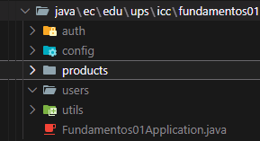

# Programación y Plataformas Web

# Frameworks Backend: Spring Boot – Estructura del Proyecto

<div align="center">
  
</div>

## Práctica 2 (Spring Boot): Estructura del Proyecto, Arquitectura Interna y Organización Modular

### Autores

### Autor
*Miguel Ángel Vanegas*   
📧 mvanegasp@est.ups.edu.ec  
💻 GitHub: [MiguelV145](https://github.com/MiguelV145)  
*Jose Vanegas*  
📧 jvanegasp1@est.ups.edu.ec   
💻 GitHub: [josevac1](https://github.com/josevac1)

---

# 1. Introducción

En el tema anterior se revisó cómo crear un proyecto Spring Boot y ejecutar un primer endpoint.
En esta práctica se profundiza en cómo se **estructura internamente un proyecto backend profesional**, cómo Spring Boot organiza sus componentes, cómo detecta controladores y servicios, y cómo aplicar una arquitectura modular basada en dominios.

El objetivo es comprender:

* cómo se organiza un proyecto Spring Boot a nivel de carpetas
* cómo funcionan controladores, servicios, repositorios y entidades dentro de MVCS
* por qué la estructura del paquete raíz es fundamental
* cómo escanea Spring Boot los componentes
* cómo organizar el proyecto como si fuera una aplicación empresarial real

---

# 2. ¿Cómo organiza Spring Boot un proyecto?

Spring Boot utiliza tres elementos clave:

### **1. Package root (paquete raíz)**

Es el paquete donde vive la clase principal:

```
Fundamentos01Application.java
```

Ejemplo:

```
ec.edu.ups.icc.fundamentos01
```

Spring Boot aplica `@ComponentScan` de forma automática para **buscar controladores, servicios, repositorios, configuraciones y componentes** **solamente dentro del package root y sus subpaquetes**.

Esto significa:

* si un controller está fuera de este paquete → ❌ **no lo detecta**
* si un servicio está en otro nivel no incluido → ❌ **no se registra como Bean**

---

### **2. ComponentScan**

Al iniciar la aplicación, Spring Boot:

```
1. Ejecuta Fundamentos01Application
2. Activa @SpringBootApplication
3. Ejecuta @ComponentScan
4. Busca automáticamente:
   - @RestController
   - @Service
   - @Repository
   - @Configuration
   - @Component
5. Registra los beans
6. Inicia Tomcat embebido
```

---

### **3. Auto-Configuration**

Spring Boot analiza las dependencias del proyecto, por ejemplo:

```
spring-boot-starter-web
```

y automáticamente:

* habilita Spring MVC
* registra el servidor embebido Tomcat
* expone rutas HTTP
* configura JSON con Jackson

---

# 3. Maven, Gradle 

Spring Boot permite dos herramientas principales de construcción (build tools):

---

## 3.1 Maven

**Características**:

* basado en XML (`pom.xml`)
* estructura estricta y muy estandarizada
* ampliamente usado en proyectos legacy o corporativos
* dependencias declaradas mediante `<dependency>`

**Ventajas**:

* documentación abundante
* comportamiento predecible

**Limitaciones**:

* archivos extensos en XML
* poca flexibilidad para scripts modernos

---

## 3.2 Gradle

**Características**:

* basado en lenguaje Groovy/Kotlin
* archivos compactos (`build.gradle`)
* permite configuraciones dinámicas
* más rápido gracias a su sistema de cache incremental

**Ventajas**:

* sintaxis clara
* builds más rápidos
* ideal para proyectos modernos (Spring Boot, Android, Kotlin)

**Por qué se utilizará Gradle en este curso**:

* es más eficiente para  proyectos iterativos
* facilita la integración con CI/CD
* posee scripts más legibles que XML
* recomendado en documentación moderna de Spring Boot
* varias empresas migran a Gradle por rendimiento

---

# 4. Archivos esenciales en un proyecto Spring Boot

| Archivo                                      | Función                                               |
| -------------------------------------------- | ----------------------------------------------------- |
| `Fundamentos01Application.java`              | Punto de entrada de Spring Boot, activa ComponentScan |
| `build.gradle`                               | Define dependencias, plugins, versiones, tareas       |
| `settings.gradle`                            | Define el nombre raíz del proyecto                    |
| `application.properties` o `application.yml` | Configuraciones del servidor, BD, logs                |
| `/resources/static/`                         | Archivos públicos estáticos                           |
| `/resources/templates/`                      | Plantillas (no usadas en este curso)                  |
| `/resources/application.properties`          | Configuración principal                               |

---

# 5. Estructura interna generada por Spring Boot

Estructura inicial:

```
src/
 └── main/
      ├── java/
      │    └── ec.edu.ups.icc.fundamentos01/
      │          └── Fundamentos01Application.java
      └── resources/
           ├── application.properties
           ├── static/
           └── templates/
build.gradle
settings.gradle
```

Pero esta estructura es insuficiente para un proyecto real.
A continuación se presenta cómo organizar una API profesional.

---

# 6. Arquitectura MVCS aplicada a Spring Boot

En Spring Boot, MVCS se distribuye así:

| Capa                     | Elemento Spring |
| ------------------------ | --------------- |
| Presentación             | `controllers/`  |
| Negocio                  | `services/`     |
| Dominio                  | `models/`       |
| Persistencia             | `repositories/` |
| Comunicación DTO         | `dtos/`         |
| Utilidades transversales | `utils/`        |
| Configuraciones globales | `config/`       |

---

# 7. Estructura modular recomendada (proyecto grande)

Para enseñar arquitectura moderna, se utilizará **estructura por dominios**.

### Proyecto base:

```
src/main/java/ec/edu/ups/icc/fundamentos01/
    ├── config/
    ├── utils/
    ├── products/
    ├── users/
    ├── auth/
    └── Fundamentos01Application.java
```

---

# 8. Estructura modular dentro de cada dominio

Cada módulo contiene **todas las capas necesarias**:

```
products/
    ├── controllers/
    ├── services/
    ├── repositories/
    ├── entities/
    ├── dtos/
    ├── mappers/
    ├── utils/
```

Lo mismo aplica para:

```
users/
auth/
orders/
payments/
etc.
```

### Ventajas pedagógicas:

* permite que cada grupo cree módulos distintos
* imita arquitectura empresarial real
* facilita escalar funcionalidades
* ordena responsabilidades
* simplifica pruebas unitarias

---

# 9. Flujo interno de Spring Boot dentro de esta estructura

```
HTTP Request → Tomcat embebido
        ↓
DispatcherServlet
        ↓
Controller (products/controllers)
        ↓
Service (products/services)
        ↓
Repository (products/repositories)
        ↓
JPA / Hibernate
        ↓
Base de Datos
        ↓
HTTP Response (DTO o JSON)
```

---

# 10. Actividad práctica del tema 02

En esta práctica se debe:

### 1. Reorganizar el proyecto con la estructura modular:

Crear dentro de:

```
src/main/java/ec/edu/ups/icc/fundamentos01/
```

las carpetas:

```
config/
utils/
products/
users/
auth/
```

### 2. Dentro de `products/` crear carpetas:

```
controllers/
services/
repositories/
entities/
dtos/
mappers/
utils/
```

### 3. Crear clases vacías para verificar ComponentScan:

Ejemplo en `products/controllers`:

```java
package ec.edu.ups.icc.fundamentos01.products.controllers;

public class ProductsController {
}
```

Y en `products/services`:

```java
package ec.edu.ups.icc.fundamentos01.products.services;

public class ProductsService {
}
```

### 4. Ejecutar la aplicación

```
./gradlew bootRun
```

El proyecto debe compilar correctamente aun con clases vacías.

---

# 11. Resultados y Evidencias

Cada estudiante debe agregar en su documento:

---

### 1. Captura del IDE mostrando la estructura modular:

Debe visualizarse claramente:

```
products/
users/
auth/
config/
utils/
```




---

### 2. Captura del archivo `Fundamentos01Application.java`

Se debe verificar:

* el package raíz
* la ubicación correcta que permite ComponentScan


---

### 3. Captura del árbol generado desde terminal:

Ejemplo:

```bash
tree src/main/java/ec/edu/ups/icc/fundamentos01
```


---

### 4. Explicación breve

Se debe redactar:

* por qué es importante tener módulos separados
* cómo se relacionan controllers, services y repositories
* qué problema evita mantener una estructura clara

La separación en módulos permite mantener el proyecto ordenado y fácil de mantener. Los controllers reciben las solicitudes, los services manejan la lógica de negocio y los repositories acceden a la base de datos. Esta estructura evita desorden, errores y facilita el crecimiento del sistema.


